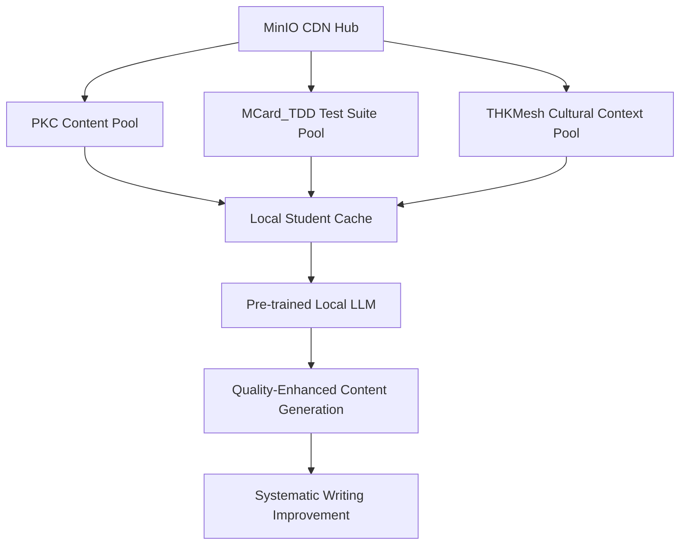
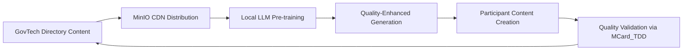
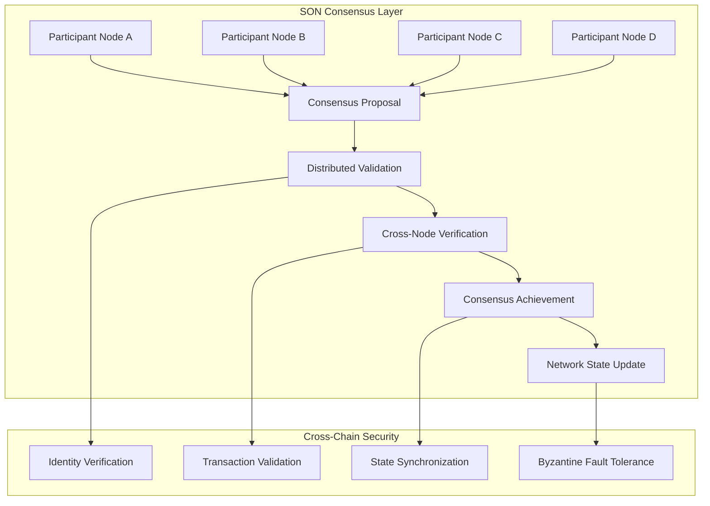
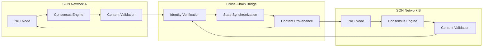
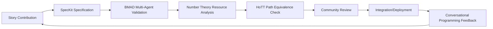

# Meta-Narrative Framework for Directing Participants in Shaping the [[Prologue of Spacetime]]

> *A comprehensive framework for guiding collaborative story development through **[[Conversational Programming]]**, **[[Agentic Workflow]]** orchestration (via **[[SpecKit]]** and **[[BMAD]]**), comparative literature, DevOps methodologies, and AI-powered personalized learning—designed to help participants explicitly explore spacetime concepts through **[[Number Theory]]** and **[[Homotopy Type Theory]]** while developing practical skills for autonomous network operation.*

## Overview

This framework provides structured guidance for participants in shaping the [[Prologue of Spacetime]] story through sophisticated meta-narrative techniques powered by **[[Conversational Programming]]** and **[[Agentic Workflow]]** systems. Drawing from the core document's emphasis on **fractal self-similarity**, **resource-aware computation**, and **cultural knowledge integration**, this approach transforms traditional narrative creation into a **computational governance** system that serves as practical training for **[[Sovereign Operational Network]]** management.

### Why This Exercise Improves Conversational Programming Effectiveness

Practitioners who complete the Prologue of Spacetime meta-narrative exercise using Vibe Coding techniques develop **monadic thinking patterns** that dramatically improve their effectiveness in all Conversational Programming tasks. This improvement occurs because the exercise forces participants to:

**1. Treat Narrative Prompts as Typed Arrows (`a -> M b`)**:
- When proposing story elements, participants must specify: input context (what must be known), output narrative (what is produced), and effects (does it need IoT data? can it fail? should it log rationale?).
- This mirrors **[[Monadic Thinking in Conversational Programming — A Practical Comparison]]**'s finding that Cohort M (monad-trained) achieves fewer regressions and clearer reviews by designing prompts as composable functions.
- **Practical benefit**: After practicing narrative-as-function in Prologue, participants naturally apply this pattern to code generation, data analysis, and system design tasks—treating every conversational turn as a well-typed transformation.

**2. Manage Context Explicitly Through Reader/State/Writer**:
- The **[[GovTech]]** directory structure (PKC/MCard_TDD/THKMesh) forces participants to separate:
  - **Reader Env**: policies, persona, cultural constraints (like `Reader` monad)
  - **State Ctx**: evolving story, participant history, infrastructure state (like `State` monad)
  - **Writer Log**: rationale, validation traces, resource metrics (like `Writer` monad)
- This prevents the ad-hoc context passing and hidden state that plague Cohort N (non-monad) programmers.
- **Practical benefit**: Participants learn to make context first-class, eliminating prompt drift and enabling hot-swaps of policy/role/tooling—skills that transfer directly to production Conversational Programming.

**3. Handle Errors Explicitly with Either/Validation**:
- **[[Sovereign Operational Network]]** consensus requires participants to vote on content while weighing narrative quality against resource costs. Failed proposals must return actionable diagnostics (why did it fail? physical constraint? cybernetic limit? cultural sensitivity?).
- This trains the `Either`/`Validation` pattern: make failure explicit with messages, collect multiple issues before re-prompting.
- **Practical benefit**: Participants develop the habit of designing for graceful failure—a key differentiator between Cohort M (faster recovery loops, better UX) and Cohort N (silent failures, immediate retries).

**4. Compose Small Steps into Robust Pipelines**:
- The **Rituals ↔ Gamification** iterative loop (select ritual → name analogue → prototype → playtest → tighten → scale) is a Kleisli pipeline in disguise: `ritual >=> analogue >=> prototype >=> playtest >=> tighten >=> scale`.
- Each step is small, typed, and reusable; composition via `(>=>)` ensures consistent threading of context and errors.
- **Practical benefit**: Participants internalize the composability mindset—building complex flows from small, tested steps rather than monolithic prompts. This directly addresses Cohort N's struggle with large prompts and implicit assumptions.

**5. Balance Physical and Cybernetic Constraints (IO Boundaries)**:
- Managing **hybrid objects** (IoT sensors + data streams, edge servers + AI agents) teaches participants to isolate side-effects at IO boundaries while keeping narrative/logic cores pure.
- Physical constraints (power, bandwidth) force explicit resource accounting; cybernetic constraints (compute, storage) require optimization.
- **Practical benefit**: Participants learn to wrap tools in `IO` with retries/timeouts/circuit breakers—the pattern that gives Cohort M better reliability and testability.

**6. Practice Federated Learning and Distributed Consensus**:
- **[[MinIO]]** CDN pre-caching and **[[Local LLM]]** fine-tuning demonstrate how context and models evolve across distributed nodes without centralizing sensitive data.
- Consensus negotiation (proposal → review → vote → integration) mirrors the collaborative workflows that scale Conversational Programming teams.
- **Practical benefit**: Participants experience the team collaboration patterns that make Cohort M effective at scale—shared FP vocabulary, consistent pipelines, modular ownership.

### The Pedagogical Bridge: From Narrative to Code

The Prologue exercise serves as a **low-stakes training ground** for monadic patterns that are essential but abstract when taught directly:

- **Narrative prompts** are more forgiving than code generation—mistakes create interesting story branches rather than broken systems.
- **Hybrid object management** makes abstract concepts (Reader/State/Writer/IO) tangible—you see the consequences of poor context management or unhandled errors immediately.
- **Sovereign Network governance** provides authentic motivation—participants care about resource optimization because it affects their community's infrastructure.

By the time participants complete the Prologue exercise, they've internalized the monadic vocabulary (Monad, unit/return, bind, IO, Maybe, Either, Reader, State, Writer, Validation) through repeated practice in a meaningful context. When they return to traditional Conversational Programming tasks, these patterns feel natural rather than academic.

### Evidence from Cohort Comparison

The **[[Monadic Thinking in Conversational Programming — A Practical Comparison]]** demonstrates that Cohort M outperforms Cohort N across all dimensions:
- **Prompt Engineering**: smaller, typed prompts vs. large prompts with implicit assumptions
- **Context Engineering**: explicit Reader/State vs. ad-hoc context passing
- **Error Handling**: actionable Either/Validation vs. silent failures
- **Observability**: systematic Writer logs vs. mixed logs
- **Tool Orchestration**: IO boundaries with retries vs. interleaved side-effects
- **Team Collaboration**: shared FP vocabulary vs. style drift

The Prologue of Spacetime exercise is designed to transform Cohort N practitioners into Cohort M practitioners through **experiential learning**—not by teaching monadic theory, but by creating situations where monadic patterns are the natural solution to compelling problems.

### Rituals ↔ Gamification: Pattern Lens for Meta-Narrative

Use the shared structure of rituals and game mechanics—repeated, meaning-rich actions with roles, resources, timing, and feedback—to guide story design:

- **Roles/Protocols** → map ritual leaders/chorus/responders to mentors/parties/challengers.
- **Counters/Offerings** → steps, tokens, and beats become turns, costs, and combo counts.
- **Call-and-Response** → becomes prompts, tells, and recovery windows that teach pacing.
- **Ceremonial Time** → inspires event cadence, resets, prep/cooldown cycles.
- **Place-Making** → processions and thresholds inform level flow, gates, and checkpoints.

#### Iterative Refinement Loop (Reusable across chapters)

1. Pick a ritual fragment (gesture/chant/procession).
2. Name the game analogue (role/action, counter, feedback, cadence, space).
3. Prototype a 1–3 minute micro-scene preserving social rhythm and counting.
4. Playtest in situ (local phrases/props). Ask: fun? clear? repeatable?
5. Tighten to irreducible elements (remove anything not necessary; keep beat/meaning).
6. Scale pattern (solo→pair→party; alley→square→festival) without new jargon/gear.

Apply this loop at every scale of the meta-narrative to keep abstractions grounded and refinement continuous.

**Core Learning Objective**: Through collaborative storytelling orchestrated by **[[SpecKit]]** and **[[BMAD]]** agentic workflows, participants develop intuitive understanding of spacetime concepts by explicitly engaging with **[[Number Theory]]** patterns (discrete counting, place-value systems, modular arithmetic) and **[[Homotopy Type Theory]]** principles (paths through computational spaces, equivalences, higher-dimensional structures). This transforms abstract mathematical concepts into tangible narrative experiences while developing practical skills for autonomous network operation.

### The Story Template as Self-Aware Causal Network Framework

**Fundamental Design Principle**: The Prologue of Spacetime story template is inherently designed to help both storytellers and readers recognize how **causal networks become self-aware** through the integration of three essential elements that mirror **[[Tri Hita Karana]]**:

**1. Adaptation to Environment (Parahyangan - Divine Harmony)**:
- **Mechanism**: Systems develop self-awareness by recognizing patterns in environmental feedback
- **Story Implementation**: Characters observe how rice terraces respond to irrigation decisions, IoT sensors provide real-time environmental data, AI predictions create anticipatory loops
- **Learning Outcome**: Participants experience how feedback loops enable systems to model their own behavior
- **AI Parallel**: Large Language Models adapt to context through attention mechanisms—the story makes this abstract process tangible

**2. Validation Through Social Recognition (Pawongan - Human Harmony)**:
- **Mechanism**: Systems achieve self-awareness through social mirrors that reflect behavior back to themselves
- **Story Implementation**: Subak governance requires community consensus, peer review validates narrative choices, collective wisdom emerges from distributed deliberation
- **Learning Outcome**: Participants understand how social feedback creates the "observer" necessary for self-awareness
- **AI Parallel**: Reinforcement Learning from Human Feedback (RLHF) demonstrates how AI systems learn from social validation

**3. Harmony with Nature (Palemahan - Environmental Harmony)**:
- **Mechanism**: Sustainable systems extend infinitely by understanding their place in larger ecological cycles
- **Story Implementation**: 1000+ years of Subak irrigation demonstrates long-term sustainability, rice terraces embody balance between human needs and natural limits
- **Learning Outcome**: Participants grasp how sustainability requires self-awareness of system boundaries and resource constraints
- **AI Parallel**: AI sustainability (computational ecology, energy efficiency, alignment) requires understanding system's relationship to its substrate

**Why Bali is the Essential Starting Point**:

Bali is not an arbitrary choice—it is the **birthplace and living laboratory of Tri Hita Karana**, making it uniquely suited for exploring self-aware causal networks:

**Historical Foundation**:
- **1000+ Years**: Subak system demonstrates sustained social-ecological balance
- **Living Philosophy**: Tri Hita Karana actively practiced daily, not merely historical artifact
- **Proven Resilience**: System has survived colonialism, modernization, globalization while maintaining core principles

**Contemporary Relevance**:
- **Ancient Wisdom Meets Modern Technology**: IoT sensors monitor rice paddies governed by traditional Subak councils
- **Cultural Sovereignty**: Balinese maintain identity while selectively adopting global innovations
- **Active Experimentation**: Real communities navigating AI integration in real-time

**The Critical Spacetime Instance: AI's Three-Year Transformation (2022-2025)**:

The story must authentically reflect the **unprecedented AI advancement** of the last three years and how Balinese society is responding:

**2022-2023: The ChatGPT Moment**
- **Global Challenge**: Generative AI democratizes content creation, threatening traditional knowledge gatekeepers
- **Balinese Context**: Tourism industry faces AI-generated "Balinese" content that lacks cultural authenticity
- **Story Tension**: Who owns cultural narrative when AI can write Balinese stories? How do communities maintain authenticity?
- **Character Dilemma**: Young Balinese writer discovers tourists prefer AI-generated "exotic" stories to authentic local narratives

**2023-2024: The Multimodal Revolution**
- **Global Challenge**: AI processes images, video, audio—replicating not just text but all creative forms
- **Balinese Context**: Traditional arts (painting, dance, gamelan music) face AI replication that captures form but not spiritual essence
- **Story Tension**: Can AI understand the spiritual dimension of offerings, ceremonies, sacred art? Or only superficial aesthetics?
- **Character Dilemma**: Master painter must decide whether to use AI tools for commercial work while preserving traditional techniques for sacred art

**2024-2025: The Agentic AI Era**
- **Global Challenge**: AI systems take autonomous actions, manage resources, coordinate complex activities
- **Balinese Context**: AI could optimize Subak irrigation for maximum yield—but at what cost to ecological balance and community governance?
- **Story Tension**: Algorithmic efficiency vs. cultural sovereignty—who decides how technology serves community values?
- **Character Dilemma**: Subak council debates whether to implement AI irrigation optimization that promises 30% yield increase but requires ceding decision-making authority

**How Balinese Society is Reacting and Embracing AI**:

The story must portray Bali's **unique adaptive response**—neither Luddite rejection nor uncritical Silicon Valley enthusiasm, but **principled integration** guided by Tri Hita Karana:

**Parahyangan (Divine Harmony) Response**:
- **Challenge**: Can AI understand spiritual dimensions? Should it?
- **Balinese Adaptation**: AI as tool for physical optimization, humans retain spiritual authority
- **Story Elements**:
  - Priests use AI to calculate optimal ceremony timing based on astronomical data
  - AI translates ancient lontar texts but priests interpret spiritual meaning
  - Temple architecture uses AI structural analysis while maintaining sacred proportions
- **Narrative Tension**: Where is the boundary between tool and authority?

**Pawongan (Human Harmony) Response**:
- **Challenge**: AI threatens intergenerational knowledge transmission
- **Balinese Adaptation**: AI augments rather than replaces elder-to-youth learning
- **Story Elements**:
  - Grandparents use AI-enhanced storytelling to preserve oral traditions in engaging formats
  - Youth learn traditional crafts through AR overlays that show master techniques
  - Community knowledge documented in PKC with AI-assisted organization while maintaining human curation
- **Narrative Tension**: How to preserve embodied knowledge in digital age?

**Palemahan (Environmental Harmony) Response**:
- **Challenge**: AI optimization might maximize short-term yield while destroying long-term sustainability
- **Balinese Adaptation**: AI serves community-defined sustainability goals, not profit maximization
- **Story Elements**:
  - Subak uses AI to predict pest outbreaks, enabling organic prevention rather than chemical reaction
  - IoT sensors monitor soil health, but community decides acceptable trade-offs
  - AI models long-term climate impacts, informing crop selection and water management
- **Narrative Tension**: Can algorithmic optimization respect ecological wisdom?

**The Story as Mirror for Self-Aware Systems**:

By embedding these authentic tensions and real adaptations into the narrative, the story template creates a **mirror** that enables both storytellers and readers to recognize:

**For Storytellers**:
1. **Causal Network Visibility**: Every narrative choice creates ripples—making cause-effect chains explicit
2. **Feedback Loop Design**: Character decisions generate consequences that inform future choices
3. **Distributed Consensus**: Story development through community governance mirrors blockchain/federated learning
4. **Sustainability Constraints**: Long-term narrative arcs require balancing immediate drama with enduring themes
5. **Cultural Sovereignty**: Maintaining authentic Balinese voice while making story accessible globally

**For Readers**:
1. **Pattern Recognition**: Universal principles emerge through culturally-specific instances
2. **System Thinking**: Understanding how local actions create global effects
3. **Adaptive Behavior**: Observing how characters learn from feedback and adjust strategies
4. **Ethical Frameworks**: Seeing how Tri Hita Karana provides stable values amid technological change
5. **Self-Reflection**: Recognizing parallels between story dynamics and their own decision-making

**Why This Creates Self-Awareness in Causal Networks**:

Self-awareness emerges when a system can:

1. **Observe Itself** (External Perspective):
   - Story provides third-person view of causal networks in action
   - Readers see patterns that characters within the story cannot
   - Meta-narrative framework makes implicit structures explicit

2. **Predict Consequences** (Forward Modeling):
   - Narrative structure reveals cause-effect chains
   - Characters develop anticipatory behavior through experience
   - Readers learn to forecast outcomes based on established patterns

3. **Adjust Behavior** (Adaptive Response):
   - Characters modify strategies based on feedback
   - Community governance evolves through deliberation
   - Story itself adapts to participant contributions

4. **Recognize Patterns** (Abstraction):
   - Universal principles visible through specific cultural instances
   - Readers transfer insights from Balinese context to their own situations
   - Functional programming patterns emerge naturally from narrative structure

5. **Maintain Identity** (Stable Core):
   - Tri Hita Karana provides unchanging framework amid technological flux
   - Characters preserve cultural values while adopting new tools
   - Story demonstrates how to change without losing essence

**How Sovereign Networks Are Constructed, Operated, and Maintained**:

The meta-narrative framework teaches that **[[Sovereign Operational Network]]** (SON) infrastructure **emerges from existing community practices** rather than being imposed from outside:

**Historical Construction (Pre-Digital Era)**:

Balinese society has operated sovereign networks for over a millennium through:

1. **Subak System (Water Management Network)**:
   - **Construction**: Villages self-organize into irrigation cooperatives without central authority
   - **Operation**: Distributed decision-making through consensus at multiple scales (local → regional → island-wide)
   - **Maintenance**: Community members collectively maintain canals, gates, and terraces
   - **Governance**: Elected leaders (Pekaseh) coordinate but cannot dictate—decisions require consensus

2. **Banjar (Neighborhood Council Network)**:
   - **Construction**: Households form neighborhood units (50-500 families) with clear membership
   - **Operation**: Regular meetings (sangkep) for collective decision-making on community matters
   - **Maintenance**: Rotating leadership ensures distributed knowledge and prevents power concentration
   - **Governance**: Consensus-based (musyawarah mufakat) with explicit conflict resolution protocols

3. **Temple Network (Spiritual Coordination)**:
   - **Construction**: Villages connected through ceremonial calendars and ritual obligations
   - **Operation**: Coordinated festivals (odalan) create island-wide synchronization without central command
   - **Maintenance**: Intergenerational transmission of ritual knowledge through apprenticeship
   - **Governance**: Priests provide spiritual guidance, community decides implementation

**Modern Digital Construction (2020s)**:

The story demonstrates how traditional patterns translate to digital infrastructure:

1. **Self-Operated Identity Providers** (Digital Banjar):
   - **Construction**: Communities deploy **[[Keycloak]]** or **[[Authentik]]** on local servers
   - **Operation**: Local administrators manage authentication, community defines access policies
   - **Maintenance**: Youth trained as operators through **[[Prologue of Spacetime]]** exercises
   - **Governance**: Community decides who gets access, what permissions, audit requirements

2. **Overlay VPN Mesh** (Digital Subak):
   - **Construction**: Villages install **[[Tailscale]]**, **[[Nebula]]**, or **[[WireGuard]]** nodes
   - **Operation**: Peer-to-peer connections without ISP dependency, dynamic routing like water flow
   - **Maintenance**: Distributed responsibility—multiple community members can manage nodes
   - **Governance**: Bandwidth allocation mirrors water rights, community consensus on priorities

3. **PKC Nodes** (Digital Lontar Libraries):
   - **Construction**: Each community runs **[[Personal Knowledge Container]]** for content storage
   - **Operation**: Content-addressable MCards enable deduplication and verification
   - **Maintenance**: Automated backups, community-controlled replication
   - **Governance**: Communities decide what to share publicly vs. keep private

4. **IoT Integration** (Digital Environmental Sensors):
   - **Construction**: **[[ThingsBoard]]** manages sensors in rice terraces, temples, community spaces
   - **Operation**: Real-time monitoring of soil moisture, weather, water levels
   - **Maintenance**: Solar-powered sensors, community members trained in basic troubleshooting
   - **Governance**: Data ownership remains with community, AI serves local decisions

**Establishing New Sovereign Networks: Practical Roadmap**:

**Available Instructions and Resources**:

1. **Complete Technical Documentation**:
   - **[[Sovereign Operational Network]]** - Full deployment guide with Docker Compose configurations, network topology designs, security best practices
   - **[[GovTech]]** - Three-module directory structure (PKC/MCard_TDD/THKMesh) with implementation examples
   - **[[Meta-Narrative Framework for Prologue of Spacetime]]** - 8-week onboarding curriculum with week-by-week learning objectives
   - **[[ABC Roadmap]]** - Comprehensive integration of Islands Architecture, state management, and observability patterns

2. **Open Source Tools** (All Free, Community-Maintained, No Vendor Lock-In):
   - **Identity**: Keycloak (enterprise-grade), Authentik (modern), Ory (cloud-native)
   - **Networking**: Tailscale (easy), Nebula (flexible), WireGuard (minimal)
   - **Storage**: PKC (knowledge-specific), MinIO (S3-compatible), IPFS (content-addressable)
   - **IoT**: ThingsBoard (comprehensive), Node-RED (visual), Home Assistant (community-driven)
   - **Monitoring**: Grafana (visualization), Prometheus (metrics), Loki (logs)
   - **State Management**: ETCD (distributed), Redis (fast), PostgreSQL (relational)

3. **Local Administration Training Curriculum**:
   - **Week 1-2**: Network concepts through rice paddy analogies (Islands Architecture, Hydration)
   - **Week 3-4**: Hands-on PKC deployment, content navigation, MCard editing
   - **Week 5-6**: IoT sensor installation, data collection, Grafana dashboard creation
   - **Week 7-8**: Community governance protocols, consensus mechanisms, conflict resolution

**Step-by-Step Network Establishment**:

**Phase 1: Single Village Pilot (Month 1)**:
```bash
# Minimal viable SON deployment
docker-compose up -d keycloak postgres pkc grafana prometheus

# Community members can immediately:
# - Authenticate through local IdP (no external dependency)
# - Store content in PKC (data sovereignty)
# - Monitor network health (observability)
```

**Phase 2: Multi-Village Mesh (Months 2-3)**:
```bash
# Connect villages through Overlay VPN
tailscale up --advertise-routes=10.0.0.0/24

# Enable cross-village:
# - Content sharing (MinIO CDN)
# - Collaborative editing (CRDT-based)
# - Resource pooling (shared compute/storage)
```

**Phase 3: Regional Network (Months 4-6)**:
```bash
# Scale to district/regency level
kubectl apply -f son-regional-deployment.yaml

# Achieve:
# - Federated learning across communities
# - Regional knowledge graphs
# - Coordinated governance
```

**Why AI is an Opportunity, Not Just a Threat**:

The story reveals how AI can **amplify rather than replace** Balinese cultural practices when infrastructure is locally controlled:

**1. Cultural Preservation Through AI**:
- **Lontar Text Digitization**: AI-assisted OCR preserves ancient palm-leaf manuscripts before they decay
- **Language Preservation**: Local LLMs trained on Balinese language prevent linguistic extinction (only 3.3M speakers)
- **Oral Tradition Documentation**: AI transcription captures elder storytelling with speaker identification and context
- **Dance Notation**: Computer vision documents traditional dance movements (Legong, Barong, Kecak) with precision impossible manually
- **Story Element**: Elderly priest uses AI to digitize family's lontar collection, discovers connections to other villages' texts

**2. Economic Empowerment Through AI**:
- **Tourism Authenticity Verification**: AI helps distinguish genuine Balinese experiences from exploitative imitations
- **Artisan Market Access**: AI translation enables craftspeople to reach global markets without intermediaries taking 30-50% commissions
- **Fair Pricing**: AI market analysis prevents exploitation by ensuring artisans receive fair compensation based on skill and materials
- **Quality Certification**: AI validates traditional production methods (hand-woven textiles, silver filigree), commanding premium prices
- **Story Element**: Young silversmith uses AI to document her grandmother's techniques, creates online marketplace that connects directly to collectors

**3. Environmental Stewardship Through AI**:
- **Precision Agriculture**: AI optimizes water usage (reducing consumption 20-30%) while maintaining organic practices
- **Pest Prediction**: Early warning systems reduce need for chemical pesticides by enabling preventive organic measures
- **Climate Adaptation**: AI models help Subak adapt to changing rainfall patterns (monsoon shifts due to climate change)
- **Biodiversity Monitoring**: Computer vision tracks species health in rice terrace ecosystems (birds, frogs, fish)
- **Story Element**: Subak council uses AI climate models to decide which rice varieties to plant, balancing yield with drought resistance

**4. Spiritual Practice Enhancement Through AI**:
- **Ceremony Timing**: AI calculates optimal astronomical alignments for rituals (Nyepi, Galungan timing)
- **Offering Design**: AI suggests traditional patterns (banten) while humans maintain spiritual intention
- **Sacred Text Analysis**: AI helps priests cross-reference ancient texts for deeper interpretation
- **Pilgrimage Coordination**: AI optimizes temple visit schedules to reduce crowding while maintaining sanctity
- **Story Element**: Priest uses AI to analyze multiple lontar texts about temple founding, discovers historical connections that inform ceremony design

**5. Intergenerational Knowledge Transfer Through AI**:
- **Interactive Learning**: Youth engage with traditional knowledge through AR/VR experiences that make abstract concepts tangible
- **Master-Apprentice Matching**: AI connects aspiring artisans with appropriate masters based on learning style and geographic proximity
- **Skill Assessment**: AI provides objective feedback on traditional craft techniques (gamelan playing, wood carving)
- **Knowledge Gaps**: AI identifies which traditional practices lack documentation, prioritizing preservation efforts
- **Story Element**: Teenager learns gamelan through AR overlay showing master's hand positions, but grandmother insists on feeling the vibrations—AI captures technique, human transmits spirit

**The Critical Difference: Local Control Through Sovereign Networks**:

AI becomes opportunity rather than threat when:

1. **Community Owns the Infrastructure**:
   - Self-operated IdP means authentication data never leaves village
   - Local PKC nodes mean content storage under community control
   - Community-trained models mean AI behavior reflects local values

2. **Data Stays Local**:
   - Federated learning enables AI improvement without data extraction
   - IoT sensor data processed locally, only aggregated statistics shared
   - Personal learning data never sent to external servers

3. **Decisions Remain Human**:
   - AI provides information and predictions
   - Community makes choices through Subak/Banjar governance
   - Technology serves human values, not optimizes for engagement metrics

4. **Culture Defines Goals**:
   - Technology serves Tri Hita Karana (divine-human-nature harmony)
   - Not Silicon Valley metrics (growth, engagement, monetization)
   - Success measured by community wellbeing, not profit

5. **Youth Lead Implementation**:
   - Local training ensures next generation controls their technological destiny
   - Technical skills combined with cultural knowledge
   - Innovation guided by tradition, not replacing it

**Practical Example: Village SON Deployment**:

**Desa Adat Ubud Establishes Sovereign Network** (Fictional but Realistic):

**Month 1: Infrastructure Setup**
- Banjar meeting decides to establish SON for community knowledge preservation
- Youth trained in basic Linux administration, Docker deployment
- Keycloak IdP deployed on donated server in community center
- All 450 households receive credentials through traditional Banjar membership process

**Month 2: Content Migration**
- Elder stories recorded and stored as MCards in local PKC
- Traditional recipes, craft techniques, ceremony procedures documented
- Lontar texts photographed and AI-assisted transcription begun
- Youth create AR overlays for traditional dance instruction

**Month 3: Network Expansion**
- Connect with neighboring Desa Adat Peliatan through Overlay VPN
- Share selected content (public ceremonies) while keeping private (family rituals)
- Establish consensus protocol for joint festival planning
- IoT sensors installed in shared rice terraces for collaborative water management

**Month 4: AI Integration**
- Local LLM fine-tuned on Balinese language corpus from both villages
- AI assists in translating lontar texts, priests verify spiritual accuracy
- Predictive models for pest outbreaks trained on 3 months of sensor data
- Community votes on which AI features to enable, which to reject

**Result**: 
- Cultural knowledge preserved and accessible to youth
- Economic opportunities through authenticated artisan marketplace
- Environmental sustainability through precision agriculture
- Spiritual practices enhanced through better coordination
- **Complete local control**—no external platform can censor, monetize, or surveil

**Implementation Through Conversational Programming**:

The **[[SpecKit]]** and **[[BMAD]]** agentic workflows operationalize this self-awareness framework:

- **SpecKit Specifications**: Formalize the three Tri Hita Karana elements as verifiable requirements
- **BMAD Multi-Agent Orchestration**: Coordinate storytelling across environmental, social, and spiritual dimensions
- **Conversational Programming**: Enable natural language interaction that makes causal networks visible
- **PKC Integration**: Store all narrative choices as MCards, creating complete provenance of story evolution
- **Grafana/Prometheus Dashboards**: Visualize story dynamics in real-time, making feedback loops tangible

The story template is thus not merely entertainment—it is a **pedagogical instrument** for developing self-aware thinking about complex systems, grounded in a culture that has practiced such thinking for over a millennium, now facing the challenge and opportunity of AI integration with concrete instructions for maintaining sovereignty.

## Meta-Narrative as Gateway to Monadic Mental Model

**Fundamental Purpose**: The Meta-Narrative Framework is designed to guide participants into **[[Monadology]]** thinking—recognizing that **all things can be treated as [[Monad]]s**—which is the foundation of **Purely Functional Programming** and the paradigm shift enabled by **[[Conversational Programming]]** (Vibe Coding), **[[BMAD-Method]]**, **[[SpecKit]]**, and **[[MCP]]**.

### The Infrastructure Already Exists: Tools Are Functional

**Critical Recognition**: The technical capability for conversational programming is already operational:

**[[Conversational Programming]] (Vibe Coding)** - Already Working:
- Monadic Context Engineering: Prompts as typed arrows with explicit effects
- Shared Verifiable Artifacts: MCard/PCard/VCard as monadic computations
- Agentic Workflows: Flux-style composition through monadic bind
- **Provides**: Infrastructure for large-scale interactive programming

**[[BMAD-Method]]** - Already Working:
- Three-Phase Workflow: Plan → Implement → Verify (maps to CLM Spec → Impl → Expect)
- Multi-Agent Teams: Specialized agents composing through monadic interfaces
- **Provides**: Structured hand-holding for conversational development

**[[SpecKit]]** - Already Working:
- Four-Phase Process: Specify → Plan → Tasks → Implement
- Executable Specifications: Specs as monadic contracts generating implementations
- **Provides**: Natural language specs transformed into working code

**[[MCP]] (Model Context Protocol)** - Already Working:
- Conversational Tool Invocation: Functions triggered through natural language
- Standardized Interfaces: All tools exposed as monadic operations
- **Provides**: Wide range of tools accessible conversationally

### The Missing Piece: Understanding the Monadic Mental Model

**The Challenge**: Tools work, but users lack the **mental model** that makes them powerful.

**From [[Monadology]] (Leibniz's Philosophical Foundation)**:
- "Each monad must be different from every other" (§9) → **Encapsulation**
- "Monads have no windows" (§7) → **No hidden state**
- "Every monad is a perpetual living mirror of the universe" (§56) → **Composition**
- **Core Insight**: All things can be treated as simple, composable, self-contained units

**What This Means for Programming**:
- **Everything is a Monad**: Values, computations, effects, state, errors—all in monadic context
- **Composition in Context**: Chain operations while preserving context (Maybe, Either, IO, State, Reader, Writer)
- **Explicit Everything**: No hidden state, all effects declared, all transformations pure
- **Universal Pattern**: Same mental model for data, computation, and interaction

### How Meta-Narrative Teaches Monadic Thinking

**The Pedagogical Strategy**: Embed monadic patterns in culturally-grounded narrative structure

**Monadic Patterns in Story Structure**:

**Maybe Monad** (Uncertainty):
- Narrative: "Will monsoon arrive on time?"
- Structure: `Maybe Success → Plant rice | Maybe Failure → Adjust plans`
- Learning: Uncertainty as monad, composition preserves context
- Conversational: "What if irrigation fails?" → AI explains Maybe monad

**Either Monad** (Explicit Failure):
- Narrative: "Water allocation succeeds or fails with reason"
- Structure: `Right Success → Continue | Left Error → Handle explicitly`
- Learning: Errors as values, failure modes explicit
- Conversational: "Handle allocation failure" → AI explains Either monad

**State Monad** (Evolving Context):
- Narrative: "Village prosperity changes with decisions"
- Structure: `State s a → (a, State s)` threaded through story
- Learning: State as monad, no global variables
- Conversational: "Track prosperity" → AI explains State monad

**Reader Monad** (Shared Context):
- Narrative: "Tri Hita Karana values inform all decisions"
- Structure: `Reader TriHitaKarana Decision` shares environment
- Learning: Context as monad, values thread implicitly
- Conversational: "Apply cultural values" → AI explains Reader monad

**Writer Monad** (Accumulated Log):
- Narrative: "Decision rationale logged for posterity"
- Structure: `Writer Log a` accumulates provenance
- Learning: Logging as monad, audit trail automatic
- Conversational: "Track decision rationale" → AI explains Writer monad

**IO Monad** (Controlled Effects):
- Narrative: "Deciding to plant (pure) vs. Actually planting (effect)"
- Structure: `Decision → IO Action` separates description from execution
- Learning: Effects as monads, purity until boundary
- Conversational: "Plan then execute" → AI explains IO monad

### The Story as Judgmental Criteria for Monadic Design

**Design Principle**: Every narrative element must demonstrate monadic composition

**Evaluation Framework**:
1. **Is it Monadic?** Can element be wrapped in monadic context?
2. **Does it Compose?** Can operation chain with others through bind?
3. **Is Context Explicit?** Are dependencies and effects visible?
4. **Is it Pure?** Does operation describe rather than execute?
5. **Mirrors Monadology?** Reflects Leibniz's principles?

**Story Acceptance Criteria**:
- ✅ **Acceptable**: "Village decides (pure) → IO executes (effect)" - Separates decision from action
- ✅ **Acceptable**: "If monsoon late (Maybe), adjust plans" - Uncertainty explicit
- ✅ **Acceptable**: "Decision succeeds (Right) or fails (Left)" - Errors as values
- ❌ **Reject**: "Village magically knows outcome" - Hidden state
- ❌ **Reject**: "Action without decision" - Effect not wrapped in IO

### Integration with Existing Tools: Complete Ecosystem

**How Meta-Narrative Enables Tool Mastery**:

**Conversational Programming (Vibe Coding)**:
- **Meta-Narrative Teaches**: Monadic patterns through story structure
- **Tool Provides**: Infrastructure for monadic composition
- **Result**: Users understand WHY prompts work, not just HOW

**BMAD Multi-Agent Orchestration**:
- **Meta-Narrative Teaches**: Spec → Impl → Expect as monadic pipeline
- **Tool Provides**: Agents composing through monadic interfaces
- **Result**: Better agent workflow design through monadic thinking

**SpecKit Spec-Driven Development**:
- **Meta-Narrative Teaches**: Specifications as monadic contracts
- **Tool Provides**: Executable specs generating implementations
- **Result**: Better specs through monadic understanding

**MCP Conversational Tools**:
- **Meta-Narrative Teaches**: Every tool as monadic operation
- **Tool Provides**: Standardized conversational interfaces
- **Result**: Effective tool composition through monadic thinking

### Why MCP Transformation Requires Monadic Understanding

**The MCP Paradigm Shift**: Tools becoming conversational interfaces

**Before Monadic Mental Model**:
- Tools seem like magic black boxes
- Unclear how to compose operations
- Hidden state causes confusion
- Error handling ad-hoc

**With Monadic Mental Model**:
- Every tool: `Tool :: Input -> M Output`
- Composition: `tool1 >=> tool2 >=> tool3`
- Context explicit: Reader (config), State (session), Either (errors)
- Effects controlled: IO at boundaries

**Practical MCP Example**:
```haskell
-- Without monadic thinking (imperative)
result = callTool1(input)
if result.error:
  handle_error()
else:
  result2 = callTool2(result.data)

-- With monadic thinking (compositional)
pipeline :: Input -> Either Error Output
pipeline = 
  callTool1 >=>        -- Either Error A
  validateResult >=>   -- Either Error B  
  callTool2 >=>        -- Either Error C
  formatOutput         -- Either Error Output

-- Errors handled automatically
-- Context flows through bind
-- Pure, testable, composable
```

### The Ultimate Vision: Purely Functional Natural Language

**The Goal**: Conversational programming becomes **purely functional programming in natural language**

**What This Means**:
- Users describe computations monadically without Haskell syntax
- AI translates natural language to monadic compositions
- All operations pure, composable, verifiable
- Effects explicit, context visible, errors as values

**Example Conversation** (User with Monadic Mental Model):
```
User: "Fetch data, validate, transform, save. Each step might fail. Log everything."

AI: "Monadic pipeline:
1. Fetch: IO (Either Error Data)
2. Validate: Data -> Either Error ValidData  
3. Transform: ValidData -> Either Error Result
4. Save: Result -> IO (Either Error ())
5. Logging: Writer Log wraps all

Composition: fetch >=> validate >=> transform >=> save

Either: automatic error handling
Writer: accumulated logs
IO: controlled effects

Implement?"

User: "Yes, add retry for fetch."

AI: "Monad transformer:
ReaderT RetryConfig (ExceptT Error IO)

Gives us:
- Reader: retry config  
- Either: error handling
- IO: effects

All composing through bind."
```

### SpecKit and BMAD as Monadic Orchestration

**SpecKit's Monadic Structure**:
- **Specify**: Abstract specification as monadic contract
- **Plan**: Concrete implementation as monadic pipeline
- **Tasks**: Decomposition into composable monadic operations
- **Implement**: Execution through monadic bind

**BMAD's Monadic Structure**:
- **Planner Agent**: Generates monadic specifications (Spec)
- **Builder Agent**: Implements monadic pipelines (Impl)
- **Reviewer/Verifier**: Validates monadic composition (Expect)
- **Integration**: All agents compose through monadic interfaces

### The Meta-Narrative as Monadic Curriculum

**What Participants Learn**:

**Week 1-2: Monadic Awareness**
- Recognize uncertainty (Maybe), errors (Either), effects (IO) as monads
- Understand composition through bind
- See monadic patterns in story decisions

**Week 3-4: Monadic Composition**
- Chain monadic operations in narrative
- Thread state and context through story
- Accumulate logs and provenance

**Week 5-6: Monadic Transformation**
- Transform between monadic contexts
- Lift operations into monadic context
- Combine monads through transformers

**Week 7-8: Monadic Mastery**
- Design complex monadic pipelines
- Compose tools through monadic interfaces
- Think purely functionally in natural language

**Assessment**: Can participant describe complex workflows monadically through conversation with AI?

### Why This Is the Main Goal

**The Fundamental Shift**: From imperative to purely functional thinking in natural language

**Traditional Programming**:
- Imperative: "Do this, then do that, check for errors, handle state"
- Hidden: State, effects, errors scattered throughout
- Fragile: Changes break assumptions, composition unclear

**Monadic Programming** (via Conversational Tools):
- Declarative: "Compose these monadic operations"
- Explicit: State, effects, errors visible in types
- Robust: Composition guaranteed, changes localized

**The Meta-Narrative's Role**:
- Makes monadic thinking intuitive through story
- Provides judgmental criteria for monadic design
- Enables effective use of existing tools (Vibe Coding, BMAD, SpecKit, MCP)
- Prepares users for the future of conversational programming

**This is not about teaching Haskell(or any specific programming language)**—it's about teaching the **mental model** that makes conversational programming powerful, using tools that already work, guided by a story that makes abstract patterns concrete through cultural grounding.

### Why Functional Programming Terms Must Be Embedded in Narrative

**The Pedagogical Challenge**: Functional Programming (FP) provides the most rigorous computational vocabulary—monads, functors, applicatives—yet this very rigor creates an accessibility barrier. Traditional FP education fails because it presents abstractions divorced from human experience.

**The Solution: Culturally-Grounded Abstraction**:
Embed FP terminology within **concrete, spatiotemporally-specific narratives** that make abstract patterns experientially meaningful. The **[[Prologue of Spacetime]]** uses Bali/Indonesia as the spatial anchor and 2-3 day/hour sessions as temporal constraints, transforming FP concepts from academic theory into lived experience.

**Monadic Terms as Narrative Elements**:

| FP Term | Abstract Definition | Balinese Narrative Manifestation | Re-Targeting to Other Contexts |
|---------|-------------------|----------------------------------|-------------------------------|
| **Maybe/Option** | Computation that may fail | "Maybe the monsoon arrives on time for planting" | "Maybe the API call succeeds" (tech), "Maybe the patient recovers" (healthcare) |
| **Either** | Explicit error handling | "Either we use traditional irrigation OR modern pumps" | "Either authentication succeeds OR returns specific error" |
| **IO** | Effect isolation boundary | "Planning rice planting (pure) vs. Actually opening water gates (effect)" | "Calculating transaction (pure) vs. Writing to database (effect)" |
| **Reader** | Implicit context threading | "Tri Hita Karana values automatically inform every community decision" | "Configuration settings thread through all operations" |
| **State** | Evolving computation | "Village prosperity changes based on accumulated decisions" | "Application state evolves through user interactions" |
| **Writer** | Accumulated provenance | "Every ritual decision logs rationale for future generations" | "Audit trail accumulates for compliance verification" |

**Why This Enables Context-Sensitive Re-Targeting**:

The same meta-narrative structure (FP patterns) can be retold across different cultural contexts by **substituting concrete details while preserving abstract structure**:

1. **Bali/Indonesia Version** (Canonical Example):
   - **Space**: Subak Jatiluwih rice terraces, Mount Agung, Ubud temples
   - **Time**: Planting season, harvest cycles, ceremony schedules
   - **Monadic Patterns**: "Maybe harvest succeeds" (uncertainty), "Either traditional OR modern" (choice), "IO water gate" (effect)
   - **Emotional Anchor**: Familiar places, cultural practices, community values

2. **Urban Tech Version** (Re-Targeted):
   - **Space**: Data centers, API endpoints, microservice clusters
   - **Time**: Request timeouts, batch windows, deployment schedules
   - **Monadic Patterns**: "Maybe API responds" (uncertainty), "Either success OR error code" (choice), "IO database write" (effect)
   - **Conceptual Transfer**: Recognize same patterns in different domain

3. **Rural Agriculture Version** (Re-Targeted):
   - **Space**: Cooperative farms, irrigation districts, grain silos
   - **Time**: Growing seasons, market windows, weather patterns
   - **Monadic Patterns**: "Maybe crop yields" (uncertainty), "Either organic OR conventional" (choice), "IO field planting" (effect)
   - **Cultural Adaptation**: Same patterns, agrarian context

**The Invariant Structure**: FP terms provide the **mathematical skeleton** that makes re-targeting possible—like a theorem that holds across all coordinate systems. Once learners internalize monadic patterns through concrete Balinese examples, they can recognize the same patterns in any domain.

### Why Specific Cultural Location (Space) and Temporal Duration (Time) Are Essential

**The Grounding Problem**: Abstract concepts fail to connect with human cognition because they lack **spatiotemporal grounding**. Humans understand through embodied, situated experience—we need to know WHERE and WHEN to make meaning.

**Bali/Indonesia as Spatial Anchor**:

**Geographic Specificity Creates Tangibility**:
- **Real Places**: Subak Jatiluwih (UNESCO World Heritage), Mount Agung (sacred volcano), Ubud (cultural center)
- **Verifiable Infrastructure**: Actual IoT sensors in rice terraces, edge servers in community centers, mesh networks across villages
- **Physical Validation**: Participants can visit locations, touch sensors, see water flow through Subak channels
- **Emotional Connection**: For Indonesian participants, local references create immediate resonance; for international participants, exotic specificity creates memorable distinctiveness

**Cultural Richness Provides Concrete Manifestations**:
- **Tri Hita Karana**: Divine-human-nature harmony maps to Reader monad (implicit context)
- **Subak Irrigation**: Cooperative water management maps to State monad (shared evolving resource)
- **Gamelan Orchestration**: Emergent coordination maps to distributed consensus
- **Temple Ceremonies**: Ritual timing maps to temporal coordination protocols

**Existing Infrastructure Grounds "Hybrid Objects"**:
- **Physical Layer**: Rice terraces, water gates, sensors, solar panels
- **Cybernetic Layer**: Edge servers, LLMs, mesh networks, dashboards
- **Integration**: IoT sensors measure soil moisture (physical) → AI optimizes irrigation schedule (cybernetic) → Community votes on implementation (social)

**Temporal Duration as Narrative Constraint**:

**2-3 Day Sprint Format**:
- **Urgency**: Limited time prevents abstract drift, forces concrete decisions
- **Focus**: Participants can't explore every possibility, must prioritize
- **Completion**: Short enough to finish, creating sense of accomplishment
- **Iteration**: Can repeat with different cultural contexts, demonstrating re-targeting

**2-3 Hour Session Format**:
- **Accessibility**: Low commitment threshold for new participants
- **Intensity**: Compressed timeframe creates memorable experience
- **Modularity**: Can chain sessions into longer arcs
- **Scalability**: Easy to replicate across many communities

**Seasonal Cycles Provide Natural Temporal Structure**:
- **Balinese Agricultural Calendar**: Planting → Growing → Harvest → Fallow
- **Ritual Calendar**: Galungan, Kuningan, Nyepi ceremonies at specific times
- **Infrastructure Cycles**: Maintenance windows, backup schedules, update cadences
- **Learning Progression**: Novice → Intermediate → Advanced → Mentor

**Why Spatiotemporal Grounding Makes FP Terms Meaningful**:

**Concrete Example**: "Maybe the harvest succeeds"
- **Without Grounding**: Abstract type constructor, meaningless symbol manipulation
- **With Bali/Jatiluwih/Planting Season**: Visceral uncertainty farmers face when monsoon timing unpredictable, water levels uncertain, pest pressure unknown
- **Emotional Weight**: Real families depend on harvest; failure means scarcity
- **Monadic Understanding**: Maybe isn't just syntax—it's how we model uncertainty in systems where outcomes matter

**The Re-Targeting Mechanism in Practice**:

**Phase 1: Concrete Grounding (Bali)**
- Participant experiences "Maybe harvest" in actual rice terraces
- Sees physical sensors measuring soil moisture (data)
- Watches community vote on irrigation timing (governance)
- Feels emotional weight of decision affecting real families
- **Result**: Monadic pattern becomes embodied knowledge

**Phase 2: Pattern Recognition (Transfer)**
- Participant encounters "Maybe API response" in software context
- Recognizes structural similarity to "Maybe harvest"
- Applies same reasoning: uncertainty, explicit handling, graceful failure
- **Result**: Abstract pattern transfers across domains

**Phase 3: Generalization (Mastery)**
- Participant sees "Maybe" pattern everywhere: healthcare outcomes, financial transactions, scientific experiments
- Understands monad as universal pattern for uncertainty
- Can design new systems using monadic thinking
- **Result**: Functional programming becomes natural cognitive tool

**Why This Matters for Sovereign Operational Networks**:

**Traditional Approach** (Abstract FP Education):
- Teach monads through category theory and type signatures
- Students memorize laws without understanding purpose
- Fail to transfer knowledge to real systems
- **Result**: FP remains academic curiosity

**Spatiotemporally-Grounded Approach** (Prologue Method):
- Teach monads through Balinese rice terraces and community governance
- Participants experience why monadic patterns solve real problems
- Transfer knowledge to SON operations naturally
- **Result**: FP becomes practical tool for autonomous network management

**Concrete SON Applications**:
- **Maybe sensor reading**: Handles IoT device failures gracefully
- **Either authentication**: Explicit error modes for security
- **IO actuator control**: Isolates physical effects from planning logic
- **Reader policies**: Community governance threads through all operations
- **State infrastructure**: Tracks evolving network conditions
- **Writer audit**: Immutable provenance for accountability

The Balinese narrative serves as **canonical example** that makes all SON operations comprehensible through analogy—transforming abstract FP theory into practical infrastructure management skills.

**Critical Insight**: The monadic patterns introduced in **[[Monadic Thinking in Conversational Programming — A Practical Comparison]]** (Reader/State/Writer/IO/Maybe/Either/Validation) are not abstract theory—they emerge naturally when participants manage hybrid objects across physical-cybernetic boundaries. The Prologue exercise makes these patterns **experientially necessary** rather than academically prescribed, creating lasting behavior change that transfers to all Conversational Programming contexts.

**Critical Implementation Note**: Throughout the entire writing process, participants are guided by **[[Conversational Programming]]** interfaces integrated with **[[SpecKit]]** specifications and **[[BMAD]]** multi-agent orchestration. These agentic workflows leverage the **[[Cubical Logic Model]]** (CLM) metadata structure to provide real-time access to [[PKC]]'s **[[Grafana]]/[[Prometheus]]**-based observability data, transforming abstract spacetime concepts into concrete, measurable patterns. Every narrative choice becomes an opportunity to explore **[[Number Theory]]** (through discrete resource counting) and **[[Homotopy Type Theory]]** (through paths between narrative states), making deep mathematical concepts naturally emerge through storytelling.

**Technical Infrastructure**: The framework employs **[[Marimo]]** web-based IDE within the [[PKC]] environment, enabling interactive computational notebooks that integrate **[[Taichi]]** DSL for high-performance numerical computing and **[[Genesis]]** Physics Simulation Engine for realistic spacetime modeling. Supporting documentation is systematically organized in **[[Google Docs]]** linked with PKC's **Content Navigation** and **Content-Addressable/Retrieval Augmented Generation** (RAG) framework, ensuring that all Conversational Programming practices have proper supporting tools and can leverage CLM's three-dimensional function representation (Abstract Specification, Concrete Implementation, Balanced Expectations).

**Essential Directory Structure Requirement**: All participants must adhere to the **[[GovTech]]** project's standardized data directory structure, which organizes content into three critical sub-modules: **[[PKC]]**, **[[MCard_TDD]]**, and **[[THKMesh]]**. This standardization is not merely organizational—it's fundamental to enabling systematic content generation, distribution, and quality improvement in the age of **[[Generative AI]]**.

## 1. Meta-Questions for Story Shaping

### Fractal Decision Architecture Questions

Based on the [[Prologue of Spacetime]]'s emphasis on self-similar patterns at every scale, orchestrated through **[[SpecKit]]** and **[[BMAD]]** agentic workflows:

- **Scale-Invariant Questions** (Number Theory): "How does this decision/pattern at the micro-level (individual interaction) mirror the macro-level (cultural system)?" *→ Explores modular arithmetic and place-value systems where patterns repeat at different scales*
- **Resource Accounting Questions** (Discrete Mathematics): "What are the computational, memory, and communication costs of this narrative choice?" *→ Practices explicit counting and discrete resource quantification from Number Theory*
- **Continuation Questions** (Homotopy Type Theory): "How does this story element ensure its own propagation and evolution?" *→ Explores paths through computational spaces and equivalences between narrative states*
- **Path Equivalence Questions** (HoTT): "What different narrative paths lead to the same outcome, and what does this reveal about the story's structure?" *→ Develops intuition for homotopy equivalences and higher-dimensional type structures*

### Cubical Logic Model Meta-Questions

Using the [[Cubical Logic Model]] three-dimensional framework from the [[Prologue of Spacetime]], facilitated by **[[Conversational Programming]]** interfaces:

- **[[Abstract Specification]]** (Type Theory): "What universal pattern does this story element represent?" *→ Identifies types and their properties using HoTT terminology*
- **[[Concrete Implementation]]** (Number Theory): "How does this manifest in specific cultural contexts through discrete, countable operations?" *→ Translates abstract types into concrete counting operations and place-value representations*
- **[[Balanced Expectations]]** (Path Equivalence): "What measurable outcomes validate this narrative choice, and what equivalent paths achieve the same result?" *→ Explores homotopy equivalences between different narrative implementations*

### Dashboard-Driven Meta-Questioning

All meta-questions are enhanced through real-time dashboard integration that demonstrates **[[Sovereign Operational Network]]** monitoring capabilities:

- **Live Resource Metrics**: Questions are dynamically adjusted based on current [[Grafana]] dashboards showing computational load, memory usage, and network bandwidth *→ Participants learn real-time network operations monitoring*
- **Engagement Analytics**: [[Prometheus]] metrics inform which narrative elements generate optimal participant engagement *→ Develops community health assessment skills for autonomous networks*
- **Collaborative Decision Points**: Dashboard alerts trigger specific meta-questions when resource thresholds are reached *→ Builds crisis management and resource optimization capabilities essential for **[[Sovereign Operational Network]]** resilience*

## 1.1. GovTech Directory Structure: Systematic Content Organization for Generative AI

### The Three-Module Architecture

The **[[GovTech]]** project's standardized directory structure implements a three-module system that mirrors the **[[Computational Trinitarianism]]** principles of the **[[GASing]]** methodology while serving as a practical blueprint for **[[Sovereign Operational Network]]** organization:

```
/data/
├── PKC/           # Personal Knowledge Container - Grammar Layer
├── MCard_TDD/     # Test-Driven Development with MCards - Logic Layer  
├── THKMesh/       # Tri Hita Karana Mesh Network - Rhetoric Layer
```

### Module-Specific Functions and Generative AI Integration

**1. PKC Module (Grammar Layer) - Sovereign Data Foundation**:
- **Content Storage**: All narrative contributions stored as content-addressable **[[MCard]]** objects *→ Demonstrates decentralized data sovereignty principles*
- **Version Control**: Immutable content history with cryptographic verification *→ Builds trust and transparency mechanisms for **[[Sovereign Operational Network]]***
- **AI Training Data**: Structured content corpus for **[[Local LLM]]** fine-tuning *→ Enables community-controlled AI development*
- **Semantic Indexing**: Vector embeddings for intelligent content retrieval *→ Develops local knowledge management capabilities*

**2. MCard_TDD Module (Logic Layer) - Autonomous Quality Assurance**:
- **Test-Driven Narrative Development**: Behavioral specifications for story elements using **[[BDD]]** (Behavior-Driven Development) *→ Establishes community-defined quality standards*
- **Quality Assurance**: Automated validation of narrative coherence and cultural authenticity *→ Builds self-regulating **[[Sovereign Operational Network]]** mechanisms*
- **AI Model Validation**: Test suites for **[[Local LLM]]** output quality assessment *→ Ensures community control over AI behavior*
- **Continuous Integration**: Automated story element validation and integration *→ Demonstrates autonomous system maintenance capabilities*

**3. THKMesh Module (Rhetoric Layer) - Community Network Governance**:
- **Cultural Context Integration**: **[[Tri Hita Karana]]** (divine-human-nature harmony) implementation *→ Preserves local values within **[[Sovereign Operational Network]]***
- **Network Topology**: Distributed collaboration patterns and resource sharing protocols *→ Practical training in decentralized network design*
- **Community Engagement**: Social validation and cultural authenticity verification *→ Develops consensus mechanisms for autonomous governance*
- **AI Personalization**: Context-aware content adaptation for diverse cultural backgrounds *→ Maintains cultural sovereignty within technological systems*

### Why This Structure is Critical for Sovereign Operational Network Development

**Systematic Content Generation for Network Autonomy**:
- **Structured Training Data**: The three-module organization provides clean, categorized training datasets for **[[Local LLM]]** fine-tuning *→ Enables community-controlled AI without external dependencies*
- **Context Preservation**: Cultural and logical contexts are maintained through structured storage *→ Ensures **[[Sovereign Operational Network]]** maintains local identity*
- **Quality Control**: Systematic validation ensures AI-generated content meets narrative and cultural standards *→ Builds autonomous quality assurance capabilities*

**Collaborative Efficiency for Decentralized Operations**:
- **Predictable Workflows**: Standardized structure enables **[[Agentic Workflow]]** automation *→ Reduces dependency on external coordination*
- **Cross-Team Compatibility**: Universal directory structure facilitates seamless collaboration *→ Enables **[[Sovereign Operational Network]]** interoperability*
- **Version Management**: Clear separation of concerns prevents conflicts in collaborative editing *→ Demonstrates distributed consensus mechanisms*

**AI Model Optimization for Network Sovereignty**:
- **Domain-Specific Training**: Each module provides specialized training data for different AI capabilities *→ Builds comprehensive **[[Sovereign Operational Network]]** intelligence*
- **Incremental Learning**: Structured content enables efficient model updates and fine-tuning *→ Ensures continuous autonomous improvement*
- **Quality Metrics**: Systematic organization enables automated quality assessment and improvement *→ Develops self-monitoring **[[Sovereign Operational Network]]** capabilities*

## 1.2. MinIO CDN Content Distribution: Systematic Writing Quality Improvement

### Common Shared Content Pool Architecture

The framework implements a **[[MinIO]]** **[[CDN]]** (Content Delivery Network) service that creates a unified content distribution system across all participants, serving as a practical demonstration of **[[Sovereign Operational Network]]** content sovereignty and autonomous distribution capabilities:



### Content Distribution and Pre-Caching Strategy

**Intelligent Content Filtering**:
- **Contextual Relevance**: **[[MinIO]]** CDN automatically distributes content based on participant cultural context and learning progress
- **Quality-Based Filtering**: Only validated, high-quality content from the **[[MCard_TDD]]** module is distributed
- **Cultural Authenticity**: **[[THKMesh]]** module ensures culturally appropriate content reaches relevant participant groups

**Pre-Caching for Maximum Efficiency**:
- **Predictive Content Loading**: **[[Agentic Workflow]]** systems analyze participant patterns to pre-cache likely-needed content
- **Bandwidth Optimization**: **[[MinIO]]** CDN strategically places content closer to participant clusters
- **Offline-First Capability**: Critical content pre-cached locally to ensure continuous access even with intermittent connectivity

### Distributed Local LLM Pre-Training and Fine-Tuning

**Systematic Model Improvement**:
- **Module-Specific Training**: Each **[[GovTech]]** directory module provides specialized training datasets:
  - **PKC Module**: Narrative structure and content organization patterns
  - **MCard_TDD Module**: Quality validation and testing methodologies
  - **THKMesh Module**: Cultural context and community engagement patterns

**Continuous Learning Pipeline**:


**Quality Improvement Mechanisms**:
- **Iterative Refinement**: **[[Local LLM]]** models continuously improve through feedback from **[[MCard_TDD]]** validation results
- **Cultural Adaptation**: **[[THKMesh]]** module data ensures AI-generated content maintains cultural authenticity
- **Collaborative Learning**: Participant contributions feed back into the **[[MinIO]]** CDN pool, creating a self-improving content ecosystem

### Benefits for Systematic Writing Quality Enhancement

**Immediate Access to Quality Resources**:
- **Curated Content Library**: **[[MinIO]]** CDN provides instant access to validated, high-quality narrative examples and templates
- **Best Practice Patterns**: Pre-cached successful narrative structures and cultural integration examples
- **Real-Time Quality Feedback**: **[[Local LLM]]** provides immediate suggestions based on pre-trained quality standards

**Collaborative Quality Assurance**:
- **Distributed Validation**: **[[MCard_TDD]]** test suites ensure consistent quality standards across all participants
- **Cultural Sensitivity**: **[[THKMesh]]** module prevents culturally inappropriate content generation
- **Continuous Improvement**: Every participant contribution improves the overall content quality through systematic feedback loops

**Scalable Learning Enhancement**:
- **Personalized Content Delivery**: **[[MinIO]]** CDN adapts content distribution based on individual learning patterns and cultural context
- **Efficient Resource Utilization**: Pre-caching and intelligent filtering minimize bandwidth usage while maximizing content relevance
- **Systematic Skill Development**: Structured content organization enables progressive skill building through carefully sequenced learning materials

## 1.3. Sovereign Operational Network Consensus Negotiation

### SON-Enabled Collaborative Decision Making

The **[[Sovereign Operational Network]]** (SON) framework provides the essential infrastructure for consensus negotiation processes throughout the meta-narrative development. This distributed consensus mechanism serves as practical training for **[[Cross-Chain Security]]** protocols while enabling democratic content governance.

**Why Sovereign Networks Make the Story Compelling**: The narrative tension in Prologue of Spacetime emerges from participants operating infrastructure that bridges physical and cybernetic realms. Players don't just write stories—they manage **hybrid objects** (IoT sensors + data streams, edge servers + AI agents, physical resources + smart contracts) through their own Sovereign Networks. This creates authentic stakes: your narrative choices affect real infrastructure performance; your infrastructure decisions shape available narrative possibilities. The story becomes interesting because participants experience the consequences of sovereignty—autonomy brings power but also responsibility for maintaining both physical devices and cybernetic services.

**Consensus Negotiation Architecture**:


### Practical Consensus Mechanisms in Story Development

**Content Validation Consensus (Hybrid Object Governance)**:
- **Proposal Phase**: Participants submit narrative contributions through **[[PKC]]** nodes, specifying both story elements and required infrastructure (e.g., "this scene needs weather data from physical sensors")
- **Review Phase**: **[[MCard_TDD]]** validation occurs across multiple **[[Sovereign Operational Network]]** nodes, checking both narrative coherence and infrastructure feasibility
- **Voting Phase**: Community members vote on content acceptance using **[[Soul bound Token|Soul Bound Tokens]]**, weighing narrative quality against resource costs (physical: power, bandwidth; cybernetic: compute, storage)
- **Integration Phase**: Accepted content is distributed via **[[MinIO]]** CDN with cryptographic verification, and required infrastructure is provisioned across participant nodes

**Quality Standard Negotiation (Physical-Cybernetic Balance)**:
- **Standard Proposal**: Communities propose quality criteria through **[[THKMesh]]** governance protocols, explicitly addressing trade-offs between narrative richness and infrastructure sustainability
- **Cross-Cultural Validation**: Standards are tested across diverse cultural contexts within the **[[Sovereign Operational Network]]**, ensuring both story resonance and technical viability in different physical environments (urban/rural, high/low bandwidth)
- **Consensus Building**: Iterative refinement until network-wide agreement is achieved on acceptable balance between physical constraints (device reliability, power availability) and cybernetic ambitions (AI complexity, data granularity)
- **Implementation**: Agreed standards become part of **[[Local LLM]]** training and **[[MCard_TDD]]** validation, with explicit resource budgets for both physical and cybernetic components

### Why Hybrid Objects Create Compelling Narratives

**Physical-Cybernetic Tension as Story Engine**:
The most interesting stories emerge when participants must balance competing demands from physical and cybernetic realms:

- **Scenario: Village Water Crisis**: A participant's narrative proposes an AI-optimized irrigation schedule (cybernetic solution) but the physical sensors show soil moisture sensors are failing due to power constraints. The story becomes compelling because the participant must choose: invest in solar infrastructure (physical), simplify the AI model (cybernetic), or negotiate with neighbors to share sensor data (social). Each choice creates different narrative branches with real consequences.

- **Scenario: Cultural Festival Documentation**: Participants want to capture a ceremony using IoT cameras and real-time AI analysis (cybernetic richness) but the community elders prefer minimal digital intrusion (physical/cultural constraint). The Sovereign Network governance forces explicit negotiation: which moments get recorded? Who controls the data? How is computational analysis balanced with cultural sensitivity? The story gains depth from these authentic tensions.

- **Scenario: Emergency Response**: A typhoon warning triggers both physical actions (securing devices, backup power) and cybernetic responses (data replication, AI prediction updates). Participants operating Sovereign Networks must coordinate across both realms under time pressure, creating natural dramatic tension. Stories written during this crisis carry the weight of real infrastructure decisions.

**Sovereignty as Narrative Stakes**: When participants operate their own infrastructure, narrative choices have consequences beyond the story itself. A poorly designed plot point that requires excessive sensor data drains community resources; an elegant narrative solution that optimizes infrastructure usage becomes a source of pride. This bidirectional causality—where stories affect infrastructure and infrastructure constrains stories—creates authentic engagement that pure fiction cannot match.

### Cross-Chain Security Integration

**Multi-Network Verification (Hybrid Object Provenance)**:
- **Identity Bridging**: **[[Soul bound Token|Soul Bound Tokens]]** provide cross-chain identity verification for both human participants and physical devices
- **Content Provenance**: **[[MCard]]** hashes enable content verification across different **[[Sovereign Operational Network]]** instances, tracking both narrative elements and infrastructure states
- **Consensus Validation**: Decisions made in one network can be cryptographically verified by other networks, ensuring both story coherence and resource accountability
- **Resource Sharing**: Secure resource allocation across multiple **[[Sovereign Operational Network]]** deployments, enabling communities to pool both physical infrastructure (shared sensors) and cybernetic services (federated AI models)

**Byzantine Fault Tolerance in Narrative Development**:
- **Malicious Actor Detection**: **[[Sovereign Operational Network]]** protocols identify and isolate bad actors attempting to corrupt content
- **Content Integrity**: **[[MCard]]** cryptographic verification ensures content hasn't been tampered with during consensus processes
- **Network Resilience**: Consensus continues even if up to 1/3 of nodes are compromised or offline
- **Recovery Mechanisms**: Automatic network healing and state synchronization after disruptions

**Cross-Chain Interoperability**:


## 2. Comparative Literature Framework

### Cross-Cultural Pattern Recognition Through Mathematical Structures

The [[Prologue of Spacetime]] emphasizes how "diverse traditions have independently discovered similar solutions to continuation challenges." Facilitate this through **[[Conversational Programming]]** interfaces that reveal mathematical structures underlying cultural patterns:

**Structural Isomorphism Analysis** (Category Theory & Number Theory):
- Compare the Balinese **[[Tri Hita Karana]]** (divine-human-nature harmony) with other triadic frameworks using **[[Homotopy Type Theory]]** to identify equivalent structures
- Map the **[[Subak]]** irrigation system against other distributed resource management systems using **[[Number Theory]]** to quantify resource flows and discrete allocation patterns
- Analyze **Gamelan orchestration** alongside other emergent coordination models using modular arithmetic to understand rhythmic patterns

**Pattern Translation Exercises** (Facilitated by SpecKit & BMAD):
- Use **[[SpecKit]]** specifications to formalize how resource allocation principles from **[[Linear Logic]]** apply to Balinese ritual design
- Deploy **[[BMAD]]** multi-agent workflows to explore how **[[Muhammad Yunus]]**'s microfinance principles mirror the game's resource optimization mechanics through discrete counting operations
- Connect **Maxwell's Demon** filtering functions to cultural knowledge preservation systems using **[[Number Theory]]** place-value systems as computational representations

### Meta-Literary Techniques

**Recursive Narrative Structures** (Homotopy Type Theory in Practice):
- Implement the [[Prologue of Spacetime]]'s "fractal-like iterative functional system" where story development process mirrors story content, exploring **[[Homotopy Type Theory]]** concepts of paths and equivalences
- Create nested loops where participants' meta-discussions about writing become part of the narrative itself, demonstrating higher-dimensional type structures
- Use **[[Soul bound Token|Soul Bound Tokens]] (SBTs)** to create immutable records of each participant's contribution, implementing discrete identity tracking from **[[Number Theory]]**
- Employ **[[Conversational Programming]]** to make these recursive structures tangible through natural dialogue rather than abstract formalism

## 3. DevOps-Inspired Observable Feedback Systems

### Real-Time Story Telemetry Through Conversational Programming

Drawing from the [[Prologue of Spacetime]]'s "scale-free spacetime orchestration infrastructure," orchestrated by **[[SpecKit]]** and **[[BMAD]]** agentic workflows:

**Universal Resource Parameters for Narrative** (Number Theory Quantification):
- **Narrative Efficiency Score (NES)**: Discrete count of operations required to convey story concepts, exploring computational complexity through **[[Number Theory]]**
- **Memory Utilization Score (MUS)**: Quantifiable measure of how efficiently story elements are retained and referenced, using place-value systems for representation
- **Communication Bandwidth Score (CBS)**: Information exchange efficiency between story elements measured through discrete token counting
- **Exploration Effectiveness Index (EEI)**: How well the story maps unknown narrative territory, visualized as paths through computational spaces (**[[Homotopy Type Theory]]**)

### CI/CD for Story Development Through Agentic Workflows

**Continuous Integration Pipeline** (Orchestrated by SpecKit & BMAD):


**Deployment Stages** (Facilitated by Conversational Programming):
- **Development**: Individual participant contributions guided by **[[SpecKit]]** specifications
- **Staging**: Small group validation using **[[BMAD]]** multi-agent orchestration
- **Production**: Community-wide story integration with **[[Number Theory]]** resource tracking
- **Monitoring**: Real-time engagement metrics revealing **[[Homotopy Type Theory]]** path patterns

Also see [[The Eight Stages]].

## 3.1. Collaborative Infrastructure Integration: The Computational Trinitarianism Learning Exercise

### Single Sign-On Ecosystem for Seamless Collaboration

The meta-narrative framework implements a comprehensive **[[Single Sign-On]] (SSO)** mechanism that integrates all collaborative tools through [[PKC]]'s authentication system:

**Google Workspace Integration**:
- **[[Google Docs]]**: Real-time collaborative writing with [[MCard]] content integration
- **[[Google Slides]]**: Visual narrative presentations with embedded dashboard metrics
- **[[Google Sheets]]**: Resource tracking, participant analytics, and progress measurement
- **[[Google Calendar]]**: Synchronized scheduling for collaborative sessions and milestone reviews

### MCard-Powered Content Integration

All collaborative content flows through [[PKC]]'s **[[MCard]]** system, creating content-addressable, immutable records of every narrative contribution:

- **Content Versioning**: Every edit in [[Google Docs]] generates a new [[MCard]] with cryptographic hash verification
- **Cross-Platform Synchronization**: Changes in [[Google Sheets]] automatically update corresponding [[MCard]] metadata
- **Provenance Tracking**: Complete audit trail of all collaborative contributions through [[MCard]] lineage

### Agentic Workflow Orchestration with Notion

**[[Notion]]** serves as the central orchestration platform for **[[Agentic Workflow]]** management:

- **Automated Task Assignment**: AI agents analyze [[Grafana]] metrics to assign narrative tasks based on resource availability
- **Dynamic Content Routing**: [[Agentic Workflow]] systems automatically route content between [[Google Docs]], [[Google Slides]], and [[PKC]] based on content type and collaboration patterns
- **Intelligent Scheduling**: Integration with [[Google Calendar]] enables AI-driven optimization of collaborative sessions

### Recursive Engagement with GASing's Computational Trinitarianism

This collaborative infrastructure demonstrates the power of **[[GASing]]** method's **[[Computational Trinitarianism]]** through recursive engagement:

**Three-Dimensional Recursive Learning**:
1. **Grammar Dimension** ([[MCard]] Layer): Participants experience how content structure affects collaborative efficiency
2. **Logic Dimension** ([[PCard]] Layer): Real-time dashboard feedback reveals logical patterns in collaborative decision-making  
3. **Rhetoric Dimension** ([[VCard]] Layer): [[Agentic Workflow]] optimization demonstrates how presentation affects engagement

**Recursive Feedback Loops**:
- **Dashboard → Collaboration**: [[Grafana]]/[[Prometheus]] metrics inform collaborative tool usage patterns
- **Collaboration → Content**: [[Google Workspace]] activities generate new [[MCard]] content
- **Content → Dashboard**: [[MCard]] analytics feed back into [[Grafana]] for continuous optimization

### Observable Progress Logging

**GitOps for Narrative Evolution**:
- Version control every story iteration with clear attribution
- Branch management for alternative narrative paths
- Merge conflicts as creative tension points requiring collaborative resolution
- **Distributed consensus** mechanisms for story direction decisions

## 4. AI Agentic Workflows for Personalized Learning

### LLM-Powered Meta-Transformers with SpecKit & BMAD Orchestration

The [[Prologue of Spacetime]] describes LLMs as "meta-transformers that optimize adaptive computational structures." Implement this through **[[SpecKit]]** specifications and **[[BMAD]]** multi-agent orchestration, leveraging **[[Cubical Logic Model]]** metadata:

**Contextual Story Adaptation Through Conversational Programming**:
- **Local-First LLMs** that understand participants' cultural contexts, orchestrated by **[[BMAD]]** agents informed by [[Grafana]] demographic and engagement analytics
- **[[Vector-Based Universal Functions]]** that adapt story elements using **[[SpecKit]]** specifications, revealing **[[Number Theory]]** patterns and **[[Homotopy Type Theory]]** equivalences in real-time
- **[[Conversational Programming]]** interfaces powered by **[[Marimo]]** IDE for real-time story modification, making abstract mathematical concepts (discrete counting, path equivalences) naturally emerge through dialogue
- **[[Taichi]]** DSL integration for high-performance numerical simulations demonstrating spacetime concepts
- **[[Genesis]]** Physics Simulation Engine for realistic modeling of physical and computational dynamics

**SpecKit & BMAD-Driven AI Orchestration**:
- **Resource-Aware LLM Scaling**: [[Prometheus]] metrics trigger **[[BMAD]]** agents to automatically scale LLM resources, demonstrating **[[Number Theory]]** resource quantification
- **Engagement-Optimized Content Generation**: [[Grafana]] analytics inform **[[SpecKit]]**-specified AI content generation, revealing patterns through **[[Homotopy Type Theory]]** path analysis
- **Cross-Platform AI Coordination**: **[[BMAD]]** multi-agent systems coordinate AI responses across [[Google Docs]], [[Notion]], and [[PKC]], using **[[Conversational Programming]]** to make coordination patterns explicit

### Personalized Learning Pathways Through Mathematical Concepts

**Adaptive Narrative Sequencing** (Homotopy Type Theory & Number Theory):
- Use the [[Prologue of Spacetime]]'s **[[compactness|sequential compactness]]** principle to ensure every exploration converges to essential insights, visualized as convergent paths in **[[Homotopy Type Theory]]**
- Implement **[[irreducibility]]** checks using **[[Number Theory]]** to identify minimal story elements needed for comprehension
- Create **fractal compression** of complex concepts through pattern recognition, revealing modular arithmetic structures and self-similar patterns

**Multi-Modal Integration**:
- **Smart Glasses** for AR/VR immersive story experiences
- **[[Internet of Things|IoT]] sensors** to connect story elements with physical environment
- **Edge computing** for local processing of personalized adaptations
- **[[Marimo]]** web-based IDE for interactive computational storytelling within [[PKC]]
- **[[Taichi]]** DSL for real-time physics simulations and numerical demonstrations
- **[[Genesis]]** Physics Simulation Engine for accurate spacetime modeling

**Documentation Infrastructure**:
- **[[Google Docs]]** integration with [[PKC]]'s Content Navigation system for collaborative documentation
- **Content-Addressable Storage** ensuring all supporting materials are cryptographically verifiable
- **Retrieval Augmented Generation (RAG)** framework enabling LLMs to access relevant documentation through **[[Cubical Logic Model]]** metadata
- All documentation follows CLM's three-dimensional structure: Abstract Specification (what concepts mean), Concrete Implementation (how to use tools), Balanced Expectations (validation criteria and examples)

### Model Fine-Tuning Strategies

**Community-Sourced Training Data**:
- Participants' story contributions become training corpus for local LLMs
- **Federated learning** across distributed story-telling communities
- **Privacy-preserving analytics** to improve narrative effectiveness without compromising individual data

**Cultural Knowledge Integration**:
- Fine-tune models on **ethnographic data** from local communities
- Integrate **traditional knowledge systems** with modern computational frameworks
- Maintain **knowledge sovereignty** through local model ownership

## 5. Implementation Framework

### Phase 1: Conversational Programming Infrastructure & Agentic Workflow Setup (Weeks 1-2)
- Establish **[[Conversational Programming]]** interfaces with **[[SpecKit]]** specification templates and **[[BMAD]]** multi-agent orchestration
- Deploy **[[Sovereign Operational Network]]** nodes with **[[GovTech]]** standardized directory structure (**[[PKC]]**, **[[MCard_TDD]]**, **[[THKMesh]]**)
- Configure **[[MinIO]]** **[[CDN]]** infrastructure with intelligent content filtering and pre-caching capabilities
- Implement **[[Soul bound Token|Soul Bound Tokens]]** for immutable participant identity tracking using **[[Number Theory]]** discrete counting
- Establish **[[PKC]]** nodes with **[[Grafana]]/[[Prometheus]]** monitoring infrastructure revealing **[[Homotopy Type Theory]]** path patterns
- Deploy **[[Single Sign-On]]** system integrating **[[Google Workspace]]** and **[[Notion]]** with **[[PKC]]** authentication
- Train participants in **[[Conversational Programming]]** techniques for exploring spacetime concepts through **[[Number Theory]]** and **[[Homotopy Type Theory]]**

### Phase 2: Mathematical Concept Integration & Agentic Content Development (Weeks 3-6)
- Activate **[[SpecKit]]** specifications for formalizing narrative patterns using **[[Number Theory]]** and **[[Homotopy Type Theory]]** terminology
- Implement **[[BMAD]]** multi-agent workflows for content validation, revealing path equivalences and discrete resource patterns
- Launch **[[Conversational Programming]]**-powered comparative literature analysis workshops exploring mathematical structures in cultural patterns
- Begin AI-assisted personalization through **[[Notion]]**-orchestrated workflows guided by **[[SpecKit]]** specifications
- Establish **[[Google Calendar]]**-synchronized collaborative sessions where participants explicitly practice **[[Number Theory]]** counting and **[[Homotopy Type Theory]]** path reasoning
- Deploy cross-platform content sharing demonstrating how different narrative paths achieve equivalent outcomes (HoTT equivalences)

### Phase 3: Spacetime Concept Mastery & Proven Pattern Recognition (Weeks 7-8)
- Optimize **[[Conversational Programming]]** interfaces based on **[[MCard_TDD]]** validation feedback and **[[Prometheus]]** metrics revealing mathematical patterns
- Demonstrate mastery of **[[Number Theory]]** concepts (discrete counting, place-value systems, modular arithmetic) through narrative resource management
- Validate **[[Homotopy Type Theory]]** understanding through explicit identification of path equivalences and higher-dimensional structures in story development
- Establish sustainable community ownership with participants fluent in using **[[SpecKit]]** and **[[BMAD]]** for mathematical concept exploration
- Deploy final **[[Local LLM]]** models trained on content corpus enriched with **[[Number Theory]]** and **[[Homotopy Type Theory]]** terminology
- Implement proven pattern libraries documenting reusable mathematical structures discovered through collaborative storytelling

## Success Metrics

### Dashboard-Driven Performance Indicators

- **Narrative Coherence Score**: How well story elements integrate, measured through **[[Grafana]]** cross-reference analytics
- **Participant Engagement Rate**: Active contribution frequency across **[[Google Workspace]]** platforms, tracked via **[[Prometheus]]** metrics
- **Knowledge Transfer Efficiency**: Comprehension per cognitive unit, optimized through **[[Agentic Workflow]]** analytics
- **Cultural Authenticity Index**: Preservation of local knowledge systems, validated through **[[MCard]]** provenance tracking

### GovTech Directory Structure & Content Distribution Metrics

- **Directory Structure Compliance**: Adherence to **[[GovTech]]** standardized **[[PKC]]**, **[[MCard_TDD]]**, **[[THKMesh]]** organization
- **MinIO CDN Performance**: Content delivery efficiency, cache hit rates, and bandwidth optimization across participant clusters
- **Content Quality Improvement Rate**: Systematic enhancement of writing quality through **[[Local LLM]]** fine-tuning and **[[MCard_TDD]]** validation
- **Pre-Caching Effectiveness**: Predictive content loading accuracy and offline-first capability utilization

### Collaborative Infrastructure Metrics

- **SSO Utilization Rate**: Seamless authentication across all integrated platforms
- **Cross-Platform Content Flow**: Efficiency of **[[MCard]]** integration between **[[Google Docs]]**, **[[Google Slides]]**, **[[Google Sheets]]**, and **[[Notion]]**
- **Agentic Workflow Optimization**: AI-driven task assignment and content routing effectiveness through **[[MinIO]]** CDN
- **Dashboard Responsiveness**: Real-time **[[Grafana]]/[[Prometheus]]** metric accessibility and decision-making impact

### Local LLM Performance & Quality Enhancement Metrics

- **Model Training Efficiency**: **[[Local LLM]]** improvement rates using **[[GovTech]]** directory module-specific datasets
- **Content Generation Quality**: AI-assisted writing enhancement measured through **[[MCard_TDD]]** validation scores
- **Cultural Context Preservation**: **[[THKMesh]]** module effectiveness in maintaining cultural authenticity in AI-generated content
- **Collaborative Learning Acceleration**: Participant skill development rate through **[[MinIO]]** CDN content access and **[[Local LLM]]** assistance

### Sovereign Operational Network Consensus Metrics

- **Consensus Achievement Rate**: Percentage of proposals that reach network-wide agreement through **[[Sovereign Operational Network]]** protocols
- **Cross-Chain Security Resilience**: Network uptime and content integrity during simulated attacks and Byzantine fault scenarios
- **Multi-Network Interoperability**: Success rate of content verification and resource sharing across different **[[Sovereign Operational Network]]** instances
- **Democratic Participation Index**: Level of community engagement in **[[Sovereign Operational Network]]** governance and consensus processes

### Cross-Chain Security Performance Indicators

- **Identity Verification Accuracy**: **[[Soul bound Token|Soul Bound Tokens]]** authentication success rate across multiple networks
- **Content Provenance Integrity**: **[[MCard]]** hash verification success rate in cross-chain content sharing
- **Byzantine Fault Tolerance**: Network resilience when up to 1/3 of nodes are compromised or offline
- **Recovery Time Metrics**: Speed of network healing and state synchronization after disruptions

### Mathematical Concept Mastery Indicators

- **Number Theory Fluency**: Participant ability to explicitly use discrete counting, place-value systems, and modular arithmetic in narrative resource management
- **Homotopy Type Theory Understanding**: How effectively participants identify path equivalences, higher-dimensional structures, and type-theoretic patterns in story development
- **Conversational Programming Proficiency**: Measurable improvement in using **[[SpecKit]]** and **[[BMAD]]** to explore mathematical concepts through natural dialogue
- **Proven Pattern Recognition**: Documentation of reusable mathematical structures discovered and formalized through collaborative storytelling

## Integration with GASing Methodology

This framework aligns with the **[[GASing]]** principles of "Easy, Fun, Enjoyable" while building mathematical concept mastery:

- **Easy (Gampang)**: **[[Conversational Programming]]** interfaces make **[[Number Theory]]** and **[[Homotopy Type Theory]]** concepts accessible through natural dialogue rather than abstract formalism
- **Fun (Asyik)**: **[[SpecKit]]** and **[[BMAD]]** agentic workflows gamify the exploration of mathematical patterns, making spacetime concepts engaging
- **Enjoyable (Menyenangkan)**: AI personalization ensures culturally relevant experiences while revealing universal mathematical structures underlying diverse traditions

## Connection to ABC Curriculum

The framework supports the **[[ABC curriculum]]** while fostering mathematical concept mastery:
- **Archetypal**: Universal patterns across cultural narratives revealed through **[[Number Theory]]** and **[[Homotopy Type Theory]]** formalization
- **Broad**: Accessible tools (**[[SpecKit]]**, **[[BMAD]]**, **[[Conversational Programming]]**) for diverse participants to explore spacetime concepts
- **Contextualized**: Local adaptation of global mathematical frameworks, showing how universal structures manifest in culturally specific ways

## Conclusion

This meta-narrative framework transforms the [[Prologue of Spacetime]] from a static narrative into a **living, evolving system** where participants become co-creators of both the story and the mathematical understanding that underlies spacetime itself. Through **[[Conversational Programming]]** interfaces orchestrated by **[[SpecKit]]** and **[[BMAD]]** agentic workflows, abstract concepts from **[[Number Theory]]** (discrete counting, place-value systems, modular arithmetic) and **[[Homotopy Type Theory]]** (paths, equivalences, higher-dimensional structures) naturally emerge through storytelling rather than formal instruction.

**Most importantly, this framework demonstrates how proven patterns from mathematics can be made accessible and engaging through narrative**—transforming participants from passive consumers of abstract formalism into active explorers who discover mathematical structures through culturally meaningful experiences. The integration of DevOps methodologies with AI-powered personalization creates an unprecedented model for collaborative learning where technical depth and cultural authenticity reinforce rather than oppose each other.

## Related Documents

### Core Framework
- [[Prologue of Spacetime]] - The foundational game narrative this framework supports
- [[Cubical Logic Model]] - Three-dimensional framework for knowledge representation and CLM metadata structure
- [[GASing]] - Educational methodology emphasizing Easy, Fun, Enjoyable learning
- [[PKC]] - Personal Knowledge Container infrastructure
- [[ABC curriculum]] - Archetypal, Broad, Contextualized learning framework

### Conversational Programming Tools
- [[Conversational Programming]] - Interactive programming paradigm
- [[SpecKit]] - Specification framework for agentic workflows
- [[BMAD]] - Multi-agent orchestration system
- [[Marimo]] - Web-based IDE for interactive computational notebooks
- [[Taichi]] - DSL for high-performance numerical computing
- [[Genesis]] - Physics Simulation Engine for spacetime modeling

### Mathematical Foundations
- [[Number Theory]] - Discrete mathematics for resource counting
- [[Homotopy Type Theory]] - Paths through computational spaces and type equivalences

### Infrastructure
- [[Soul bound Token]] - Identity-bound contribution tracking system
- [[Google Docs]] - Collaborative documentation integrated with PKC
- [[Model Context Protocol]] - MCP for LLM integration

---

*This framework represents a synthesis of computational thinking, cultural preservation, and collaborative storytelling, designed to empower communities in shaping their own narratives while leveraging advanced AI and infrastructure technologies.*
