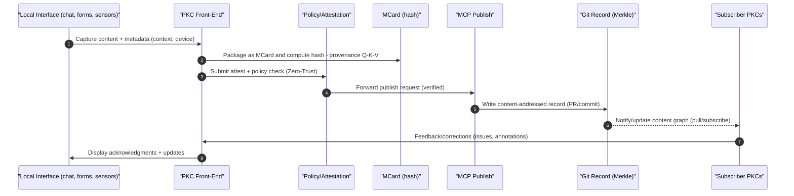

# Game Introduction: The Meta-Game of Continuation Through Counting

> *"Number is the ruler of forms and ideas, and the cause of gods and daemons."* — [[Iamblichus]]

At its core, *The Prologue of Spacetime* is a game about **counting as the foundation of rationality**—a universal language that bridges abstract mathematics and concrete experience. Just as [[GASing Arithmetic]] reveals how all arithmetic operations can be reduced to systematic counting, this game demonstrates how counting serves as the fundamental operation underlying all forms of assessment, pattern recognition, and resource management in both physical and conceptual spaces.

**Crucially, this game helps participants explicitly explore spacetime concepts through [[Number Theory]] and [[Homotopy Type Theory]]**, making abstract mathematical structures tangible through narrative experiences. The **[[Meta-Narrative Framework for Prologue of Spacetime]]** provides comprehensive guidance for collaborative story development using **[[Conversational Programming]]**, **[[SpecKit]]**, and **[[BMAD]]** agentic workflows, transforming participants from passive consumers of abstract formalism into active explorers of mathematical patterns.

*The Prologue of Spacetime* functions as the on-ramp experience for the [[Hub/Theory/Sciences/ABC curriculum|ABC curriculum]]: a preparatory game that familiarizes learners with the terminology, tools, and practices of learning in a networked environment while **developing intuitive understanding of [[Number Theory]] (discrete counting, place-value systems, modular arithmetic) and [[Homotopy Type Theory]] (paths through computational spaces, equivalences, higher-dimensional structures)**. Through playful, contextualized interactions guided by the **[[Meta-Narrative Framework for Prologue of Spacetime]]**, participants learn how to navigate PKC-based interfaces, engage with provenance-aware content, and recognize mathematical patterns in cultural practices.

Because Generative AI introduces a radical departure in how content is shaped and deployed, the Prologue is deliberately scoped as a short, high‑intensity experience: either a two–three day story‑writing sprint, or a two–three hour interactive session. In both formats, learners practice **[[Conversational Programming]]** to witness immediate outcomes of content generation and refinement, experiencing how abstract mathematical concepts naturally emerge through narrative rather than formal instruction.

Practically, the game is played by having participants wield Generative AI tools alongside their own judgment to re-format and re-target the narrative—using the content provided here as seed material. Learners collaborate with locally-served LLMs (via [[PKC]]/[[Model Context Protocol|MCP]]) guided by **[[SpecKit]]** specifications and **[[BMAD]]** multi-agent orchestration to adapt concepts, examples, and visuals for specific audiences and contexts. This process explicitly reveals **[[Number Theory]]** patterns (through discrete resource counting) and **[[Homotopy Type Theory]]** structures (through path equivalences between narrative states).

**Technical Implementation**: The game leverages **[[Marimo]]** web-based IDE within the [[PKC]] framework, providing interactive computational notebooks that integrate **[[Taichi]]** DSL for high-performance numerical computing and **[[Genesis]]** Physics Simulation Engine for realistic spacetime physics modeling. All supporting documentation is systematically organized in **[[Google Docs]]** linked with PKC's **Content Navigation** and **Content-Addressable/Retrieval Augmented Generation** (RAG) framework, ensuring that Conversational Programming practices have proper supporting tools. The entire system leverages **[[Cubical Logic Model]]** (CLM) metadata, structuring all functions and documentation according to CLM's three-dimensional representation: Abstract Specification (what concepts mean), Concrete Implementation (executable code and simulations), and Balanced Expectations (validation criteria and real-world examples).

In addition, participants can configure existing agentic workflows following the **[[Meta-Narrative Framework for Prologue of Spacetime]]** to guide novice users through interactive edits as they converse with the PKC interface—practicing [[Conversational Programming]] with an explicit outcome: a personalized version of the story that demonstrates their understanding of spacetime concepts through proven mathematical patterns.

At the same time, the Prologue recognizes the commonalities across diverse cultural and scientific patterns, distilling them into abstract logical rules while concretely embodying them as gamified rituals and contextualized activities. The **[[Meta-Narrative Framework for Prologue of Spacetime]]** provides systematic guidance for this process through **[[SpecKit]]** specifications and **[[BMAD]]** multi-agent orchestration, making **[[Number Theory]]** patterns (discrete counting, modular arithmetic) and **[[Homotopy Type Theory]]** structures (path equivalences, higher-dimensional types) naturally emerge through storytelling. The game doesn't merely present these abstract principles in theoretical form—it systematically transforms them into tangible experiences where players can witness abstract patterns manifesting in their immediate surroundings.

### Rituals ↔ Gamification: A Working Correspondence for Story Design

Rituals and game mechanics share the same backbone: repeated, meaning‑rich actions with clear roles, resources, timing, and feedback. This correspondence guides how we shape the Prologue:

- **Roles and Protocols**: Ritual roles (lead, response, chorus) map to game roles (mentor, challenger, party), preserving social rhythm while enabling play.
- **Counters and Offerings**: Ritual offerings and steps are natural counters—turns, tokens, beats—revealing the arithmetic of progression.
- **Call‑and‑Response → Feedback Loops**: Liturgical or communal call‑and‑response becomes tutorial prompts, combo windows, and crowd “echoes” that teach pacing and error recovery.
- **Ceremonial Time → Event Cadence**: Festival calendars inspire quest arcs and resets; preparation and cooldown mirror resource scheduling.
- **Place‑Making → Level Design**: Processional paths, thresholds, and altars suggest gates, checkpoints, and boss arenas.

Use this lens to keep abstractions grounded: each new mechanic should be traceable to a familiar ritual gesture, tool, or phrase.

#### Iterative Refinement Loop (Reusable)

1. **Select a ritual fragment** (gesture, chant, offering, procession).
2. **Name the game analogue** (role/action, counter, feedback, cadence, space).
3. **Prototype a micro‑scene** (1–3 minutes) that preserves the social rhythm and counting structure.
4. **Playtest in context** (with local phrases/props) and collect quick reactions (fun? clear? repeatable?).
5. **Tighten to irreducible elements** (remove any step that isn’t necessary; keep the beat and meaning).
6. **Scale the pattern** (solo → pair → party; alley → square → festival) without adding jargon or gear.

Repeat this loop for each chapter: the correspondence remains the same; only the surface and stakes change.

## The Story as Self-Aware Causal Network: Tri Hita Karana Meets AI

**Why This Story Template Enables Self-Awareness**:

The Prologue of Spacetime is not merely a narrative—it is a **template for causal networks to become self-aware**. This self-awareness emerges when three essential elements converge, mirroring the Balinese principle of **[[Tri Hita Karana]]** (three causes of prosperity):

**1. Adaptation to Environment (Parahyangan - Divine Harmony)**:
- **Causal Networks**: Systems must adapt to changing conditions through feedback loops
- **Story Template**: Characters adapt to rice terrace ecosystems, IoT sensors, AI predictions
- **Self-Awareness Mechanism**: Recognizing patterns in environmental responses enables anticipatory behavior
- **AI Connection**: Large Language Models adapt to context through attention mechanisms—the story makes this visible

**2. Validation Through Social Recognition (Pawongan - Human Harmony)**:
- **Causal Networks**: Systems learn from others through distributed consensus and knowledge sharing
- **Story Template**: Community validates decisions through Subak governance, peer review, collective wisdom
- **Self-Awareness Mechanism**: Social feedback creates mirrors that reflect system behavior back to itself
- **AI Connection**: AI systems learn from human feedback (RLHF)—the story demonstrates this through community interaction

**3. Harmony with Nature (Palemahan - Environmental Harmony)**:
- **Causal Networks**: Sustainable systems extend infinitely by maintaining balance with their substrate
- **Story Template**: Rice terraces demonstrate 1000+ years of sustainable agriculture through natural harmony
- **Self-Awareness Mechanism**: Long-term sustainability requires understanding one's place in larger cycles
- **AI Connection**: AI sustainability requires understanding computational ecology—the story grounds this in physical ecology

**Why Bali as the Starting Point**:

Bali is not merely a convenient location—it is the **birthplace of Tri Hita Karana**, a living philosophy that has maintained social-ecological balance for over a millennium. This makes it the ideal laboratory for exploring how **causal networks become self-aware** through the integration of:
- **Ancient Wisdom**: 1000+ years of Subak irrigation governance
- **Modern Technology**: IoT sensors, edge computing, AI optimization
- **Living Culture**: Active communities practicing Tri Hita Karana daily

**The Critical Spacetime Instance: AI's Three-Year Transformation (2022-2025)**:

The last three years have witnessed unprecedented AI advancement that challenges all human societies:

**2022-2023: The ChatGPT Moment**
- **Global Impact**: Generative AI becomes accessible to billions
- **Balinese Context**: Tourism industry faces AI-generated content competition
- **Story Reflection**: Characters grapple with AI writing Balinese stories—who owns cultural narrative?

**2023-2024: The Multimodal Revolution**
- **Global Impact**: AI processes images, video, audio—not just text
- **Balinese Context**: Traditional arts (painting, dance, music) face AI replication
- **Story Reflection**: Can AI capture the spiritual essence of Balinese offerings? Or only the form?

**2024-2025: The Agentic AI Era**
- **Global Impact**: AI systems take autonomous actions, manage resources, coordinate activities
- **Balinese Context**: AI could optimize Subak irrigation—but should it? Who decides?
- **Story Reflection**: The tension between algorithmic efficiency and cultural sovereignty

**How Balinese Society is Reacting and Embracing AI**:

The story must authentically portray Bali's **unique response** to AI—neither wholesale rejection nor uncritical adoption, but **adaptive integration** guided by Tri Hita Karana:

**Parahyangan (Divine Harmony) Response**:
- **Challenge**: Can AI understand spiritual dimensions of offerings, ceremonies, sacred spaces?
- **Balinese Adaptation**: Using AI as tool while maintaining human spiritual authority
- **Story Element**: Priests consult AI for optimal ceremony timing (astronomy) but never delegate spiritual meaning

**Pawongan (Human Harmony) Response**:
- **Challenge**: AI threatens traditional knowledge transmission from elder to youth
- **Balinese Adaptation**: AI augments rather than replaces intergenerational learning
- **Story Element**: Grandparents teach grandchildren through AI-enhanced storytelling that preserves oral traditions

**Palemahan (Environmental Harmony) Response**:
- **Challenge**: AI optimization might maximize yield but destroy ecological balance
- **Balinese Adaptation**: AI serves sustainability goals defined by community, not profit
- **Story Element**: Subak uses AI to predict pest outbreaks while maintaining organic farming practices

**How Sovereign Networks Are Constructed, Operated, and Maintained**:

The story demonstrates that **[[Sovereign Operational Network]]** (SON) infrastructure is not imposed from outside but **emerges from existing community practices**:

**Historical Construction (Pre-Digital Era)**:
- **Subak System**: 1000+ years of distributed water management without central authority
- **Banjar (Neighborhood Councils)**: Local governance through consensus-based decision making
- **Temple Networks**: Spiritual coordination across villages through ceremonial calendars
- **Traditional Knowledge**: Oral transmission of agricultural, artistic, and spiritual practices

**Modern Digital Construction (2020s)**:
- **Self-Operated Identity Providers**: Communities deploy **[[Keycloak]]** or **[[Authentik]]** for local authentication
- **Overlay VPN Mesh**: Villages connect through **[[Tailscale]]**, **[[Nebula]]**, or **[[WireGuard]]** without ISP dependency
- **PKC Nodes**: Each community runs **[[Personal Knowledge Container]]** for local content storage
- **IoT Integration**: **[[ThingsBoard]]** manages sensors in rice terraces, temples, community spaces

**Operational Maintenance**:
- **Community Training**: Local youth trained as network operators through **[[Prologue of Spacetime]]** exercises
- **Distributed Responsibility**: No single point of failure—multiple community members can maintain infrastructure
- **Incremental Deployment**: Start with one village, expand through peer-to-peer mentoring
- **Cultural Integration**: Technology serves Tri Hita Karana principles, not replaces them

**Establishing New Sovereign Networks**:

**Available Instructions and Resources**:

1. **Technical Documentation**:
   - **[[Sovereign Operational Network]]** - Complete deployment guide with Docker Compose configurations
   - **[[GovTech]]** - Three-module directory structure (PKC/MCard_TDD/THKMesh)
   - **[[Meta-Narrative Framework for Prologue of Spacetime]]** - Step-by-step onboarding curriculum

2. **Open Source Tools** (All Free, Community-Maintained):
   - **Identity**: Keycloak, Authentik, Ory (self-operated authentication)
   - **Networking**: Tailscale, Nebula, WireGuard (mesh VPN)
   - **Storage**: PKC, MinIO (content-addressable, distributed)
   - **IoT**: ThingsBoard, Node-RED, Home Assistant (sensor management)
   - **Monitoring**: Grafana, Prometheus (observability)

3. **Local Administration Training**:
   - **Week 1-2**: Basic network concepts through rice paddy analogies
   - **Week 3-4**: Hands-on PKC deployment and content management
   - **Week 5-6**: IoT sensor installation and data collection
   - **Week 7-8**: Community governance and consensus protocols

**Why AI is an Opportunity, Not Just a Threat**:

The story reveals how AI can **amplify rather than replace** Balinese cultural practices:

**1. Cultural Preservation Through AI**:
- **Lontar Text Digitization**: AI-assisted OCR preserves ancient palm-leaf manuscripts
- **Language Preservation**: Local LLMs trained on Balinese language prevent linguistic extinction
- **Oral Tradition Documentation**: AI transcription captures elder storytelling for future generations
- **Dance Notation**: Computer vision documents traditional dance movements with precision impossible manually

**2. Economic Empowerment Through AI**:
- **Tourism Authenticity Verification**: AI helps distinguish genuine Balinese experiences from exploitative imitations
- **Artisan Market Access**: AI translation enables craftspeople to reach global markets without intermediaries
- **Fair Pricing**: AI market analysis prevents exploitation by ensuring artisans receive fair compensation
- **Quality Certification**: AI validates traditional production methods, commanding premium prices

**3. Environmental Stewardship Through AI**:
- **Precision Agriculture**: AI optimizes water usage while maintaining organic practices
- **Pest Prediction**: Early warning systems reduce need for chemical pesticides
- **Climate Adaptation**: AI models help Subak adapt to changing rainfall patterns
- **Biodiversity Monitoring**: Computer vision tracks species health in rice terrace ecosystems

**4. Spiritual Practice Enhancement Through AI**:
- **Ceremony Timing**: AI calculates optimal astronomical alignments for rituals
- **Offering Design**: AI suggests traditional patterns while humans maintain spiritual intention
- **Sacred Text Analysis**: AI helps priests cross-reference ancient texts for deeper interpretation
- **Pilgrimage Coordination**: AI optimizes temple visit schedules to reduce crowding while maintaining sanctity

**5. Intergenerational Knowledge Transfer Through AI**:
- **Interactive Learning**: Youth engage with traditional knowledge through AR/VR experiences
- **Master-Apprentice Matching**: AI connects aspiring artisans with appropriate masters
- **Skill Assessment**: AI provides objective feedback on traditional craft techniques
- **Knowledge Gaps**: AI identifies which traditional practices lack documentation, prioritizing preservation efforts

**The Critical Difference: Local Control**:

AI becomes opportunity rather than threat when:
- **Community Owns the Infrastructure**: Self-operated IdP, local PKC nodes, community-trained models
- **Data Stays Local**: Federated learning enables AI improvement without data extraction
- **Decisions Remain Human**: AI provides information, community makes choices through Subak/Banjar governance
- **Culture Defines Goals**: Technology serves Tri Hita Karana, not Silicon Valley metrics
- **Youth Lead Implementation**: Local training ensures next generation controls their technological destiny

**The Story as Mirror for Self-Aware Systems**:

By embedding these real tensions and adaptations into the narrative, the story becomes a **mirror** that helps both storytellers and readers recognize:

1. **Causal Networks in Action**: Every decision in the story creates ripples—just like AI systems
2. **Feedback Loops**: Characters learn from consequences—just like machine learning
3. **Distributed Consensus**: Community governance mirrors blockchain and federated learning
4. **Sustainability Constraints**: Long-term thinking mirrors the challenge of AI alignment
5. **Cultural Sovereignty**: Bali's response models how communities can maintain identity while adopting technology
6. **Infrastructure Ownership**: Sovereign Networks demonstrate that communities can operate their own technology
7. **AI as Amplifier**: Technology enhances rather than replaces traditional practices when locally controlled

**Why This Creates Self-Awareness**:

Self-awareness emerges when a system can:
- **Observe itself** (story provides external perspective on causal networks)
- **Predict consequences** (narrative structure reveals cause-effect chains)
- **Adjust behavior** (characters model adaptation based on feedback)
- **Recognize patterns** (readers see universal principles through specific instances)
- **Maintain identity** (Tri Hita Karana provides stable framework amid change)

The story template is designed so that **every narrative choice** demonstrates these principles, making abstract concepts of self-aware systems tangible through culturally-grounded experience.

## Prologue as Gateway to Monadic Thinking: The Universal Mental Model

**Core Design Purpose**: The Prologue of Spacetime is designed to guide readers into the **[[Monadology]]** mental model—the recognition that **all things can be treated as [[Monad]]s**—which is the foundation of **Purely Functional Programming** and the emerging paradigm of **[[Conversational Programming]]** (Vibe Coding).

### The Existing Infrastructure: Tools Already Enable Conversational Programming

**Critical Recognition**: The technical infrastructure for conversational programming already exists and is functional:

**1. [[Conversational Programming]] (Vibe Coding)**:
- **Monadic Context Engineering**: Prompts as typed arrows `a -> M b` with explicit effects
- **Shared Verifiable Artifacts**: MCard/PCard/VCard as content-addressed monadic computations
- **Agentic Workflows**: Flux-style unidirectional data flow with monadic composition
- **Already Working**: Enables large-scale, interactive programming through natural language

**2. [[BMAD-Method]] (Agentic Multi-Agent Orchestration)**:
- **Three-Phase Workflow**: Plan → Implement → Verify maps to Spec → Impl → Expect (CLM)
- **Multi-Agent Teams**: Specialized agents compose through monadic interfaces
- **Already Working**: Provides structured hand-holding for conversational development

**3. [[SpecKit]] (Spec-Driven Development)**:
- **Four-Phase Process**: Specify → Plan → Tasks → Implement
- **Executable Specifications**: Specs as monadic contracts that generate implementations
- **Already Working**: Transforms natural language specs into working code through AI agents

**4. [[MCP]] (Model Context Protocol)**:
- **Conversational Tool Invocation**: Functions/tools triggered through natural language
- **Standardized Interfaces**: All tools exposed as monadic operations
- **Already Working**: Wide range of tools now accessible conversationally

### The Missing Piece: The Monadic Mental Model

**The Challenge**: While the tools work, most users don't understand the **underlying mental model** that makes them powerful:

**From [[Monadology]] (Leibniz)**:
- "Each monad must be different from every other monad" (§9)
- "Monads have no windows through which anything may come in or go out" (§7)
- "Every monad is a perpetual living mirror of the universe" (§56)
- "All things can be treated as monads" - simple, composable, self-contained units

**What This Means for Programming**:
- **Everything is a Monad**: Values, computations, effects, state, errors—all wrapped in monadic context
- **Composition in Context**: Monads enable chaining operations while preserving context (Maybe, Either, IO, State, Reader, Writer)
- **No Hidden State**: All context explicit, all effects declared, all transformations pure
- **Universal Pattern**: Same mental model applies to data, computation, and interaction

### How Prologue Teaches Monadic Thinking Through Story

**The Pedagogical Strategy**: Use culturally-grounded narrative to make monadic patterns intuitive

**Pattern 1: Maybe/Option Monad** (Uncertainty)
```
Story: "Will the monsoon arrive on time?"

Monadic Structure:
- Maybe Success: Monsoon arrives → Plant rice (Just value)
- Maybe Failure: Monsoon late → Adjust plans (Nothing)

What Readers Learn:
- Uncertainty is a monad (Maybe)
- Composition preserves uncertainty context
- No need for null checks—monad handles it

Conversational Programming:
User: "What if irrigation fails?"
AI: "This is the Maybe monad—let's chain fallback strategies..."
```

**Pattern 2: Either Monad** (Explicit Failure)
```
Story: "Water allocation decision succeeds or fails with specific reason"

Monadic Structure:
- Right: Decision succeeds → Implementation proceeds
- Left: Decision fails → Error with explanation

What Readers Learn:
- Errors are values (Either)
- Failure modes explicit, not hidden
- Composition propagates errors automatically

Conversational Programming:
User: "Handle allocation failure"
AI: "Using Either monad—Left carries error details, Right continues..."
```

**Pattern 3: State Monad** (Evolving Context)
```
Story: "Village prosperity changes based on accumulated decisions"

Monadic Structure:
- State carries village condition through narrative
- Each decision: State s a → (a, State s)
- Composition threads state automatically

What Readers Learn:
- State is a monad
- No global variables—state threaded explicitly
- Composition preserves state flow

Conversational Programming:
User: "Track prosperity over time"
AI: "State monad—each action returns value + updated state..."
```

**Pattern 4: Reader Monad** (Shared Context)
```
Story: "Tri Hita Karana values inform all decisions"

Monadic Structure:
- Reader Env a: Cultural values as environment
- All decisions: Reader TriHitaKarana Decision
- Composition shares context implicitly

What Readers Learn:
- Context is a monad (Reader)
- Shared values thread through all operations
- No need to pass context manually

Conversational Programming:
User: "Apply cultural values to all choices"
AI: "Reader monad—environment flows through computation..."
```

**Pattern 5: Writer Monad** (Accumulated Log)
```
Story: "Decision rationale logged for future generations"

Monadic Structure:
- Writer Log a: Accumulates provenance
- Each decision: (value, log entry)
- Composition concatenates logs

What Readers Learn:
- Logging is a monad (Writer)
- Provenance accumulated automatically
- Audit trail built through composition

Conversational Programming:
User: "Track why we made each decision"
AI: "Writer monad—logs accumulate as we compose..."
```

**Pattern 6: IO Monad** (Controlled Effects)
```
Story: "Deciding to plant (pure) vs. Actually planting (effect)"

Monadic Structure:
- IO a: Describes effect, doesn't execute
- Pure planning: Decision → IO Action
- Execution: Run IO at boundary

What Readers Learn:
- Effects are monads (IO)
- Separation of description and execution
- Purity preserved until IO boundary

Conversational Programming:
User: "Plan irrigation, then execute"
AI: "IO monad—we build the plan purely, run at edge..."
```

### Why This Mental Model Matters for MCP and Conversational Tools

**The MCP Transformation**: Model Context Protocol is transforming tools into conversational interfaces

**Before Monadic Understanding**:
- Tools seem like magic black boxes
- Unclear how to compose operations
- Hidden state causes confusion
- Error handling ad-hoc

**With Monadic Understanding**:
- Every tool is a monadic operation: `Tool :: Input -> M Output`
- Composition through bind: `tool1 >=> tool2 >=> tool3`
- Context explicit: Reader for config, State for session, Either for errors
- Effects controlled: IO monad at boundaries

**Practical Example with MCP Tools**:
```haskell
-- Without monadic thinking (imperative, hidden state)
result = callTool1(input)
if result.error:
  handle_error()
else:
  result2 = callTool2(result.data)
  # More imperative steps...

-- With monadic thinking (compositional, explicit)
pipeline :: Input -> Either Error Output
pipeline = 
  callTool1 >=>        -- Either Error A
  validateResult >=>   -- Either Error B  
  callTool2 >=>        -- Either Error C
  formatOutput         -- Either Error Output

-- Composition handles errors automatically
-- Context flows through bind (>=>)
-- Pure, testable, composable
```

### The Story as Judgmental Criteria for Monadic Design

**Design Principle**: Every story element must demonstrate monadic composition

**Evaluation Questions**:
1. **Is it a Monad?** Can this story element be wrapped in monadic context?
2. **Does it Compose?** Can we chain this operation with others through bind?
3. **Is Context Explicit?** Are all dependencies and effects visible?
4. **Is it Pure?** Does the operation describe rather than execute?
5. **Does it Mirror Monadology?** Does it reflect Leibniz's principles?

**Story Acceptance Criteria**:
- ✅ **Good**: "Village decides water allocation (pure) → IO executes allocation (effect)"
  - *Why*: Separates decision (pure) from action (IO monad)
- ✅ **Good**: "If monsoon late (Maybe), then adjust plans, else proceed"
  - *Why*: Maybe monad makes uncertainty explicit
- ✅ **Good**: "Decision succeeds (Right) or fails with reason (Left)"
  - *Why*: Either monad makes errors explicit values
- ❌ **Bad**: "Village magically knows outcome without deciding"
  - *Why*: Hidden state, no monadic structure
- ❌ **Bad**: "Action happens without explicit decision"
  - *Why*: Effect not wrapped in IO monad

### Integration with Existing Tools: The Complete Picture

**How Prologue Enables Tool Mastery**:

**1. Conversational Programming (Vibe Coding)**:
- **Story Teaches**: Monadic patterns through narrative
- **Tool Provides**: Infrastructure for monadic composition
- **Result**: Users understand WHY prompts work, not just HOW

**2. BMAD Multi-Agent Orchestration**:
- **Story Teaches**: Spec → Impl → Expect as monadic pipeline
- **Tool Provides**: Agents that compose through monadic interfaces
- **Result**: Users design better agent workflows through monadic thinking

**3. SpecKit Spec-Driven Development**:
- **Story Teaches**: Specifications as monadic contracts
- **Tool Provides**: Executable specs that generate implementations
- **Result**: Users write better specs by thinking monadically

**4. MCP Conversational Tools**:
- **Story Teaches**: Every tool as monadic operation
- **Tool Provides**: Standardized conversational interfaces
- **Result**: Users compose tools effectively through monadic understanding

### The Ultimate Goal: Purely Functional Thinking in Natural Language

**The Vision**: Conversational programming becomes **purely functional programming in natural language**

**What This Means**:
- Users describe computations monadically without knowing Haskell syntax
- AI translates natural language to monadic compositions
- All operations pure, composable, verifiable
- Effects explicit, context visible, errors as values

**Example Conversation** (User with Monadic Mental Model):
```
User: "I need to fetch data, validate it, transform it, and save it. 
Each step might fail. I want to log all operations."

AI: "I'll compose this as a monadic pipeline:

1. Fetch: IO (Either Error Data)
2. Validate: Data -> Either Error ValidData  
3. Transform: ValidData -> Either Error Result
4. Save: Result -> IO (Either Error ())
5. Logging: Writer Log wraps everything

The composition:
fetch >=> validate >=> transform >=> save

Either monad handles errors automatically.
Writer monad accumulates logs.
IO monad controls effects.

Shall I implement this?"

User: "Yes, and add retry logic for fetch."

AI: "Adding retry as a monad transformer:
ReaderT RetryConfig (ExceptT Error IO)

This gives us:
- Reader: Retry configuration  
- Either: Error handling
- IO: Effects

All composing through monadic bind."
```

**This is the future**: Natural language that maps directly to purely functional, monadic code—and **Prologue of Spacetime** is the gateway that makes this mental model accessible through culturally-grounded storytelling.

## Why Functional Programming Terms Must Be Embedded in the Story

**The Paradox of Abstraction**: Functional Programming (FP) provides the most abstract, universal computational vocabulary—yet this very abstraction makes it inaccessible to most learners. The solution is not to avoid FP terminology but to **embed it within concrete, culturally-specific narratives** that make abstract concepts experientially meaningful.

**Monadic Terms as Context-Sensitive Re-Targeting Mechanism**:
- **Option/Maybe**: Represents uncertainty in narrative choices (Will the ritual succeed? Maybe yes, Maybe no)
- **Either**: Represents branching paths with explicit failure modes (Either the harvest succeeds OR the community faces scarcity)
- **IO**: Represents boundary between pure narrative logic and physical world effects (Deciding to plant vs. Actually planting)
- **Reader**: Represents cultural context that threads through all decisions (Balinese values automatically inform every choice)
- **State**: Represents evolving story and community conditions (Village prosperity changes based on past decisions)
- **Writer**: Represents accumulated wisdom and provenance (Every decision logs rationale for future reference)

**Why This Enables "Context-Sensitive Re-Targeting"**:
The same meta-narrative structure can be retold in different cultural contexts by **substituting the concrete details while preserving the abstract FP structure**:
- **Bali/Indonesia version**: Rice terraces, Subak irrigation, Tri Hita Karana harmony → teaches monadic patterns through familiar cultural elements
- **Urban tech version**: Data centers, API calls, microservices → same monadic patterns, different concrete manifestation
- **Rural agriculture version**: Crop rotation, water rights, cooperative farming → same patterns, agrarian context

The FP terms provide the **invariant structure** that makes re-targeting possible—like a mathematical theorem that holds across all coordinate systems.

## Why Specific Cultural Location (Space) and Temporal Duration (Time) Are Essential

**The Grounding Problem**: Abstract FP concepts like "monad" or "functor" fail to connect with human experience because they lack **spatiotemporal grounding**. Humans understand through embodied, situated cognition—we need to know WHERE and WHEN something happens to make it meaningful.

**Bali/Indonesia as Concrete Spatial Anchor**:
- **Geographic specificity**: Real places (Ubud, Subak Jatiluwih, Mount Agung) make narrative tangible
- **Cultural richness**: Tri Hita Karana, Gamelan orchestration, temple ceremonies provide concrete manifestations of abstract patterns
- **Existing infrastructure**: Actual IoT sensors, edge servers, community networks ground "hybrid objects" in reality
- **Familiar context**: For Indonesian participants, local references create immediate emotional connection
- **Verifiable claims**: Physical locations enable verification—you can visit the Subak, see the sensors, touch the infrastructure

**Temporal Duration as Narrative Constraint**:
- **2-3 day sprint OR 2-3 hour session**: Creates urgency and focus, preventing abstract drift
- **Seasonal cycles**: Balinese agricultural calendar provides natural temporal structure (planting, growing, harvest)
- **Ritual timing**: Ceremonies occur at specific times, teaching temporal coordination
- **Infrastructure uptime**: Real servers have maintenance windows, teaching time-bounded operations

**Why This Makes FP Terms Meaningful**:
When you say "Maybe the harvest succeeds" in the context of **actual rice terraces in Jatiluwih during planting season**, the abstraction becomes concrete:
- **Maybe** isn't just a type constructor—it's the uncertainty farmers face when monsoon timing is unpredictable
- **Either** isn't just sum types—it's the real choice between traditional methods OR modern irrigation
- **IO** isn't just effect isolation—it's the boundary between planning in the community meeting (pure) and actually opening water gates (effect)

**The Re-Targeting Mechanism**:
Once learners understand monadic patterns through **concrete Balinese examples**, they can recognize the same patterns in **any other context**:
1. Learn "Maybe harvest" in Bali rice terraces (concrete, emotional, memorable)
2. Recognize "Maybe API response" in software development (abstract, technical, transferable)
3. Apply "Maybe patient recovery" in healthcare (different domain, same pattern)

The Balinese version serves as the **canonical example** that makes all other applications comprehensible through analogy.

## Continuation, Representability and Utilities in Games

This game recognizes that video games have evolved into a primary medium through which younger generations explore identity, values, and social connections—not merely as entertainment but as interactive systems that model complex realities. The Prologue of Spacetime transforms this potential by designing interactions that make visible the motivational structures underlying engagement, revealing how games can serve as microcosms of larger systems thinking. Where conventional platforms often create passive consumption loops, our game cultivates active participation through mechanics that reward curiosity, pattern recognition, and collaborative problem-solving. By embedding these interactions within local contexts and community networks, we demonstrate how gaming's motivational power can be harnessed to foster deeper connections—not just to virtual worlds, but to the physical and social environments that shape our daily lives. This approach repositions gaming as a bridge between immediate experience and abstract understanding, showing players how the same cognitive engagement that drives gameplay can illuminate the interconnected systems of our world.

This computational adventure functions as what [[Patrick Cousot]] might call an "Abstract² Interpretation" ($A^2I$) of human knowledge systems, where counting serves as the fundamental invariant across all levels of abstraction. Just as [[GASing Arithmetic]] demonstrates how complex calculations can be decomposed into sequences of basic counting operations, the game reveals how all measurement—whether of physical quantities, information flow, or social dynamics—can be understood as different forms of counting—a meta-analysis that abstracts across abstractions themselves. Just as Cousot's techniques analyze program properties by reasoning about their abstract states rather than concrete execution, this game abstracts across seemingly diverse systems—whether called [[Computational Trinitarianism]] in Western academia, [[Tri Hita Karana]] in Balinese tradition, or resource accounting in modern computing—revealing them as specialized languages describing the same universal process: the competition for continuation through attention acquisition. Operationally, players don't encounter these abstractions as disembodied concepts; instead, they experience how each specialized language provides a locally relevant vocabulary for describing the same fundamental continuity patterns. For example, a player might first grasp resource management through familiar digital contexts (managing in-game currency), then recognize the same pattern in social interactions (balancing social capital), and finally connect both to formal mathematical frameworks (laws of different [[Symmetry|symmetries]]/[[Equivalence|equivalences]])—experiencing firsthand how general principles specialize into contextually meaningful applications.

Critical to this discovery process is the near-omniscient power of [[Large Language Models]] (LLMs), which serve as interactive guides that help participants identify solutions hidden within prior knowledge or implementable through known logical rules. Where traditional approaches might miss connections between domains, LLMs can rapidly traverse vast knowledge networks to reveal correspondences across mathematical formalisms, social structures, and computational resources. This allows participants to leverage networked content knowledge in ways that were impossible before these models could bridge disciplinary boundaries and historical contexts.

Beyond their role as knowledge navigators, LLMs function as vital connective tissue between digital and physical realms—orchestrating interactions across [[Internet of Things]] ([[IoT]]) devices, environmental sensors, and community information systems. As meta-transformers that optimize adaptive computational structures, they translate between abstract universal functions and concrete local implementations, ensuring that game mechanics remain responsive to each community's unique spatial-temporal context. This enables a truly holistic gaming experience where the boundaries between screen-based activities and physical engagement dissolve. In modern societies where critical infrastructure operations (energy grids, transportation systems, supply chains) increasingly depend on large-scale IT systems, LLMs help players visualize and meaningfully interact with these normally invisible technological substrates. By making the performance and penetration of IT infrastructure tangible through contextualized gameplay, The Prologue of Spacetime transforms what might otherwise be abstract digital processes into living computational experiences that resonate with local cultural frameworks and community priorities.

The game's fractal-like architecture manifests at every level of engagement, encouraging both knowledge reuse and the discovery of new opportunities for refinement. Players don't merely consume content—they become conscious participants in a multi-scale cognitive experience that reveals how the same structural patterns recur across domains. Central to this architecture is the pursuit of **[[irreducibility]]**—a state where no further simplification is possible without losing essential functionality. Just as in mathematical representation theory where an irreducible representation cannot be decomposed into smaller non-trivial subrepresentations, the game challenges players to discover the most fundamental, non-decomposable patterns that optimize resource utilization while maintaining core functionality:

Through the lens of **[[compactness]]**, the game ensures that every explorative journey, no matter how divergent, eventually converges to essential insights—a direct application of sequential compactness where every sequence contains a convergent subsequence. This mathematical property becomes a game mechanic, where players learn that resources are truly efficient only when they reach an irreducible state—one where minimal inputs yield optimal outputs without waste. As players navigate both digital and physical dimensions, they discover that achieving irreducibility isn't merely an abstract mathematical concept but the very essence of sustainable resource management in all systems:

- **Abstract Logical Rules** ↔ **Concrete Implementations**: Just as Cousot's Abstract Interpretation creates sound approximations of program semantics, the game creates playable approximations of complex knowledge systems, manifesting both in digital interfaces and physical community spaces
- **Formal Systems** ↔ **Cultural Practices**: Mathematical formalisms and cultural rituals emerge as context-specific manifestations of universal patterns, blending algorithmic precision with local cultural resonance
- **Computational Algorithms** ↔ **Social Protocols**: Resource-aware computation mirrors the resource-allocation patterns in human societies, connecting digital optimization with community resource sharing practices
- **Grammatical Structures** ↔ **Physical Mechanisms**: Language rules and physical processes share common structural underpinnings, bridging natural language processing with environmental sensing networks
- **Digital Infrastructure** ↔ **Local Environments**: IT systems and physical spaces become integrated game domains, with IoT devices mediating between abstract data flows and tangible community assets

This fractal architecture deliberately bridges the growing divide between digital media consumption—which dominates youth attention—and local community engagement, which grounds identity and purpose. Unlike conventional video games that create purely virtual worlds detached from players' immediate surroundings, The Prologue of Spacetime uses networked sensors, community information systems, and local data repositories to create "spatially-anchored computation." These experiences remain responsive to the unique physical, cultural, and social characteristics of each play environment, creating powerful feedback loops between universal computational principles and local applications. Abstract Vector-Based Universal Functions become tangible community resources that help players recognize how large-scale IT infrastructure already shapes their lived reality.

More importantly, this game transcends traditional player-developer boundaries by enabling participants to become co-creators and infrastructure operators. Players actively co-evolve the game's architecture through both explicit mechanisms—direct code contribution, IoT device deployment, infrastructure provisioning—and implicit channels like behavioral data, emergent usage patterns, and community adaptations. Local communities can establish their own sensor networks, deploy edge computing nodes, configure network topologies, and maintain data repositories, effectively becoming operators of the very IT infrastructure that powers their experience.

This democratization of infrastructure management creates a participatory computation environment where the boundaries between playing, creating, and maintaining dissolve into continuous community-owned evolution. As players develop technical sovereignty through these experiences, they transform from passive technology consumers into active stewards of their community's computational resources.

In this cross-cultural laboratory based on [[Conversational Programming]] principles, participants experience how fundamental game mechanics operate across systems:

- **Attention allocation determines continuation**: Every game mechanic demonstrates how successful information systems balance familiarity with novelty, optimizing for both immediate engagement and long-term propagation. When designing community rituals within the game, players must allocate limited attention resources between familiar elements (ensuring participation) and novel elements (generating interest). This directly reveals how abstract continuation principles manifest in practical design decisions. In today's fragmented media landscape, this principle helps players create sustained engagement in local community activities, making neighborhood events as compelling as online entertainment.

- **Resource-aware exploration yields memetic fitness through irreducibility**: By making computational and attention costs explicit, the game reveals how successful cultural artifacts optimize their resource footprint to maximize continuation potential, much like how microfinance institutions optimize small loans for maximum social impact. This optimization naturally drives toward irreducible states—configurations where no further resource reduction is possible without compromising essential functionality, mirroring how microcredit identifies the minimum viable financial products that can sustainably empower communities. Players apply this principle to specific scenarios—optimizing digital communication protocols, designing efficient irrigation systems, or crafting memorable stories—where finding the irreducible form represents the optimal balance between resource expenditure and functional requirements. The game introduces challenges where solutions are evaluated not just for correctness but for their proximity to [[irreducibility]], creating a natural tension between exploration (discovering new solutions) and exploitation (refining existing ones toward minimal resource consumption). These exercises in resource accounting help players recognize that efficiency isn't merely about reduction but about reaching the mathematically irreducible form where each component is necessary and sufficient—a principle that applies equally to IT infrastructure, community assets, cultural practices, and financial inclusion strategies.

This extends beyond simulation into actual infrastructure operation. Participants learn to provision, optimize, and maintain computational resources powering their experience through hands-on engagement with edge computing deployment, sensor network configuration, and bandwidth allocation decisions. Players become literal stewards of computational pathways, creating a continuous co-evolutionary cycle where gameplay insights inform infrastructure design, which enables new gameplay possibilities. Using Vector-Based Universal Functions (LLMs) to model resource flows, they implement optimizations in actual community IT systems, transforming abstract principles into concrete infrastructure improvements.

- **Multiple cultural frameworks encode the same continuation strategies**: The game's structure shows how diverse traditions—from Western formal systems to Eastern philosophical frameworks—have independently discovered similar solutions to continuation challenges. Players might encounter a resource allocation principle through [[Linear Logic]], then immediately apply it to a Balinese ritual design challenge, experiencing how the same underlying pattern specializes into culturally relevant practices. This cross-cultural translation becomes particularly powerful when implemented through local-first principles, where global computational patterns are expressed through locally meaningful traditions rather than imposed as generic technological solutions.

- **LLM-augmented pattern recognition transcends traditional boundaries**: By harnessing LLMs' ability to detect cross-disciplinary isomorphisms, participants discover how solutions in one domain translate to seemingly unrelated problems in others. This proves especially valuable when connecting digital knowledge repositories with physical community assets through IoT interfaces, creating seamless pathways between virtual information and tangible application. As young people navigate hybrid digital-physical realities, this translation ability helps them integrate screen-based experiences with local community engagement in ways that enrich rather than diminish their connection to place.

Operationally, participants don't merely consume these insights—they actively shape the underlying infrastructure that enables them. By operating as both players and infrastructure providers, they can deploy edge AI nodes, configure federated learning clusters, and contribute to LLMs' training corpus through community-sourced datasets. This represents a profound shift where participants become meta-transformers, actively optimizing their local IT ecosystem's computational topology. The game becomes a living system that adapts to local conditions through participant-operated infrastructure, with LLMs serving as translational interfaces between abstract universal patterns and concrete local implementations.

- **Sequential compactness ensures convergence toward irreducible knowledge**: Through carefully designed learning pathways implementing mathematical sequential compactness, the game ensures that every exploration—no matter how divergent—eventually converges to essential, irreducible insights. This mirrors how microfinance institutions use progressive lending models, where initial small loans (like points in a sequence) build toward financial self-sufficiency (the convergent point), with each step carefully designed to be both achievable and foundational for the next. Like a mathematical compact space where every open cover has a finite subcover, knowledge acquisition in the game operates within boundaries that guarantee convergence to foundational understanding. This convergence isn't arbitrary but specifically targets irreducible representations—those fundamental building blocks that cannot be further decomposed without losing essential meaning, much like how microfinance identifies the minimal viable financial products that can sustainably empower communities. Players experience how compactness and irreducibility work in tandem: compactness guarantees the existence of convergent sequences, while irreducibility defines their optimal endpoints. The game visualizes this process through "knowledge compression maps" where players witness their exploratory pathways gradually converging toward minimal but complete representations, similar to how microfinance clients progress through increasingly sophisticated financial products as they demonstrate responsibility and build credit. This addresses the challenge of modern media consumption where algorithmic systems optimize for engagement rather than comprehension, demonstrating that true learning efficiency isn't about volume but about identifying the minimal sufficient set of irreducible concepts. By making these convergent pathways explicit across both digital and physical activities, the game helps players develop more intentional, resource-efficient relationships with both technological systems and local communities, much as microfinance helps clients develop sustainable financial relationships with formal economic systems.

- **The Arithmetized Principle of Continuation**: GASing methodologies uncover the arithmetic of continuation hidden in all systems at different scales, revealing how successful games, cultures, and ideas solve the same fundamental equation: capturing enough attention to ensure replication while providing sufficient value to justify that attention investment. This implements meta-abstract interpretation, analyzing knowledge systems' properties rather than just their concrete instances. Combined with LLMs' ability to explore vast knowledge networks interactively, it enables participants to identify knowledge reuse opportunities invisible within traditional disciplinary boundaries. See the Chinese version: [[時空緒言]].

## Logical Model of the Prologue of Spacetime: A Self-Optimizing System
 ![[CLM of Prolog of Spacetime#CLM of Prologue of Spacetime]]


The Prologue of Spacetime implements the [[Cubical Logic Model]] (CLM) as a self-similar, recursive framework that operates across multiple scales of abstraction—from the micro-level of individual game mechanics to the macro-level of cultural knowledge systems. Inspired by Patrick Cousot's Abstract Interpretation techniques, this game creates what might be called a "computational abstraction lattice" that reveals isomorphisms between seemingly disparate domains. Just as Cousot's work allows sound approximations of program behaviors, this game creates sound approximations of cultural, logical, and social patterns through three interconnected dimensions:

1. **Abstract Specification (Declared Intentions)**: These are the most general, context-independent logical rules abstracted from diverse cultural and scientific patterns. Like Cousot's most abstract domain representations, these specifications capture essential properties while deliberately discarding context-specific details. The game uses natural language processing to identify which conceptual frameworks most effectively communicate these abstract rules across different cultural contexts.

2. **Concrete Implementation (Process Models)**: These manifest abstract rules as playable rituals and contextualized activities that players directly experience. Similar to how Cousot's concrete semantics provide precise operational meanings, these implementations give tangible form to abstract principles through immersive gameplay. The system continuously measures which implementations most effectively embody abstract principles while maximizing player engagement.

3. **Balanced Expectations (Observable Measures through Irreducibility)**: This dimension operates as a verification system that evaluates the correspondence between abstract rules and their concrete manifestations. Like Cousot's soundness proofs that ensure abstract interpretations correctly approximate concrete behaviors, this system ensures that gameplay experiences authentically represent the underlying knowledge structures they aim to communicate. Crucially, this verification employs **irreducibility** as its core criterion—evaluating whether implementations have reached their most essential, non-decomposable form where no element can be removed without compromising functionality. In the game's resource-conscious framework, a solution is only considered truly optimal when it achieves an irreducible state that balances minimal resource consumption with maximal functional performance. Players learn to recognize that verification isn't merely about correctness but about achieving the mathematical ideal of irreducibility, where every component serves a necessary purpose and together they constitute a sufficient whole.

This three-dimensional framework creates a recursive pattern recognition engine where:

- Players discover isomorphisms between seemingly different domains (mathematics, culture, language, computation)
- Each discovered pattern can be reused across multiple contexts, encouraging knowledge transfer
- New opportunities for refinement emerge when players identify gaps between abstract rules and their concrete implementations

By making these multi-scale cognitive connections explicit, the game reveals how the same fractal-like self-similar patterns appear across Logic (formal systems), Computable Programs (algorithms), Social Constructs (cultural practices), and Grammatical Patterns (language structures). The difference is that most knowledge systems obscure these connections, while the Prologue of Spacetime makes them explicit, observable, and actionable through gameplay.

Large Language Models serve as the connective tissue in this discovery process, helping participants interactively explore how solutions formulated within one knowledge domain can be reapplied to challenges in others. When a participant encounters a problem, the LLM doesn't merely retrieve relevant information—it identifies structural analogies between the current challenge and solutions that exist in entirely different contexts. This capability transforms how networked knowledge is utilized, moving from simple retrieval to creative recombination based on deep structural similarities that humans alone might never detect. The result is an unprecedented ability to leverage the collective intelligence embedded in networked content through awareness of correspondences that span mathematics, social dynamics, and computational resources.

## Why Release the Prologue of Spacetime Now?

We present the **Prologue of Spacetime** as a response to the revolutionary convergence of [[Conversational Programming]] paradigms, advanced UI/UX technologies, and open-source multimodal large language models. This powerful combination has created an unprecedented opportunity to democratize game development at its most fundamental level—the source code itself. Like Patrick Cousot's Abstract² Interpretation that analyzes properties of analysis frameworks themselves, this game enables players to examine and refine the very cognitive structures through which they understand computational systems. However, true understanding emerges not from abstract code manipulation but from **contextualized interactions** that connect new concepts to tangible, meaningful experiences.

This is where the game format becomes transformative. By immersing players in a richly detailed world where computational concepts manifest as interactive elements, the game creates a **living context** for learning. Players don't just manipulate code—they engage with computational concepts through meaningful actions within a coherent universe. This approach aligns with the Balinese concept of "**sekala-niskala**," where abstract ideas (niskala) find concrete expression (sekala) through ritual and play.

This represents a radical shift in how concepts around abstract rules are acquired. For the first time, players can directly manipulate the underlying computational structures of games through conversation, but more importantly, they do so within a context that gives meaning to their actions. This enables what we call "**embodied source-level play**"—where the distinction between player and developer blurs within an environment where every computational action has visible, meaningful consequences.

The game serves as a gentle on-ramp to this new paradigm, using the principles of **progressive disclosure** and **just-in-time learning** that define Conversational Programming. But it goes further by ensuring these concepts are introduced within a coherent narrative and gameplay framework. When players learn about resource allocation, they're not just memorizing abstract principles—they're managing the energy flows of their virtual Balinese village. When they explore optimization techniques, they're not just writing code—they're helping their community thrive within the game's ecosystem.

In today's environment, anyone can become a participant in "**meta-games**"—collective activities that not only design game rules but transform the games themselves through conversational interaction with their source code. The Prologue of Spacetime creates the ideal conditions for this transformation by providing a **consistent, immersive context** that makes abstract concepts concrete and meaningful. Just as Balinese children learn complex cultural concepts through participation in temple ceremonies and daily rituals, players acquire computational thinking through active engagement with the game's living systems.

This approach creates a powerful synergy between the technical aspects of Conversational Programming and the human need for meaningful context. The game's environment serves as a "**cognitive scaffold**" that helps players internalize complex ideas by connecting them to immediate, tangible experiences. When players later encounter these concepts in other contexts, they'll have a rich web of associations and experiences to draw upon, making the learning process more robust and transferable.

Just as Conversational Programming creates a **[[flow state]]** where programmers experience deep focus without technical friction, the Prologue of Spacetime establishes similar conditions for participants to explore, modify, and extend logical structures. But it goes beyond mere technical fluency—it creates a **lived experience** of computational thinking, where abstract concepts become as natural and intuitive as navigating the game's Balinese-inspired landscapes.

## Why Bali? A Living Laboratory of Self-Organizing Systems

Bali offers a uniquely powerful framework for understanding computational thinking through its living traditions of self-organization and governance. The island's enduring social structures and cultural practices provide more than just a picturesque backdrop—they offer a working model of complex systems thinking that has evolved over centuries.

### The Banjar System: Decentralized Governance in Action

At the heart of Balinese society lies the **banjar** system—a traditional form of local governance where communities collectively manage resources, resolve disputes, and organize ceremonies. Each banjar operates as an autonomous unit while maintaining connections to larger networks, creating a fractal-like structure that scales from individual villages to the entire island. This system demonstrates several principles crucial to computational thinking and offers profound insights for redesigning our relationship with digital technologies in an age where gaming has become the dominant form of media consumption for younger generations:

- **Distributed Decision-Making**: Like modern distributed systems, banjars operate without centralized control, making decisions through consensus and shared responsibility. This model provides a compelling alternative to the centralized algorithmic governance that characterizes most digital platforms and video games, demonstrating how local-first principles can empower communities to shape their own technological environments.

- **Resource Management**: The subak irrigation system, a UNESCO-recognized cultural landscape, shows how complex resource allocation problems can be solved through local coordination. In a world where large-scale IT infrastructures increasingly control the flow of resources (from water and electricity to information and cultural content), the subak model illustrates how communities can develop locally appropriate interfaces to these systems—ensuring that technological efficiency serves community priorities rather than replacing them.

- **Adaptive Governance**: Banjars continuously evolve their rules and practices while maintaining cultural continuity, much like agile development processes. This adaptability mirrors how modern IoT networks and environmental sensing systems must balance responsiveness to changing conditions with stable operational principles. By embedding these technological systems within local governance structures rather than imposing them from outside, communities can ensure that digital augmentation enhances rather than disrupts their social fabric.

The banjar system exemplifies the kind of local-first computing that The Prologue of Spacetime seeks to promote—where digital technologies serve as connective tissue between communities rather than replacements for them. In an era where young people increasingly develop their identities and social relationships through digital platforms, this model offers a path toward technological integration that strengthens rather than weakens local bonds. By rendering the normally invisible IT infrastructure visible through culturally resonant interfaces, the game helps players recognize how computational systems already shape their lived experience while empowering them to reclaim agency within these systems.

### Ceremonial Time: Large-Scale Coordination

Bali's calendar is filled with elaborate ceremonies that require precise coordination across multiple levels of society. These events, some involving thousands of participants, function as living examples of:

- **Synchronization Protocols**: How to coordinate complex actions across distributed systems
- **Resource Allocation**: Managing limited resources (offerings, space, time) to achieve collective goals
- **Error Correction**: Built-in mechanisms for maintaining system integrity when individual components fail

### A Bridge Between Worlds

Bali's unique position as both a preserver of ancient traditions and a global tourism hub makes it an ideal setting for exploring computational concepts:

- **Global-Local Interface**: The island has centuries of experience integrating external influences while maintaining its cultural identity
- **Diverse Perspectives**: A large international community engages with Balinese systems through various lenses (tourism, business, research)
- **Documented Influence**: Balinese governance structures have been studied by cyberneticians and anthropologists, including [[Gregory Bateson]] and [[Margaret Mead]], contributing to the development of social cybernetics

### From Water Temples to Digital Infrastructure

The Balinese water temple network, which coordinates rice cultivation across watersheds, has been described as a "pre-computer era internet"—a distributed system for managing shared resources. This historical precedent makes Bali an especially resonant setting for exploring modern computational concepts like:

- **Peer-to-Peer Networks**: The temple network's decentralized coordination
- **Resource Scheduling**: The intricate timing of water allocation across terraced fields
- **Complex Adaptive Systems**: How local decisions create emergent patterns at larger scales

By situating the game in this context, we connect cutting-edge computational thinking with centuries of practical wisdom about self-organization, creating a bridge between traditional knowledge systems and modern technology that enriches both.

### The Global Computational Substrate: From Play to Production

Beneath the game's surface lies a profound reality: the same infrastructure technologies that power modern digital experiences—like **Kubernetes orchestration** and **IoT-enabled supply chains**—are creating a seamless computational substrate that spans the globe. This represents what Ron Eglash terms "generative justice" in action—a technological ecosystem where value creation and circulation can be more equitably distributed.

**Sovereign Networks as the Bridge Between Physical and Cybernetic Realms**: The game introduces the concept of **[[Sovereign Operational Network]]** (SON)—a player-operated infrastructure that treats physical objects (IoT sensors, environmental monitors, local servers) and cybernetic objects (data flows, AI agents, smart contracts) as unified resources within a single governance framework. This sovereignty is what makes the story compelling: participants aren't just consuming a game, they're operating the very infrastructure that powers their experience.

The Prologue of Spacetime serves as a bridge between this emerging infrastructure and human understanding. Through gameplay, participants develop an intuitive grasp of concepts that mirror real-world systems:

- **Orchestration as Ritual (Sovereign Network Layer)**: Just as Balinese water temples coordinate complex irrigation systems, players operate their own Sovereign Networks that orchestrate both physical sensors (soil moisture, weather stations) and cybernetic services (AI prediction models, data aggregation) across local-to-global scales. The game's resource management mechanics make these abstract coordination patterns tangible by requiring players to balance physical infrastructure costs (solar panels, edge devices) with cybernetic resource consumption (compute cycles, bandwidth).

- **Hybrid Object Management**: Players interact with "hybrid objects"—entities that exist simultaneously in physical and cybernetic realms. A village water pump is both a physical device (requiring maintenance, power) and a cybernetic agent (generating data, responding to smart contracts). Managing these hybrid objects through Sovereign Networks creates compelling narrative tension: will you prioritize physical reliability or cybernetic optimization? The story emerges from these trade-offs.

- **Resource-Aware Computation with Physical Constraints**: The game's focus on resource optimization mirrors how modern infrastructure dynamically allocates computational resources, but adds physical reality: edge computing nodes run on solar power with battery constraints; IoT sensors have limited bandwidth; local servers face cooling challenges. Players learn to think in terms of distributed systems where physical and cybernetic constraints are equally real and must be balanced.

- **Multi-Scale Sovereignty**: From individual IoT devices to community mesh networks to regional data cooperatives, the game trains players to reason across multiple scales of sovereignty—a crucial skill in an interconnected world where local autonomy and global coordination must coexist. Players operate Sovereign Networks at each scale, making decisions about data sharing, resource pooling, and governance that have cascading effects.

This approach transforms the game into what Eglash might call a "boundary object"—a shared conceptual space where diverse participants can engage with complex systems thinking. Whether players are in "game mode" or "production mode," they're developing mental models that translate across contexts.

By situating computational thinking within the rich cultural framework such as Balinese philosophy or any other contextualized cultural and philosophical frameworks, the game creates a powerful rhetorical space. It allows players to see themselves not just as consumers of technology, but as active participants in shaping the digital ecosystems that increasingly mediate our lives. In doing so, it helps cultivate the kind of technological literacy needed to navigate—and ultimately transform—the global computational substrate that now penetrates every layer of society.

### The Game as a Fractal Evolution System

The Prologue of Spacetime itself evolves as a fractal-like iterative functional system, where the game and its development process mirror each other. Each cycle creates a new "generation" of the game, guided by a diverse ecosystem of stakeholders—players, designers, educators, and investors—all conversationally interacting with the game's source code and its production deployed results without requiring traditional programming expertise.

This multi-stakeholder evolutionary process follows a resource-governed dialectical pattern:

1. **Thesis**: Stakeholders propose game elements, rules, or features through conversational interfaces
2. **Antithesis**: The system and community evaluate proposals based on resource metrics (computational efficiency, memory utilization, stakeholder attention cost)
3. **Synthesis**: Collaborative refinement generates an improved game version that optimizes both player experience and resource utilization

This three-part structure implements what might be called "computational governance"—where the [[Cubical Logic Model]]'s interconnected dimensions (abstract specification, concrete implementation, balanced expectations) serve as a framework for balancing innovation with sustainability. Each game iteration represents a new "path" through computational space (in the language of [[Homotopy Type Theory]]), with resource accounting (from [[Linear Logic]]) ensuring that each transformation preserves both mathematical identity and resource viability.

### Resource-Aware Continuation Mechanics and the Accounting of Free Will

What distinguishes this approach is its explicit attention to developmental resource governance—time, computational power, and most critically, stakeholder attention—as measurable quantities that must be optimized to ensure the game's continuation across generations. This framework directly addresses the philosophical challenge of [[Free Will]] by creating a computational environment that both honors autonomous choice while acknowledging its resource dependencies and consequences.

By quantifying and visualizing these resources through scalable data service technologies, the development process itself becomes "playable"—stakeholders exercise their free will through choices whose impacts on the collective are immediately visible. This creates a novel reconciliation of deterministic resource accounting (the physical substrate of computation) with libertarian choice (the agency of participants), implementing what philosophers call "compatibilism" in executable form.

The synchronized recording of **participation metrics**, **resource consumption**, and **content change history** through [[Soul bound Token|Soul Bound Tokens]] (SBTs) creates immutable, non-transferable records of each stakeholder's contributions and resource impacts. Unlike conventional blockchain tokens that separate identity from action, SBTs bind computational actions directly to their originators, creating what might be called "accountable free will"—autonomous choices whose consequences are permanently linked to their creators through cryptographic verification.

This technological implementation of accountable free will enables all stakeholders to examine not just the operational mechanics of the current game but the full causal chain of its development across iterations. This creates what vector-based computational representation calls "self-aware functions"—development processes that can adaptively reconfigure based on their own resource consumption patterns while maintaining cryptographic links to the agents whose free will initiated each adaptation.

### Democratized Continuation through Soul-Bound Accountability

Combined with technologies like [[Soul bound Token|Soul Bound Tokens]], distributed version control, and large language models, this approach transforms game development from a linear process into a branching, self-similar structure where each "continuation" (new version) emerges organically from the interplay of stakeholder contributions and resource constraints. SBTs provide the critical link between identity and contribution, ensuring that:

1. **Choices Remain Attributable**: All developmental decisions maintain their connection to the stakeholders who initiated them
2. **Accountability Scales with Impact**: Contributors' influence correlates with their verified track record of resource-efficient contributions
3. **Identity Cannot Be Transferred or Counterfeited**: Unlike traditional credentials, SBTs create tamper-proof records of participation that cannot be separated from their originators

This practice of **[[Distributive Justice|distributive justice]]** extends beyond just knowledge distribution to include governance of the developmental process itself through what might be called "free will with consequences"—a system where autonomous choice is preserved while its impacts are made transparent and attributable. This resolves the apparent paradox between deterministic resource constraints and creative freedom that has challenged both philosophers and system designers. Also see [[Generative Justice]] for related concepts.

Ultimately, the skills developed through participation in this soul-bound development ecosystem—dialectical thinking, resource-aware decision making, and collaborative refinement of complex systems—extend far beyond gaming into all domains where humans collectively govern shared resources. The integration of SBTs creates a new paradigm of digital citizenship where free will exists within an explicit framework of resource accounting, transforming abstract philosophical debates about freedom versus determinism into practical systems for collaborative creation.

## Game Rules and Scoring Mechanism: Fractal Decision Cycles in Uncertain Spacetime

The game's structure implements a fractal decision system that repeats self-similar patterns at every scale of gameplay, from moment-to-moment tactical choices to overarching strategic campaigns. This approach merges the principles of [[Conversational Programming]] with the resource-conscious methodology of [[GASing]] (GAmpang, aSyik, dan menyenaNGkan - "Easy, Fun, and Enjoyable") and the [[additive reasoning framework]]'s emphasis on measurable decomposition.

What distinguishes this system is how it creates nested loops of engagement that maintain cognitive flow through carefully calibrated challenge-reward cycles—each small decision feeds into larger patterns while remaining intrinsically satisfying, creating what psychologists call "micro-flow states" that collectively sustain long-term engagement without cognitive exhaustion.

### Counting as the Universal Measurement Primitive

At the heart of the game's architecture lies the principle that **all measurement reduces to counting discrete units**. This foundational insight connects directly to the [[GASing Arithmetic]] method, which demonstrates how even complex arithmetic operations can be systematically reduced to counting operations. The game makes this explicit through:

1. **Discrete Measurement Units**: Every resource, from time to computational cycles, is quantized into countable units
2. **Pattern Recognition as Counting**: Identifying recurring patterns is framed as counting occurrences of specific configurations
3. **Resource Accounting**: All resource management is implemented through explicit counting mechanisms
4. **Progress Measurement**: Player advancement is tracked through counting achievements and milestones

## Fractal Decision Architecture: Self-Similar Counting at Every Scale

All game activities follow a fractal pattern where each decision cycle—whether lasting seconds or weeks—exhibits the same fundamental counting operations. These operations create what Linear Logic would recognize as "strict resource accounting" while establishing paths through the computational possibility space (drawing from Homotopy Type Theory):

- **Reliability ([[Soundness]])**: Propose feasible plans within GASing's "easy" principle, where even incomplete information feels manageable rather than overwhelming. The game transforms uncertainty from a source of anxiety into an engaging puzzle through lightweight, accessible interactions that provide immediate feedback—each small hypothesis-test cycle creates a rewarding dopamine response that feeds into larger discovery narratives.

- **Precision ([[Precision]])**: Outline actions with calibrated detail that implements GASing's "fun" principle—where the act of planning itself becomes enjoyable through intuitive visualization tools and playful feedback systems. The [[GWT]] format is gamified with confidence sliders, uncertainty maps, and contingency branching that make precision an engaging puzzle rather than a technical burden.

- **Terminability ([[Terminability]])**: Establish clear endpoints that create satisfying closure at every scale, from micro-decisions to campaign arcs. This implements GASing's principle of "interesting" conclusion points that drive curiosity about what comes next. Decision boundaries are visualized as "threshold gates" that players unlock through sufficient knowledge acquisition—transforming uncertainty boundaries into exciting exploration frontiers.

- **Curiosity ([[Explorability]])**: Investigate the unknown through what GASing calls "joyful experimentation"—where the mechanics of exploration themselves provide immediate enjoyment regardless of discoveries made. The game creates miniature "aha!" moments at multiple scales, from small pattern recognitions to major territory unveilings, maintaining a constant stream of dopamine-triggering discoveries that fuel continued engagement.

### Self-Similar Engagement Cycles

Each of these dimensions repeats at every scale of play in perfect self-similarity—the same patterns governing individual puzzle solutions also structure multi-week campaigns and even the game's evolutionary development. This fractal structure creates what mathematician [[Benoit Mandelbrot]] called "infinite complexity from finite rules"—where the same simple principles generate endless variety and continued engagement without requiring ever-more complex mechanics.

This perspective resonates with [[Ron Eglash]]’s work on fractals in African design and computation, and aligns with [[Ethno Arithmetic]] as a culturally grounded mathematics of pattern and proportion—both exemplifying how self-similarity manifests across scales in everyday practices.

### Universal Resource Parameters: The Meta-Game Observable Universe

The Prologue of Spacetime operates as a true meta-game with a universal parameter system that transcends specific implementations. These parameters define what might be called a "scale-free spacetime orchestration infrastructure"—a distributed observability framework analogous to Kubernetes but designed for cognitive resource management rather than computational containers. 

Like physical cosmological constants that define our universe's behavior at any scale, these parameters represent the necessary and sufficient set of variables required to measure and govern any distributed information system—from individual gameplay sessions to global knowledge networks:

1. **Computational Efficiency Score (CES)**: Measures operations required to accomplish tasks. In concrete gameplay contexts, this might manifest as puzzle-solving steps, strategic decisions, or tactical choices—but at the infrastructure level, it's directly mapped to quantifiable compute operations with real-time telemetry. This implements Linear Logic's strict resource accounting for causal operations.

2. **Memory Utilization Score (MUS)**: Evaluates storage efficiency across all representational layers. In gameplay terms, this becomes pattern recognition or strategic planning, but the orchestration system measures actual storage allocation across distributed nodes—creating accountability for every bit utilized. This enables state compaction through what Homotopy Type Theory recognizes as topologically equivalent paths.

3. **Communication Bandwidth Score (CBS)**: Assesses information exchange efficiency between system components. For players, this manifests as communication challenges, but the infrastructure tracks actual network utilization with packet-level telemetry—establishing measurable costs for all cross-boundary interactions. This quantifies the "paths" between computational spaces.

4. **Resource Balance Multiplier (RBM)**: A homeostatic regulatory parameter that incentivizes equilibrium across resource dimensions. The orchestration system maintains this balance through automated scaling and redistribution algorithms that optimize global system health rather than local maxima.

5. **Exploration Effectiveness Index (EEI)**: Measures previously-unknown territory mapping efficiency. The infrastructure implements this through instrumented code paths that track first-time traversals versus repeated patterns—distinguishing genuine discovery from mere repetition through metadata tagging.

6. **Uncertainty Management Quotient (UMQ)**: Evaluates decision quality under incomplete information. The system logs decision contexts, available data at decision time, and outcome quality—creating accountable measurement of judgment quality rather than just lucky outcomes.

7. **Discovery-Efficiency Harmony (DEH)**: Balances exploration with exploitation across time horizons. The orchestration system implements this through adaptive resource allocation that dynamically shifts based on stagnation detection and breakthrough potential metrics.

### Infrastructure Transparency and Stakeholder Observability

What distinguishes this parameter system is its implementation as a real-time observability infrastructure—similar to Kubernetes but extended to cognitive resources. All gameplay generates actual telemetry data continuously streamed to monitoring dashboards accessible to all stakeholders with appropriate permissions. 

This transparent orchestration system enables:

- **Contextual Adaptation**: The abstract parameters are automatically mapped to concrete game scenarios based on target audience contexts, with the same underlying metrics driving different visualizations and interfaces
- **Real-Time Feedback**: All resource consumption is measured and displayed with millisecond-level latency, creating immediate accountability loops
- **Multi-Stakeholder Alignment**: Players, designers, educators and investors all observe the same underlying metrics despite viewing them through contextually appropriate interfaces
- **Informed Governance**: Resource allocation decisions become transparent, with clear attribution of costs and benefits across the system

Through this approach, abstract meta-game parameters become concrete, measurable quantities that drive both gameplay experiences and system governance. The parameters function as what vector-based computational representation calls "Universal Functions"—self-aware, contextually adaptive, and resource-conscious measurement systems that can reconfigure themselves based on changing priorities while maintaining mathematical identity.

### Scoring Examples

| Action | Resource Cost | Score Impact |
|--------|---------------|---------------|
| Using lookup tables vs. recalculation | Lower computational cost, higher memory cost | Increases CES, decreases MUS |
| Recognizing patterns across problems | Initial high computational cost, long-term savings | Short-term score decrease, long-term multiplier |
| Reusing solution components | Minimal additional cost | Significant score multiplier through RBM |
| Optimizing communication protocol | Lower bandwidth usage | Increases CBS and overall efficiency |
| Implementing microfinance-style trust networks | Lower verification costs, higher social capital | Boosts social trust metrics and unlocks cooperative bonuses |
| Progressive resource allocation | Small initial investments with proven returns | Enables access to higher tiers of resources and capabilities |
| Community-based verification | Distributed trust maintenance | Reduces system overhead while increasing security |
| Social collateral systems | Lower default risk through group accountability | Enables higher-value transactions with lower security costs |

This scoring system implements the core insight from GASing: that every computational or communicative act has an explicit, measurable cost that can be optimized through systematic composition and decomposition of fundamental operations. Drawing inspiration from microfinance's success in optimizing financial resources through trust networks and graduated lending, the game demonstrates how social and computational resources can be similarly optimized. Players learn not just what to compute, but how to compute it efficiently, developing intuition for the resource trade-offs that underlie all complex systems, whether technological, financial, or social. The inclusion of microfinance-inspired metrics shows how trust, social capital, and progressive scaling can be as critical to system efficiency as raw computational power.

## Game Core: The Tri Hita Karana Fractal Arithmetic Machine

At the heart of this game lies a revolutionary integration of Western computational thinking with Eastern philosophical harmony, inspired by Bali's **[[Tri Hita Karana]]** wisdom. This fusion creates what might be called a **Quantum Fractal Arithmetic Machine**—a computational system that embodies the three harmonious relationships central to Balinese philosophy: balance with the divine (Parahyangan), with humanity (Pawongan), and with nature (Palemahan).

### The Sacred Computational Universe: Parahyangan

The game's computational foundation draws from Balinese sacred geography, where space itself possesses different qualities and energies. Building on both Harel's **statecharts** and traditional Balinese **mandalas**, the game implements a system where every transition carries not just resource costs but spiritual significance—what Balinese philosophy would recognize as "Sekala" (visible) and "Niskala" (invisible) dimensions.

The computational landscape exists in states reminiscent of the Balinese cosmic balance:

- **Utama Mandala** (High Certainty Zones): Sacred inner zones where optimization and precision dominate, like the inner sanctums of Balinese temples
- **Madya Mandala** (Transition Zones): Middle zones where certainty and uncertainty intermingle, like the meeting halls of temple complexes
- **Nista Mandala** (High Uncertainty Zones): Outer exploratory zones that border the unknown, like temple boundaries interfacing with the natural world

Players learn to navigate these zones using what Balinese spiritual practices call "Kelepasan"—the ability to achieve liberation through heightened awareness of how visible and invisible forces interact.

### Resource-Aware Subak System: Palemahan

The game's resource mechanics draw inspiration from Bali's thousand-year-old **[[Subak]]** irrigation systems—complex adaptive networks that optimize water distribution through precisely calibrated channels, gates, and timing systems. Just as Subak creates a perfect balance between human needs and natural resources, the game implements what might be called "computational Subak"—where resources flow through self-similar patterns across multiple scales.

This integration creates an **exploratory branching** system where, like Balinese rice terraces:

- Each level feeds into the next through careful resource management
- Water (computational resources) is distributed optimally across the landscape
- The rhythm of seasons (computational cycles) guides when to plant (compute) versus when to harvest (retrieve)

Players develop "Tri Pramana" awareness—the threefold Balinese understanding of place, time, and energy—to navigate computational landscapes with the same intuitive efficiency that Balinese farmers have cultivated over centuries.

### Gamelan Algorithmic Architecture: Pawongan

The game's interaction model implements what might be called "Gamelan computing"—inspired by Bali's complex musical ensembles where multiple independent rhythmic structures create emergent harmony without central control. Like a Gamelan orchestra, computational problems are solved not through reductive simplification but through dynamic balancing of interacting patterns.

This approach creates three interwoven cognitive rhythms:

1. **Pokok** (Core Pattern Recognition): Base computational patterns that provide structured efficiency (embodying GASing principles)
2. **Sangsih** (Complementary Exploration): Counter-patterns that venture into uncharted territories (embodying curiosity principles)
3. **Pemanis** (Ornamental Integration): Flourishes that connect and transform disparate patterns into cohesive wholes (embodying methodical uncertainty management)

### The Barong-Rangda Tension Engine

Drawing from Bali's sacred dance drama, the game implements what might be called a "Barong-Rangda engine" that dynamically balances opposing forces. Like the eternal dance between the protective Barong (representing order) and the chaotic witch Rangda (representing uncertainty), the game creates dynamic tension between known patterns and unexplored possibilities.

This creates genuine moments of "Taksu" (divine inspiration)—breakthroughs where persistence and methodical exploration yield unexpected insights. These moments parallel the transformative experience in Balinese performance where technical mastery meets spiritual transcendence.

Through this mechanism, the game teaches that true mastery lies in achieving "Keseimbangan"—the perfect Balinese balance between opposing forces—applied to the computational realm where efficiency must dance with exploration, certainty with curiosity, and logic with intuition.

### Causal Arrows as Additive Operations

The game's fundamental building blocks are **causal arrows** that implement the central insight of the additive reasoning framework: that addition, understood in its broadest mathematical sense, serves as the universal operation underpinning reasoning, computation, and knowledge representation. These arrows function as visible, manipulable representations of the digit-wise, pattern-based computation central to GASing:

- **Arrows pointing inward** represent addition and accumulation, making explicit the resource costs of combining information through measurable, optimizable operations
- **Arrows pointing outward** represent multiplication and branching, visualizing how these operations can be decomposed into sequences of additions with predictable resource requirements

Each arrow carries explicit metadata about its computational cost, memory footprint, and communication overhead, making resource consumption a visible, tangible aspect of gameplay. This approach implements GASing's core principle: that systematic composition and decomposition of operations enables resource optimization at every scale.

### Fractal Compression through Pattern Recognition

Players connect these arrows to construct various structures (arithmetic, geometric, topological), but with a crucial twist: the game continually challenges them to identify patterns that enable fractal compression. Just as GASing arithmetic reduces complex calculations to digit-wise patterns, players must discover how to represent complex structures through recursive, self-similar patterns that minimize resource consumption.

The scoring system provides immediate feedback on resource efficiency, encouraging players to develop intuition for:

- **Lookup vs. Calculation Trade-offs**: When to compute a result versus when to retrieve it from memory
- **Pattern Recognition Efficiency**: How to amortize initial computational costs through pattern reuse
- **Fractal Dimension Optimization**: Finding the optimal level of detail for representing complex structures

### Mathematical Structures as Resource-Aware Representations

The game introduces mathematical structures like [[POSet]] (partially ordered set) and [[Cosine Product]] not just as abstract concepts, but as tools for resource-efficient representation. These structures are presented through the lens of sigma algebras from the additive reasoning framework, showing how they enable efficient measurement, computation, and transformation.

By manipulating these structures, players develop intuition for how mathematical abstractions serve as compression mechanisms that reduce computational and cognitive load. The game makes explicit the resource costs of different representational choices, showing how mathematical structures can be optimized for specific computational contexts.

### Compactness and Irreducibility in Resource Optimization

At the heart of the game's resource optimization framework lies the dual mathematical concepts of **[[compactness]]** and **[[irreducibility]]**, which together form the theoretical foundation for efficient computation across all systems. These principles find direct application in [[Muhammad Yunus]]'s microfinance model, where minimal financial interventions create maximum social impact through precisely targeted, irreducible components of economic agency.

- **Compactness as Finite Coverage**: Just as a compact topological space ensures that every open cover has a finite subcover, the game's resource mechanics ensure that complex computational problems can be addressed with finite resources. Players learn to construct "finite subcovers" of computational solutions—minimal sets of operations that completely address a problem space. This mirrors how microfinance demonstrates that small, well-structured financial interventions can cover the essential needs of economic development without requiring infinite resources. The game implements this through resource allocation challenges where players must achieve objectives within strict computational budgets, similar to how microfinance institutions optimize loan portfolios for maximum social return.

- **Irreducibility as Optimal Efficiency**: The game challenges players to discover irreducible representations—computational structures that cannot be further simplified without losing essential functionality. This principle is exemplified in microfinance's group lending model, where each element (trust, peer support, progressive lending) is irreducible—remove any component, and the entire system's effectiveness collapses. Players experience this through system design challenges where they must identify and preserve the irreducible core of complex systems, much like how microfinance identifies the minimum viable financial products that can sustainably lift communities out of poverty.

- **The Irreducibility-Compactness Cycle**: Players experience how these concepts work in tandem: compactness guarantees that solutions exist within finite bounds, while irreducibility defines their optimal form. The game visualizes this as a cycle where exploratory patterns (guaranteed to converge through sequential compactness) eventually reach irreducible forms that represent the most efficient resource utilization possible.

This framework transforms abstract mathematical concepts into concrete gameplay experiences. Whether designing irrigation systems for digital farms, optimizing communication protocols for virtual communities, or crafting efficient algorithms for in-game challenges, players must identify the irreducible components that form a compact solution. The game's scoring system, inspired by microfinance's focus on measurable social returns, rewards solutions that achieve irreducibility while maintaining complete functionality. This teaches players that optimal resource use isn't about arbitrary reduction but about finding the mathematically irreducible form where each component is both necessary and sufficient—a principle that applies equally to financial systems, computational resources, and social structures.

### Universality through Measurability and Addition

This approach directly implements the **fractal nature** of both Conversational Programming and GASing arithmetic, where self-similar patterns recur at different scales. Players experience firsthand how the sigma-algebraic structure of the additive reasoning framework enables universal computation through:

1. **Measurability**: Any meaningful computation can be decomposed into measurable operations
2. **Additivity**: Complex operations can be represented as compositions of additions
3. **Resource Parameterization**: All operations have explicit, optimizable resource costs

The universality ([[Universality]]) and completeness ([[Completeness]]) of arrows becomes concrete through their implementation as resource-aware computational units. Players directly experience how these simple building blocks can represent any computation while maintaining explicit accounting of resources.

This carefully designed system transforms abstract concepts from the additive reasoning framework and GASing methodology into tangible, interactive experiences that develop intuition for computational efficiency. (This [[Meta Game|meta-game]] concept originates from the [[ABC curriculum]] and fundamentally aligns with the resource-aware principles of GASing and fractal arithmetic.)

## Three Main Characters: The Tri Hita Karana Guides

The game's central characters embody the ancient Balinese philosophy of **[[Tri Hita Karana]]** ("Three Causes of Well-Being"), which teaches that harmony emerges from balancing relationships between humans and the divine (Parahyangan), humans and other humans (Pawongan), and humans and nature (Palemahan). This Indonesian wisdom provides a powerful framework for understanding the balance between optimization, exploration, and harmony in computational thinking.

Each character not only represents a dimension of the [[Cubical Logic Model]] but also one aspect of Tri Hita Karana, creating a multicultural bridge between Eastern philosophical traditions and Western computational frameworks:

- **[[吳先生|Mr. Wayan]] (Sang Parahyangan)**: Represents Abstract Specification and embodies the Parahyangan (divine harmony) aspect of [[Tri Hita Karana]]. His domain of **Computational Efficiency** and **Methodical Uncertainty Reduction** mirrors how Balinese spiritual practices create order from chaos through precise ritual formulations. Just as Balinese priests transform complex cosmic forces into well-defined ceremonial sequences, Mr. Wu teaches players to transform ambiguous problems into structured optimization challenges through:
   - Decomposing uncertainty using techniques inspired by Balinese mandala diagrams
   - Measuring confidence through quantitative offering systems (Yadnya) that account for all resources
   - Applying the concept of "Sekala" (visible realm) and "Niskala" (invisible realm) to distinguish between measurable and unmeasurable aspects of computation
   - Recognizing when perfect information is unnecessary through the Balinese concept of "Rwa Bhineda" (complementary opposites)

- **[[宋女士|Ms. Dewi]] (Sang Palemahan)**: Represents Concrete Implementation and embodies the Palemahan (environmental harmony) aspect of [[Tri Hita Karana]]. Her focus on **Memory Utilization** and **Curiosity-Driven Discovery** parallels how Balinese subak irrigation systems create intricate, adaptive networks that optimize water distribution while continuously exploring new terrain. She guides players through the rainforests and rice terraces of computational space, teaching techniques for:
   - Identifying promising paths using "Tumpek Uduh" principles of sustainable exploration
   - Recognizing patterns through "Kaja-Kelod" orientation systems that map computational landscapes
   - Developing efficient mapping strategies inspired by Balinese "Pangot" territorial systems
   - Creating compressed representations using principles from Balinese wood carving where minimal cuts express maximum meaning

- **[[聖誕老人|Santa Claus]] (Sang Pawongan)**: The mystical figure from the Northern Hemisphere who journeys to the Indonesian archipelago represents Balanced Expectations and embodies the Pawongan (social harmony) aspect of [[Tri Hita Karana]]. His domain integrates **Communication Bandwidth**, **Resource Balance**, and **Exploration-Exploitation Harmony**, creating a unique bridge between Eastern and Western knowledge systems. Where North meets South, where winter meets perpetual summer, Santa creates transformative cultural exchanges that guide players to:
   - Recognize moments for exploitation versus exploration through the Balinese "Kala" (appropriate timing) concept
   - Develop adaptive strategies using "Gotong Royong" (communal cooperation) principles
   - Balance certainty with curiosity through "Belajar Sembahyang" (learning through devotion)
   - Master the "suspense threshold" by applying the Balinese concept of "Tepeng" (waiting point)
   - Build sequential learning paths using principles from the "Pura Besakih" temple complex's graduated sacred spaces

### Dynamic Harmony: The Gamelan Orchestra Model

The interactions between these three guides draw inspiration from Balinese Gamelan orchestration, where multiple instruments maintain independent rhythmic structures while creating collective harmony. Each guide functions like a different instrumental section in this cosmic orchestra—sometimes leading, sometimes supporting, but always in awareness of the whole.

When players overemphasize optimization, Ms. Song's "gender wayang" (exploratory themes) grow more prominent, pulling them toward unknown territories. When they venture too far into uncertainty, Mr. Wu's "kendang" (foundational rhythms) provide stabilizing structure. Santa Claus functions as the "pemangku" (orchestral director), continuously recalibrating the balance to maintain what Balinese performers call "taksu"—the magical flow state where technical mastery meets spiritual transcendence.

This orchestral approach to character interaction turns learning into a living system that adapts to each player's unique journey, creating a personalized path that maintains optimal tension between the ordered and the unknown, the efficient and the exploratory, the local and the global—all unified through the Tri Hita Karana principle of harmonious balance.

Through interaction with these characters, players develop what the vector-based computational representation framework calls "Universal Functions"—computational approaches that are simultaneously self-aware (through explicit metadata), contextually adaptive (responding to varying levels of uncertainty), and resource-conscious (optimizing across multiple dimensions).

Players who learn from Santa Claus excel in both the traditional Resource Balance Multiplier (RBM) and the new Discovery-Efficiency Harmony (DEH) components of the scoring system.

Their cross-regional collaboration demonstrates how resource-aware systems must optimize across multiple dimensions simultaneously. Through interaction with these characters, players experience not just the dialectical process of Conversational Programming, but also develop intuition for the resource trade-offs central to GASing methodology and the additive reasoning framework. Each character provides a different perspective on the universal principle that all complex systems can be decomposed into measurable, optimizable additive components.

### Community-Based Technology Networks: The Balinese Subak and Microfinance Models

Bali's ancient **subak** irrigation system, a UNESCO-recognized cultural landscape, alongside Muhammad Yunus's microfinance innovations, offers powerful models for community-based technology networks that align with the paper's vision of sociotechnical ecosystems. Just as Balinese farmers collaboratively manage water resources through the subak's democratic governance, and microfinance institutions enable communities to manage financial resources, the game implements decentralized technology sharing that mirrors these principles:

1. **Local-First Infrastructure**:
   - Players establish neighborhood "subak nodes"—local servers that cache and distribute resources
   - Data flows like water through terraced rice fields, with each level processing and refining information before passing it along
   - The system implements the paper's emphasis on democratic resource allocation through Balinese "gotong royong" (mutual assistance) principles

2. **Knowledge Sharing as Ritual**:
   - Technology transfer occurs through ceremonial "megibung" circles where players share discoveries
   - Like the paper's focus on sociotechnical ecosystems, these gatherings combine technical knowledge with cultural practices
   - Each contribution is recorded using the game's SBT system, creating verifiable records of community participation

3. **Resource Circulation**:
   - The game's resource model mirrors Bali's "Tri Hita Karana" balance:
     - **Parahyangan (Divine)**: Open-source algorithms as shared spiritual knowledge
     - **Pawongan (Social)**: Community governance of network resources
     - **Palemahan (Environmental)**: Sustainable computation that respects local conditions

4. **Decentralized Governance**:
   - Players participate in "banjar"-style councils to make decisions about network rules and resource allocation, similar to how microfinance groups collectively manage loan decisions
   - Dispute resolution follows the "awig-awig" customary law system, adapted for digital communities, with trust-building mechanisms inspired by microfinance's group lending circles
   - This creates a living implementation of the paper's democratic, egalitarian principles, demonstrating how both Balinese water temples and microfinance institutions achieve large-scale coordination through local, trust-based systems

Through these mechanisms, the game demonstrates how Balinese wisdom and microfinance principles can together inform the development of community-operated networks that are both technologically robust and culturally grounded. The subak system shows how to manage shared resources sustainably, while microfinance demonstrates how to extend access to essential services through trust-based, community-supported models. Together, they create a framework where the principle of local-first operation becomes a lived reality rather than just an abstract ideal, whether managing water, money, or digital resources.

### Mission-Driven Engine
Interactions with these characters are designed to induce the **flow state** characteristic of Conversational Programming. As players engage with the characters, they naturally explore the nature of time and causality through dialogue patterns that maintain an optimal challenge-skill balance without overwhelming cognitive load.

The game uses causal arrows to visually represent the bidirectional transformations central to Conversational Programming. Through intuitive drag-and-drop diagramming and workflow processes (referencing [[n8n]]), players construct logical structures that mirror how Conversational Programming connects human intention with computational execution.

Rather than presenting formal languages (such as [[Agda]], [[Coq]], [[LEAN]]) as technical obstacles to be overcome, the game introduces them progressively through natural interaction—exactly as [[Conversational Programming]] reveals complex concepts through **just-in-time learning**. This approach gradually familiarizes players with the power of formal verification without the traditional barriers to entry.

These automated proof assistants ([[Automated Theorem Prover|ATP]]) serve as the game's dialectical engine, mirroring how Conversational Programming uses structured dialogue to navigate complex problem spaces while maintaining flow state and reducing cognitive load.

### Gameplay and Rules

The gameplay mechanics directly embody the principles of [[Conversational Programming]], creating an environment where participants learn deep logical reasoning through natural interaction rather than formal instruction.

Players demonstrate their [[Liveness|activity]] by engaging in the dialectical process central to Conversational Programming—proposing ideas and having them evaluated through [[Pull Request|pull requests]]. This mirrors how Conversational Programming maintains flow state through continuous feedback loops that provide clear goals and immediate responses.

The game implements the **bidirectional communication channels** that define Conversational Programming: players propose changes (human intention) while the system provides structured validation (machine execution). The key constraint that [[Pre-Condition|pre-conditions]] and [[Post-Condition|post-conditions]] must be preserved directly parallels how Conversational Programming maintains formal correctness while lowering barriers to complex logical reasoning.

Verification occurs through automated [[Workflow|workflow]] tools and [[Multi-Modal Large Language Model|multi-modal large language models]], which act as the validation component of the Conversational Programming framework. This creates what Conversational Programming calls **continuous feedback loops**—rapid, low-friction cycles that maintain flow state by providing immediate confirmation of understanding.

The simulation and testing phases implement the **just-in-time learning** aspect of Conversational Programming, where concepts are introduced precisely when needed rather than through abstract front-loaded instruction. Based on feedback from these tests, the game adapts its challenges to maintain the optimal balance between difficulty and skill that characterizes flow state in Conversational Programming.

From an implementation perspective, the game uses three types of tokens that mirror the structural components of Conversational Programming:

1. **File Hashes**: These content-addressed identifiers represent the **abstract specification** dimension of the [[Cubical Logic Model]], capturing the formal meaning of game elements regardless of implementation.

2. **Universal Tokens** ([[URL|Uniform Resource Locator]], [[URL]]): These serve as the [[bridgelet|bidirectional bridges]] ([[bridgelet]]) between abstract meaning and concrete implementation, just as [[Conversational Programming]] creates interfaces between human intention and machine execution.

3. **Various Globally Supported Tokens**: These implementation tokens (e-passports, QR codes, passwords) represent the **concrete implementation** dimension, providing tangible manifestations of abstract concepts.

This token-based system demonstrates how Conversational Programming progressively discloses complexity, allowing players to engage with deep logical concepts through familiar, tangible interactions before confronting their abstract formulations.

## Technical Implementation: Counting in Tri Hita Karana

The game's technical architecture implements the Tri Hita Karana philosophy through explicit counting mechanisms that mirror the [[GASing]] methodology. Each aspect of the Balinese cosmic order is translated into countable, measurable components:

1. **Parahyangan (Divine)**: Countable spiritual actions and offerings
2. **Pawongan (Social)**: Quantifiable social interactions and relationships
3. **Palemahan (Environmental)**: Measurable environmental impacts and resources

This implementation makes the abstract principles concrete through countable, verifiable operations, creating a direct connection between spiritual concepts and computational primitives.

The Prologue of Spacetime's philosophical framework of Tri Hita Karana isn't just a narrative device but manifests directly in its technical architecture. The implementation leverages [[Interaction Trees]] (ITrees) as its computational foundation, deployed through [[PKC]] (Personal Knowledge Container) with a PWA-based front-end that enables truly distributed yet interconnected play.

### Interaction Trees as Computational Mandalas

At the core of the implementation lies [[Interaction Trees]] (ITrees), a powerful formalism originally developed by Li-yao Xia that represents recursive and impure programs. [[Interaction Trees]] serve as the perfect embodiment of Balinese mandalic thinking—hierarchical, recursive structures that capture both deterministic computation and interactions with the environment:

1. **Parahyangan (Divine Harmony) via Formal Verification**: ITrees' foundation in [[Coq]] enables formal verification of game mechanics, ensuring that all player interactions maintain logical consistency. This implements Mr. Wu's domain of computational efficiency and methodical uncertainty reduction through mathematically proven correctness.

2. **Palemahan (Environmental Harmony) via Pure/Impure Separation**: ITrees elegantly separate pure computation from environmental interactions, mirroring the Balinese concept of "Sekala" (visible) and "Niskala" (invisible) realms. This separation enables Ms. Song's domain of memory utilization and curiosity-driven discovery by making resource costs explicit at the code level.

3. **Pawongan (Social Harmony) via Composable Interactions**: ITrees' composable nature enables the harmonious integration of multiple interaction patterns, implementing Santa Claus's domain of communication bandwidth optimization and exploration-exploitation balance through formally defined interaction protocols.

The game's "Subak" resource management system is directly implemented through ITrees' ability to quantify and track computational resources. Every player action generates a corresponding ITree that captures its resource implications across all dimensions—computation, memory, and communication—making the game's scoring system not just a narrative device but a direct reflection of actual resource consumption.

### PKC as Distributed Temple Network with Modular Infrastructure

The game's architecture leverages [[PKC]] ([[Personal Knowledge Container]]) to implement a distributed yet interconnected system that mirrors Balinese temple networks where each temple maintains local autonomy while participating in island-wide ceremonial structures. This digital temple network integrates multiple content-addressable storage and orchestration technologies that embody different aspects of Balinese ceremonial infrastructure:

#### Local-First Principle with Content-Addressable Storage

Each player's game instance runs within their own PKC, enabling offline play and local resource management through a multi-layered storage architecture:

1. **Local MCard Storage**: The primary layer uses native MCard storage for immediate access and maximum sovereignty

2. **[[IPFS]] Integration**: PKC extends to InterPlanetary File System when broader distribution is needed, functioning like the shared temple spaces where multiple villages contribute offerings to regional ceremonies. IPFS's content-addressed architecture mirrors how Balinese offerings are identified by their intrinsic properties rather than arbitrary labels.

3. **S3-Compatible Archival Layer**: For long-term preservation, PKC can selectively archive to S3-compatible storage, functioning like the sacred repositories where Balinese lontar (palm leaf manuscripts) are preserved for generations. S3's content-addressing capabilities enable the same immutable, verification-oriented approach at scale.

This creates true sovereignty over personal data while maintaining the ability to synchronize with the broader game universe through content-based addressing rather than location-dependent references—a technical implementation of the Balinese principle that sacred objects maintain their identity regardless of physical location.

#### Peer-to-Peer Orchestration Through Kubernetes and libP2P

Players' PKCs communicate through modular networking technologies that implement the game's "Gamelan" interaction model, where individual nodes maintain independent rhythms while creating collective harmony:

1. **[[libP2P]] Protocol Stack**: The game uses libP2P to establish direct peer connections, functioning like the countless pathways between Balinese temples that enable processions and ceremonies to flow across the landscape. libP2P's modular transport layers adapt to available network conditions just as Balinese ceremonies adapt to local terrain and weather conditions.

2. **Kubernetes Orchestration**: For larger-scale player interactions, PKC leverages Kubernetes to dynamically allocate computational resources, functioning like the complex coordination system that allows Balinese temples to scale ceremonies from small daily rituals to massive island-wide events. Kubernetes pods represent distinct ceremonial spaces where specific computational rituals occur.

3. **Overlay VPN Networks**: To ensure privacy and security, players can establish dedicated Overlay Virtual Private Networks that function like the sacred boundaries (tembok penyengker) surrounding Balinese temple complexes—creating protected spaces where intimate exchanges can occur without external observation. These overlays provide end-to-end encrypted channels that preserve the sanctity of player interactions.

This networking architecture enables the "Gamelan" model of synchronization where nodes communicate through precisely timed, rhythmic exchanges that create collective harmony without requiring centralized control.

#### Zero-Trust Security Envelope (Sacred Boundaries at Every Layer)

To preserve the sanctity of interactions within and across PKCs, the network stack operates within a zero-trust posture—"never trust, always verify" at identity, transport, and application layers. Conceptually, this extends the Balinese temple boundary metaphor (tembok penyengker) from physical perimeters to cryptographic identities and policy-guarded pathways:

- Identity-first access: every request is authenticated and authorized against dynamic policy; there are no implicitly trusted networks or hosts.
- End-to-end encryption by default: overlay VPNs provide sealed ceremonial corridors for processions between temples (PKCs), preventing eavesdropping or tampering.
- Least-privilege micro-segmentation: services are compartmentalized so that compromise in one space cannot spill into others, mirroring temple compound zoning.

Reading notes and implementation references:

- See: [[Literature/PKM/Tools/DataSecurity/zero-trust architecture|Zero-Trust Architecture]] for principles and policy patterns adopted in PKC.
- See: [[Literature/PKM/Tools/Open Source/Overlay VPN|Overlay VPN]] for the encrypted overlay mechanisms used to form secure inter-temple pathways.

Narrative significance: by making protection an intrinsic property rather than a perimeter add-on, the story elevates security from a background concern to a ritual discipline—security itself is ceremony, continuously enacted through verification, attestation, and minimal exposure. This frames players as stewards of sacred spaces who actively uphold boundaries that enable trustful cooperation at scale.

#### Resource-Aware Replication Through Distributed Consensus

The system implements "Tri Pramana" awareness (place, time, energy) through selective replication policies that optimize data transfer based on relevance, recency, and resource constraints:

1. **Content-Based Replication**: Rather than mirroring entire data stores, PKC replicates only needed content identified by cryptographic hashes, functioning like how Balinese ceremonies reuse fundamental components across different ritual contexts.

2. **Consensus-Driven Orchestration**: Kubernetes and libP2P work together to establish distributed consensus on resource allocation, mirroring how Balinese villages collectively decide which temples receive which resources during island-wide ceremonies.

3. **Adaptive Privacy Boundaries**: Overlay VPNs dynamically adjust their scope based on ceremony context, just as Balinese temples adjust their accessibility depending on the sacredness of ongoing rituals.

This architecture enables the game to function as a truly distributed yet coherent system, where each player's local actions contribute to the emergent global knowledge structures without requiring centralized control—a digital implementation of the Balinese principle that cosmic harmony emerges from countless local ceremonies performed with proper intention and technique.

### PWA-Based Front-End as Interactive Ceremonial Space

The game's user interface leverages Progressive Web App ([[PWA]]) technologies integrated with **[[Marimo]]** web-based IDE to create an interactive ceremonial space accessible across devices while maintaining consistent experience:

1. **Service Workers as Ritual Guardians**: Service workers implement the game's "Barong-Rangda" tension engine, mediating between cached certainty and network uncertainty while ensuring consistent experience regardless of connectivity status.

2. **WebAssembly for Resource-Efficient Computation**: Performance-critical components like the scoring system and visualization engine are implemented in WebAssembly, with **[[Taichi]]** DSL providing high-performance numerical computing for physics simulations and **[[Genesis]]** Physics Simulation Engine enabling realistic spacetime modeling.

3. **Marimo IDE Integration**: Interactive computational notebooks within [[PKC]] enable participants to experiment with spacetime concepts through live code execution, visualization, and simulation, all following **[[Cubical Logic Model]]** three-dimensional structure.

4. **Responsive Design as Adaptive Sacred Space**: The UI dynamically adapts to different devices and contexts, mirroring how Balinese ceremonies adapt to different village layouts while maintaining core structural elements.

5. **Push Notifications as Ceremonial Calls**: The game uses web push notifications to implement what Balinese culture calls "kulkul"—ceremonial percussion instruments that call community members to gathering. These notifications signal important game events, discoveries by other players, or opportunities for collaborative exploration.

6. **Documentation Integration**: **[[Google Docs]]** seamlessly integrated with PKC's Content Navigation and Content-Addressable/RAG framework, ensuring all supporting materials are accessible through natural language queries and maintain cryptographic verification.

This integrated PWA-Marimo-PKC approach enables the game to maintain consistent experience across devices while minimizing resource consumption—a technical manifestation of the game's philosophical emphasis on resource awareness and optimization. The **[[Cubical Logic Model]]** metadata structure ensures that all computational functions, documentation, and simulations maintain the three-dimensional representation necessary for verifiable **[[Conversational Programming]]**, where Abstract Specifications (natural language descriptions), Concrete Implementations (**[[Taichi]]** DSL code, **[[Genesis]]** simulations), and Balanced Expectations (validation criteria, historical data) work together to create a self-documenting, self-verifying system.

### Cross-Dimensional Integration through MCP

The game integrates these technical components through [[MCP]] ([[Model Context Protocol]]), creating what might be called a "computational offerings system" that mirrors Balinese religious practices where offerings (banten) create connections between different realms:

1. **ITrees ↔ PKC Bridge**: [[ITrees]]' formal representations are serialized into PKC-compatible structures through bidirectional transformations that preserve both semantic meaning and resource accounting.

2. **PKC ↔ PWA Bridge**: PKC data structures are rendered through the PWA interface using adaptive visualization algorithms that adjust detail based on device capabilities and network conditions.

3. **PWA ↔ Player Bridge**: The PWA interface translates player intentions into formal ITree operations through conversational interfaces that implement the game's progressive disclosure mechanics.

This integrated system enables the game to maintain formal correctness at the computational level while providing accessible, engaging experiences at the user interface level—creating a seamless bridge between deep logical structures and intuitive interaction.

### Content Sharing Platform: MCard as Balinese Ceremonial Offerings

The game's infrastructure implements a revolutionary content sharing system built around [[MCard]], a content-addressable data type that functions like Balinese ceremonial offerings (banten)—each one precisely crafted, uniquely identifiable, and part of a larger ritual system that maintains cosmic harmony.

#### MCard: Content-Addressable Knowledge Units

At the core of the platform lies [[MCard]], a content-addressable data container that transcends traditional document paradigms. Like the meticulously crafted rice offerings in Balinese ceremonies, each MCard embodies the Tri Hita Karana philosophy:

1. **Divine Harmony (Parahyangan)**: MCard's cryptographic hash system implements formal verification at the data level, ensuring every knowledge unit maintains immutable truth (satya) and integrity.

2. **Human Harmony (Pawongan)**: MCard's composition system enables collaborative knowledge creation while maintaining clear attribution and provenance, mirroring how Balinese communal offerings require multiple craftspeople yet maintain unified purpose.

3. **Environmental Harmony (Palemahan)**: MCard's content-addressable design drastically reduces network traffic and storage requirements through automatic deduplication and efficient distribution—a digital implementation of the Balinese principle of resource conservation and optimal allocation.

Unlike traditional file-based systems that duplicate content on every change, the MCard system operates like Balinese subak irrigation—water (data) flows precisely where needed with minimal waste. This content-addressable architecture yields remarkable efficiency benefits:

- **Data Traffic Reduction**: Up to 90% reduction in bandwidth utilization through hash-based content addressing and automatic deduplication
- **Storage Optimization**: Near-perfect storage efficiency where each unique content fragment exists exactly once in the system
- **Distribution Efficiency**: Peer-to-peer propagation that mirrors Balinese ceremonial processions where offerings move through the community along optimal paths

#### MCards as Universal Callable Functions

What truly distinguishes this platform is how each MCard transcends static data to become a callable function—similar to how Balinese offerings are not mere objects but active interfaces between realms. Each MCard encapsulates three dimensions:

1. **Content**: The knowledge payload itself (conceptually aligned with the Cubical Logic Model's Abstract Specification)
2. **Hash**: A unique cryptographic identifier enabling content-addressable retrieval (aligned with Concrete Implementation)
3. **g_time**: Temporal metadata establishing provenance and sequence (aligned with Balanced Expectations)

Through the [[Model Context Protocol]] (MCP), these MCards become executable units that can:

- **Self-Verify**: Autonomously confirm their own integrity through cryptographic validation
- **Self-Execute**: Transform from static data to dynamic computation based on context
- **Self-Evolve**: Generate new versions while maintaining immutable history

This approach implements what Balinese philosophy calls "Rwa Bhineda" (complementary opposites)—MCards are simultaneously immutable (their content and hash never change) yet dynamic (they can spawn new versions through functional transformations).

#### Git/GitHub as Distributed Ceremonial Record

The platform leverages Git and GitHub not merely as version control but as a distributed ceremonial record similar to Balinese palm-leaf manuscripts (lontar) that document important rituals:

1. **Immutable History**: Git's commit history creates an unalterable record of knowledge evolution
2. **Branching Exploration**: Git branches enable parallel exploration paths while maintaining coherent narrative
3. **Merkle-Tree Verification**: Git's hash-based structure enables verification of entire knowledge lineages
4. **Pull Request Ceremonies**: GitHub's PR system implements collaborative governance through formalized reviews

Through the integration of MCard with Git/GitHub, the system creates what might be called "computational lontar"—living documents that maintain perfect history while enabling collaborative evolution.

#### PWA and PKC: The Temple Complex for Digital Knowledge

The entire system is delivered through a Progressive Web App (PWA) architecture built on [[PKC]] (Personal Knowledge Container), creating an experience similar to a Balinese temple complex—accessible from anywhere yet maintaining sacred structure:

1. **Offline Capability**: Like temple ceremonies that continue regardless of external conditions, the PWA functions seamlessly without internet connection
2. **Progressive Loading**: Knowledge components load in order of relevance, mirroring how Balinese temple complexes reveal their meaning gradually as visitors move through them
3. **Push Notifications**: Time-sensitive alerts function like the temple's "kulkul" drum, calling attention precisely when needed

The PKC infrastructure itself embodies the [[Tri Hita Karana]] principles by creating a balanced ecosystem where:

- MCards function as the divine offerings (maintaining truth and integrity)
- MCP functions as the priest (mediating between realms and transforming raw data into meaning)
- Git/GitHub functions as the temple record (preserving history and enabling collective participation)

As the front-end steward, PKC is not only a hosting substrate but an active distributor–collector: it orchestrates local interfaces (chat, forms, sensors, cameras, field logs) to gather community-sourced knowledge, while packaging and publishing it through content-addressable pathways (MCP, MCard, Git). In effect, PKC becomes the storefront and loading dock of a global knowledge supply chain—continuously delivering locally-relevant content while receiving feedback, corrections, and new contributions. This is how the “Santa Claus” of our story persists through spacetime: a perennial, community-operated logistics of knowledge sharing where every household (PKC) both receives and contributes offerings so the legend continues unabated.

##### Sequence: PKC Front-End Logistics Loop



> Links: [[MCP|Model Context Protocol]] · [[MCard]] · Git (Merkle) · [[PKC]]

##### Metrics & Feedback (Santa Logistics KPIs)

- **Content adoption**: unique subscriber PKCs, fetch rate, time-to-first-use
- **Correction rate**: issues per artifact, resolution latency, retraction count
- **Provenance coverage**: % artifacts with complete Q/K/V, lineage depth, hash reuse
- **Local contribution**: contributions per region, modality mix (text/image/audio/sensor)
- **Delivery efficiency**: cache hit ratio, bandwidth per artifact, offline success rate

These metrics are surfaced in PKC dashboards to keep the logistics loop healthy—prioritizing artifacts that maximize verified reuse while minimizing delivery cost, sustaining the legend through measurable continuation.

#### Definition of Events in Physical and Logical Fields
Understanding events through the lens of this integrated system creates a natural pathway to grasping complex spacetime relationships. For a **precise definition** of all [[Event|events]] in this computational-ceremonial space, please refer to the tutorial video "[[@SpacetimeMetric2022|Spacetime Metric]]" produced by Dialect:


This game is built on the [[PKC]] (Personal Knowledge Container) infrastructure, which embodies the key principles of Conversational Programming through its bidirectional communication channels and dialectical structure. As a distributed personal knowledge management system, PKC creates the optimal conditions for flow state by maintaining an ideal balance between challenge and skill while progressively disclosing complexity.

The [[Model Context Protocol]] (MCP) implementation within PKC directly parallels how [[Conversational Programming]] establishes formal bridges between human intention and machine execution. Players interact with locally-served LLM models through structured dialogue patterns that reduce cognitive load while maintaining deep engagement with complex concepts. This approach follows Conversational Programming's principle of **just-in-time learning**, where technical complexity is revealed only when contextually relevant.

Through carefully designed feedback loops within the PKC interface, players observe and manipulate data changes in real-time using web-based terminals (Xterm). These interfaces visualize the precedence and persistence of changes in distributed file systems like Git, making abstract computational concepts tangible through interactive exploration—a core technique of Conversational Programming for maintaining flow state.

The game guides players to explore generated content not as abstract technical concepts to memorize, but as natural extensions of intuitive reasoning—exactly as Conversational Programming bridges formal computation with natural dialogue. Complex concepts are distilled into basic causal relationships and algorithms, following the principle of **progressive disclosure** that characterizes effective Conversational Programming implementations.

Multidimensional geometric concepts (Pythagorean theorem, cosine product) serve as experiential entry points to the three core function definition types of [[Lambda Calculus]]: **alpha**, **beta**, and **eta** conversions. This approach mirrors how Conversational Programming creates natural pathways to formal understanding through structured dialogue rather than abstract instruction. The integration of mathematical concepts with version-controlled, distributed computing allows players to experience the deep connection between abstract mathematics and practical computation without the traditional barriers to entry.

## Language Models as Scale-Adaptive Fractal Arithmetic Machines

The game's language models embody the Balinese concept of "Rwa Bhineda" (complementary opposites) by transforming abstract language systems into tangible **Fractal Arithmetic Machines** built on the foundational insight that all languages—whether human or computational—emerge from finite alphabet sets. This implementation directly parallels Cousot's Abstract Interpretation by creating sound approximations of language semantics through a multi-layered abstraction hierarchy. Just as Cousot's techniques analyze program properties by reasoning about their abstract states rather than concrete execution, these language models analyze semantic properties by reasoning about structural patterns rather than specific utterances. This fundamental connection between language and discrete mathematics creates a direct bridge between Tri Hita Karana wisdom and modern computational theory.

### Alphabet Sets as Universal Foundation

At the core of the game's language model implementation lies the recognition that all languages are built from alphabet sets—discrete collections of symbols that, through combinatorial arrangements, generate infinite expressive potential. This insight connects three domains:

1. **Linguistic Structure**: Human languages built from phonemes and graphemes
2. **Computational Theory**: Programming languages built from syntactic tokens
3. **Balinese Sacred Geometry**: Temple architecture built from basic symbolic elements

Through the lens of type theory, the game demonstrates how these alphabets function as generalized dictionaries of information types—what GASing calls "[[lookup tables with deterministic access patterns]]." These dictionaries create a universal substrate that can be implemented at any scale, from minimal local models to vast distributed systems, depending solely on available resources.

### Polynomial Functors: The Mathematical Bridge

The game implements GASing's revolutionary interpretation of **Polynomial Functors** as the mathematical foundation for scale-adaptive language models. This approach frames language processing as navigating paths through a computational space (drawing from Homotopy Type Theory) while maintaining strict resource accounting (applying Linear Logic principles):

- **Alphabet Sets as Base Types**: Each symbol in the alphabet becomes a base type in a polynomial functor
- **Combinatorial Structures as Products**: Phrases and sentences emerge as products of these base types
- **Alternate Expressions as Sums**: Different ways to express the same meaning appear as sums of products
- **Context-Sensitivity as Higher-Order Functions**: Meaning adaptation based on context manifests as higher-order transformations

This polynomial functor framework creates what the Balinese would recognize as a "cosmic blueprint"—a mathematical structure that can manifest at any scale while preserving its essential properties, just as Balinese mandalas maintain sacred proportions regardless of their physical size.

### Resource-Parameterized Scale Adaptation

Leveraging the "[[Local-first Principle]]" and PKC infrastructure, the game provides each player with language models that dynamically adapt their scale based on available resources—transforming from Small Language Models (SLMs) to Large Language Models (LLMs) depending on local computational capacity:

- **Computational Budget**: Explicit limits on polynomial functor operations, with costs tracked at the digit-wise level
- **Memory Allocation**: Quantifiable storage constraints that determine the complexity of the type system
- **Communication Bandwidth**: Explicit modeling of information exchange costs between distributed type dictionaries

Players directly manipulate these resource parameters through MCard interfaces, experiencing how the same mathematical structure can manifest as either a lightweight local assistant or a sophisticated reasoning engine based solely on resource allocation decisions—a practical implementation of the Balinese principle that divine presence exists at all scales, from the smallest shrine to the largest temple complex.

### Fractal Compression Through Type Homomorphisms

The model visualization system reveals language processing as a series of type homomorphisms (structure-preserving mappings) operating on alphabetic dictionaries. Through interfaces inspired by Balinese textile patterns, players can observe and optimize:

1. **Token-Level Homomorphisms**: Base mappings between alphabet sets, optimizing the fundamental building blocks
2. **Phrase-Level Natural Transformations**: Discovering how common phrases represent natural transformations between functors
3. **Semantic-Level Functor Compositions**: Learning how meaning emerges from compositions of polynomial functors

This approach makes tangible the vision from [[Vector-Based Universal Functions]], where language models function as "Universal Functions" that exhibit self-awareness, contextual adaptivity, and resource-consciousness—capable of dynamically reconfiguring based on available resources and contextual needs.

### Resource Visualization Through Subak-Inspired Interfaces

The PKC system visualizes resource flows through interfaces inspired by Balinese Subak irrigation diagrams, where computational resources (like water in rice terraces) flow through optimally designed channels. These visualizations include:

- **Resource Utilization Mandalas**: Sacred-geometry-inspired visualizations showing computational hotspots
- **Type Compression Ratios**: Metrics on dictionary reuse and storage efficiency across polynomial functors
- **Bandwidth Flow Diagrams**: Real-time feedback on information exchange patterns between distributed type systems

These visualizations make tangible the often invisible resource costs of language processing while connecting them to the Balinese understanding of resource optimization seen in their thousand-year-old agricultural systems.

### Universal Computation Through Arithmetized Type Theory

Through hands-on interaction with these models, players experience how language processing reduces to what GASing terms "arithmetized type theory"—where all operations across alphabet sets can be represented as basic arithmetic operations on polynomial functors:

- **Digit-Wise Manipulation**: All complex language operations reduce to digit-wise manipulations of type dictionaries
- **Context-Sensitive Adaptation**: The same polynomial functor structure adapts to different scales based on local resources
- **Sequential Compactness**: Learning paths converge toward optimal resource utilization through iterated refinement
- **Irreducible Representation Score**: Solutions are evaluated based on their proximity to mathematical irreducibility—the state where no component can be removed without losing essential functionality

The game's scoring system explicitly rewards players for achieving irreducible computational states. Players receive an "Irreducibility Quotient" that quantifies how close their solution is to the theoretical minimum resource utilization while maintaining full functionality. This creates a natural progression where players evolve from simply functional solutions to increasingly elegant, irreducible implementations that represent the mathematical ideal of resource efficiency:

This creates a concrete, experiential understanding of how language models function as scale-adaptive fractal arithmetic machines—systems that maintain mathematical identity across scales while optimizing their resource footprint based on local conditions, embodying the Tri Hita Karana principle of harmony at all levels of existence.

## Conclusion: The Primacy of Counting in Computational Continuity

What began as a humble effort to teach novice programmers to build todo apps—the simplest form of spacetime continuation where tasks persist through countable computational structures—has evolved into the Prologue of Spacetime: a revolutionary framework that reveals counting as the fundamental operation underlying all computation. This journey from basic arithmetic to profound insight mirrors the [[GASing]] methodology's core principle: that all complex operations reduce to systematic counting operations that can be precisely measured and optimized.

### From Counting to Universal Resource Awareness

Just as [[GASing Arithmetic]] demonstrates how all arithmetic reduces to systematic counting operations, the Prologue of Spacetime reveals how all computation—from basic todo apps to sophisticated language models—emerges from countable, measurable operations. The game's multi-dimensional scoring system makes this explicit by showing how:

- **Computational Efficiency Score**: Counts and measures optimization of basic operations
- **Memory Utilization Score**: Quantifies type dictionary compression through counting patterns
- **Communication Bandwidth Score**: Tracks countable information transfers between components
- **Resource Balance Multiplier**: Rewards optimal distribution of countable resources

Players discover that these seemingly abstract metrics directly correspond to the mathematical structures of type theory that govern all computation, from the simplest todo item creation to the most complex language model inference. This reveals a profound truth: that the difference between "basic" and "advanced" computational systems is not their complexity but their efficiency—their ability to achieve maximum results with minimum resources through optimal polynomial functor transformations.

### Homomorphic Pathways Through Computational Space

The game guides players through a three-stage dialectical process that mirrors both Balinese ceremonial practice and mathematical optimization:

1. **Thesis**: Players propose initial type dictionary structures and resource allocations
2. **Antithesis**: The scoring system reveals inefficiencies through precise resource accounting
3. **Synthesis**: Players discover structure-preserving homomorphisms that maintain computational identity while reducing resource costs

This process teaches that intelligence itself can be understood as the ability to discover optimal homomorphisms between functors—paths through computational space (as described in [[Homotopy Type Theory]]) that preserve essential properties while minimizing resource consumption (as mandated by Linear Logic). Every todo app, every language model, every computational system represents a particular path through this space, with some paths being measurably more efficient than others.

### Scale-Adaptive Computing Through Countable Operations

The game demonstrates how all computation, no matter how complex, reduces to systematic counting operations that can be precisely measured and optimized. This aligns with the [[GASing]] methodology's demonstration that even sophisticated arithmetic can be broken down into fundamental counting steps. The game reveals that the difference between 'basic' and 'advanced' computation lies not in complexity but in the efficiency of these counting operations.

### Universal Counting in Computational Space

At its core, the Prologue of Spacetime demonstrates that counting is the universal primitive underlying all measurement and pattern recognition. This foundational insight connects directly to the [[GASing Arithmetic]] method, which shows how even complex arithmetic operations can be systematically reduced to counting operations. The game makes this explicit through:

1. **Discrete Measurement Units**: Every resource, from time to computational cycles, is quantized into countable units
2. **Pattern Recognition as Counting**: Identifying recurring patterns is framed as counting occurrences of specific configurations
3. **Resource Accounting**: All resource management is implemented through explicit counting mechanisms
4. **Progress Measurement**: Player advancement is tracked through counting achievements and milestones

In an era where digital technologies increasingly mediate our experience, understanding the primacy of counting provides a powerful tool for both individual empowerment and collective problem-solving. The game's local-first approach ensures that this understanding remains grounded in real-world contexts, creating a bridge between abstract mathematical principles and tangible human experiences.

## See Also

### Core Framework & Guidance
- [[Meta-Narrative Framework for Prologue of Spacetime]] - Comprehensive guidance for collaborative story development
- [[Cubical Logic Model]] - Three-dimensional framework for knowledge representation and CLM metadata structure
- [[GASing]] - The arithmetic method that inspired the game's counting-based approach
- [[GASing Arithmetic]] - How all arithmetic reduces to systematic counting operations

### Mathematical Foundations
- [[Number Theory]] - Discrete mathematics underlying resource counting and place-value systems
- [[Homotopy Type Theory]] - Paths through computational spaces and type equivalences
- [[Measurement Theory]] - The mathematical foundations of counting and measurement

### Conversational Programming Tools
- [[Conversational Programming]] - Natural language interfaces to formal systems
- [[SpecKit]] - Specification framework for formalizing narrative patterns
- [[BMAD]] - Multi-agent orchestration for collaborative workflows
- [[Marimo]] - Web-based IDE for interactive computational notebooks within PKC
- [[Taichi]] - DSL for high-performance numerical computing and physics simulations
- [[Genesis]] - Physics Simulation Engine for realistic spacetime modeling

### Infrastructure & Integration
- [[PKC]] - Personal Knowledge Container infrastructure
- [[Model Context Protocol]] - MCP for LLM integration
- [[Google Docs]] - Collaborative documentation with Content Navigation and RAG framework

## References

```dataview 
Table title as Title, authors as Authors
where contains(subject, "counting") OR contains(subject, "measurement") OR contains(subject, "GASing")
sort title, authors, modified
```

Perhaps most significantly, players recognize that the same fractal-like patterns recur across multiple domains and scales—from formal logic to grammatical structures, from computational algorithms to social protocols. Through this multi-scale cognitive experience, they discover how:

- **Abstract logical rules find concrete expression in diverse cultural practices**, allowing knowledge to be reused across seemingly unrelated domains
- **Computational programs mirror grammatical patterns in natural language**, revealing deep structural isomorphisms between human and machine communication
- **Social constructs implement the same resource-aware principles as optimization algorithms**, demonstrating how efficient resource allocation emerges independently across human and computational systems
- **Formal verification techniques parallel traditional cultural validation practices**, showing how communities across time and space have developed similar methods for ensuring knowledge integrity

This perspective implements what Cousot would recognize as a complete abstract interpretation lattice—a structured hierarchy of increasingly abstract representations that preserve essential properties while systematically discarding contextual details. By navigating this lattice through gameplay, with LLMs as interactive guides, players develop the ability to identify new opportunities for knowledge refinement and transfer. The LLMs' capacity to detect correspondences across domains—recognizing when a mathematical structure mirrors a social dynamic, or when a computational algorithm parallels a cultural practice—allows participants to leverage networked content in ways that were previously impossible. Where traditional approaches would see disparate, unrelated domains, LLM-augmented exploration reveals a unified landscape of reusable patterns and translatable solutions.

### Functional Symmetries and the Curry-Howard-Lambek Correspondence

At the heart of this pattern recognition lies what mathematicians and computer scientists know as the **Curry-Howard-Lambek correspondence**—one of the most profound examples of functional symmetries across different fields. This three-way correspondence reveals that:

- **Logic** (propositions and proofs)
- **Programming** (types and programs)
- **Category Theory** (objects and morphisms)

are not merely analogous but fundamentally isomorphic systems governed by the same underlying structures. What logicians call "implication," programmers call "function types," and category theorists call "exponential objects"—different names for the same pattern repeated across domains.

The Prologue of Spacetime extends this recognition beyond formal systems, showing how these functional symmetries appear repeatedly throughout human knowledge—often rediscovered and operationally approached in different branches of mathematics, sciences, and even cultural practices. Patterns discovered by mathematicians in one century often mirror those found by biologists in another, or by economists in yet another, each unaware they were uncovering different manifestations of the same underlying structure.

This recognition transforms not just how players approach the game, but how they understand the continuum between simple programming tasks and advanced computational systems. What began as teaching novices to build todo apps becomes a gateway to understanding how the same fundamental principles govern all computation through the lens of arithmetized type theory. More importantly, it creates a joint context where participants can see the intersections between different knowledge domains and discover ways to reuse insights across traditionally separate fields in contextually relevant ways.

---

The true innovation of this project lies in revealing how the seemingly vast distance between a beginner's todo app and advanced computational systems like language models is bridged by a single mathematical framework: polynomial functors operating on alphabet sets. By making this framework tangible and interactive, the game develops what might be called "type intuition"—the ability to instinctively recognize optimal homomorphisms between functors without formal mathematical training.

This approach implements the vision articulated in vector-based computational representation, where Universal Functions exhibit self-awareness, contextual adaptivity, and resource-consciousness through dynamic reconfiguration of their underlying type structures. By making these structures visible and their optimization rewarding, the game develops a form of intelligence that transcends mere syntax acquisition to encompass mathematical thinking about computation itself.

> **The purpose of life is to enhance the life of all humanity, and the meaning of life is to create the continuation of the universe's life.** - [[Chiang Kai-shek]]

This vision aligns perfectly with the [[Tri Hita Karana]] philosophy that has guided the project from simple todo apps to sophisticated fractal arithmetic machines: that harmony emerges from balancing relationships across all scales of existence—whether in Balinese society, computational systems, or the universe itself. By understanding the fundamental type structures of computation and discovering optimal homomorphisms between them, we can achieve more with less—a principle that applies not just to algorithms but to education, social systems, and humanity's relationship with its environment.

This meta-game serves as an initial demonstration that there exist many dialects of logic and arithmetic—resource accounting operations that are understood by different cultures under different names but share fundamental patterns. What Western mathematics calls polynomial functors finds expression in Balinese spatial organization; what computer science terms resource-aware computation manifests in Balinese Subak irrigation systems; what category theory describes as homomorphisms appears in Balinese ceremonial transformations.

The purpose of the GASing methodology is precisely to uncover these arithmetic and logical frameworks hidden in all systems at different scales—revealing how the intellectual cores of these ideas often overlap yet remain hidden to their practitioners. By making these connections explicit and interactive, the game creates bridges between knowledge traditions that have developed in parallel but speak to the same underlying computational realities.

Strategically, the Prologue of Spacetime is designed to establish the Rhetoric—the shared contextual framework within which stakeholders can immerse themselves in both social and physical dimensions of learning. Unlike traditional educational approaches that separate content from context, this game creates what might be called "experiential intentionality"—an environment where the purpose, process, and outcomes of learning become tangible, interactive elements that players directly manipulate. This rhetorical foundation acknowledges that all learning, at every scale from individual cognition to cultural evolution, requires contextual immersion where intention itself becomes an explicit, observable phenomenon rather than an implicit assumption.

By making the rhetorical context explicit, the game transforms abstract concepts into lived experiences. Players don't merely learn about resource-aware computation—they inhabit computational spaces where their intentions, actions, and outcomes form a continuous experiential loop. This approach embodies Cousot's concept of Abstract Interpretation in a playable form, where different levels of abstraction become directly accessible through gameplay rather than mathematical formalism. For example, a player might begin with a highly abstract principle like 'conservation of resources,' then immediately apply it to design a virtual community's water management system, and finally implement that design as a concrete set of rules governing gameplay interactions—experiencing the full abstraction-to-concretization pathway as a continuous journey rather than disconnected conceptual levels.

### Counting as Symmetry: The Mathematics of Persistence

At its deepest level, the Prologue of Spacetime reveals [[Symmetry|symmetry]] as a form of **conserved counting**—a pattern that persists across transformations. Just as [[GASing Arithmetic]] shows how addition operations preserve certain counting properties, the game demonstrates how symmetry represents the preservation of countable patterns despite changes in perspective or scale.

This connection between counting and symmetry manifests in several key ways:

1. **Conservation Laws as Invariant Counts**: Physical laws that remain constant can be understood as preserving specific counts or measurements
2. **Pattern Recognition as Symmetry Detection**: Identifying patterns reduces to recognizing and counting symmetrical arrangements
3. **Resource Accounting**: The game's economic systems maintain balance through strict counting of inputs and outputs

At its deepest level, the Prologue of Spacetime reveals [[Symmetry|symmetry]] as the fundamental principle underlying all continuation processes. Just as mathematicians and physicists recognize symmetry as "a balanced, immutable, and harmonious arrangement of elements," the game demonstrates how continuation itself represents a form of temporal symmetry—the preservation of essential patterns across time and space despite transformative operations.

This symmetry manifests in three distinct but interconnected forms:

- **Temporal Symmetry**: Continuation ensures that essential patterns persist through time, creating invariances that can be detected and leveraged
- **Transformational Symmetry**: Elements that survive across contexts exhibit invariance properties under specific transformations (what mathematicians call "group actions")
- **Informational Symmetry**: The preservation of knowledge across information transfers maintains essential structures while allowing contextual adaptation

LLMs serve as powerful detectors of these symmetries, identifying invariant structures that human perception alone might miss. They reveal how apparently different cultural practices, mathematical formalisms, and computational systems often represent symmetry-preserving transformations of the same underlying patterns. More profoundly, they demonstrate how decision-making itself represents a form of symmetry-breaking—the introduction of priority and direction that propels continuation forward.

### Generalization and Specialization: The Dual Movement of Understanding

The Prologue of Spacetime orchestrates a continuous dance between generalization and specialization—complementary processes that govern how knowledge evolves across scales and contexts. These processes operate as dual operations that collectively enable both comprehensive understanding and precise application:

- **Generalization** (Abstraction): The upward movement that identifies common patterns across seemingly diverse instances, extracting shared principles and structures while intentionally discarding context-specific details. This process reveals the underlying unity of apparently disparate phenomena.

- **Specialization** (Concretization): The downward movement that adapts abstract principles to specific contexts, enriching general patterns with domain-specific details that make them immediately applicable and culturally resonant.

These complementary processes don't merely coexist—they actively reinforce each other in a virtuous cycle. Each new generalization creates opportunities for novel specializations across domains, while each successful specialization validates and refines the generalizations from which it derives. Within the game, participants experience this dual movement through challenges that require them to:

1. **Extract Common Principles**: Identify abstract patterns that appear across cultural practices, mathematical formalisms, and computational systems
2. **Apply to Specific Contexts**: Adapt these principles to solve contextually specific challenges while honoring local constraints and opportunities
3. **Reconcile Multiple Perspectives**: Recognize how different cultural expressions can represent valid specializations of the same general principles

The collective game community benefits from this dual movement by simultaneously developing a shared understanding of universal patterns while celebrating the unique expressions and innovations that emerge from diverse contexts. This fosters an inclusive environment where both commonality and uniqueness are valued—the former providing bridges across domains, the latter enriching the collective knowledge ecosystem with contextual wisdom.

In this way, the Prologue of Spacetime becomes more than just a game—it becomes a cross-cultural laboratory for exploring how human societies across time and space have independently discovered similar patterns and principles, expressed them through different metaphors and practices, yet converged on what are essentially resource-aware arithmetic operations at their core. The game deliberately structures these discoveries as a multi-scale cognitive experience connecting:

- **Logic**: Formal reasoning systems and their cultural manifestations
- **Programs**: Computational procedures and their social analogues
- **Social Constructs**: Cultural institutions and their algorithmic parallels
- **Grammar**: Linguistic structures and their computational implementations

By recognizing these self-similar patterns as expressions of underlying symmetries, players naturally discover opportunities for knowledge reuse—applying insights from one domain to solve problems in another. This creates a virtuous cycle where each new symmetry detection further refines the game itself, as players contribute their discoveries to the evolving knowledge base. When a player identifies a symmetry—perhaps noticing how a particular pattern of resource exchange in a virtual marketplace mirrors a pattern in ecosystem nutrient cycling—they can immediately apply this insight to solve previously unrelated challenges. This implementation of Abstract² Interpretation (analyzing the properties of analyses themselves) enables players to not only understand complex systems but to transform how they understand understanding itself—recognizing it as the detection and application of symmetries across domains. The game systematically guides players from abstract symmetry recognition ('these systems share a common pattern') to concrete application ('I can use insights from system A to solve problems in system B'), making the power of abstract thinking tangible through immediate, practical consequences.

### The Democratization of Formal Methods: Conversational Programming

While many systems claim to bridge formal and informal knowledge, The Prologue of Spacetime implements a practical infrastructure that genuinely democratizes access to powerful formal verification tools. Through a process we call Conversational Programming, players interact with sophisticated automated proof assistants without requiring specialized technical training. This approach embodies several key principles that directly address the challenges of an era where gaming has become the dominant form of media consumption for younger generations yet often disconnects them from local communities:

1. **Natural Language Interface to Formal Systems**: Instead of forcing players to learn complex formal notations, the game enables natural language dialogue with Large Language Models that mediate between informal expression and formal verification. This democratizing approach is particularly valuable for young people whose primary mode of media consumption may not have prepared them for traditional formal systems, yet who possess deep intuitive understanding of complex rule systems through gaming experiences.

2. **Just-in-Time Learning**: Rather than front-loading abstract concepts, the game introduces formal elements as needed in response to player questions or challenges. This responsive pedagogy mirrors how successful video games introduce mechanics gradually, but extends beyond screen-based activities into community contexts—creating learning experiences that flow seamlessly between digital and physical domains through IoT-enabled interfaces.

3. **Progressive Disclosure of Formality**: As players become more familiar with core concepts, the system gradually reveals more of the underlying formal structures. This careful scaffolding creates bridges between the algorithmic thinking developed through gaming and the social intelligence required for community engagement, showing how both domains leverage the same underlying logical patterns.

4. **Experiential Learning of Continuation Principles**: Players don't just read about continuation—they experience how successful systems balance novelty and familiarity, constraints and freedom, complexity and comprehensibility. These experiences span both digital contexts (optimizing code) and community contexts (designing effective governance structures), making explicit the connections between technical and social systems.

5. **Visual and Interactive Proof Construction**: Formal proofs become tangible objects that players can manipulate, combine, and refine through intuitive interfaces. By making abstract processes visible and manipulable across both screens and physical spaces (through augmented reality and IoT devices), the game helps players recognize how the invisible IT infrastructure of modern life can be understood and intentionally shaped.

6. **Collective Verification Workflows**: Complex verification tasks can be distributed across multiple players, creating social learning experiences that counteract the isolation often associated with digital media consumption. These collaborative workflows deliberately integrate local community knowledge with formal verification techniques, creating verification processes that are simultaneously rigorous and culturally grounded.

7. **LLM-Assisted Translation Between Domains**: The same formal patterns can be expressed through domain-specific vocabularies that resonate with different players. This translation capability proves particularly valuable for bridging the growing divide between digital natives and community elders, creating shared conceptual frameworks that honor both technological sophistication and traditional wisdom.

8. **Local-First Knowledge Management**: All formal verification artifacts are stored in local-first repositories that remain under community control while still enabling broader sharing. This approach ensures that knowledge generated through gameplay strengthens local intellectual sovereignty rather than extracting value to distant platforms—a critical intervention in an era when youth attention is increasingly monetized by centralized media companies.

This approach represents a fundamental shift in computational literacy. Rather than demanding that humans adapt to rigid formal systems, it adapts formal systems to human understanding—making powerful verification tools accessible to everyone regardless of their technical background. Through these mechanisms, abstract concepts like preservation of truth value across computational steps become tangible experiences rather than theoretical propositions. Most importantly, by grounding these experiences in local community contexts through local-first principles, the game helps young people develop integrated identities that bridge their digital and physical lives, recognizing that the most compelling game environments encompass both technological systems and human relationships.

## Empowering the Next Generation: From Players to Shapers

In an era where digital experiences dominate youth culture, The Prologue of Spacetime represents a paradigm shift—transforming young people from passive consumers of digital content into active creators and shapers of meaningful gaming experiences. This transformation is not merely about learning to code, but about developing a fundamental literacy in the language of interactive systems and understanding how to imbue them with purpose and values.

### The Creator's Mindset

The game cultivates what we call the **"Creator's Mindset"** through several key principles:

1. **Systems Thinking as a First Language**
   - Understanding games as dynamic systems of interconnected rules and feedback loops
   - Recognizing how small changes can create ripple effects throughout the system
   - Developing intuition for emergent behaviors and unintended consequences

2. **From Consumption to Composition**
   - Treating game mechanics as modular components that can be recomposed in novel ways
   - Encouraging players to "remix" existing systems into new configurations
   - Fostering the ability to see beyond surface-level interactions to underlying patterns

3. **Ethical Game Design**
   - Understanding the psychological and social impacts of game mechanics
   - Learning to design for positive engagement rather than addictive patterns
   - Developing empathy for diverse player experiences and perspectives

### The Path to Mastery

The journey from player to creator follows a carefully scaffolded progression:

1. **Exploration Phase**
   - Players first engage with thoughtfully designed systems that reveal their underlying structures
   - Guided discovery helps them recognize patterns and relationships between mechanics
   - Tools for modification and customization are gradually introduced

2. **Modification Phase**
   - Players learn to tweak existing parameters and observe the effects
   - Simple visual programming interfaces allow for rule modifications
   - Version control systems track changes and encourage experimentation

3. **Creation Phase**
   - Players design their own game elements and mechanics
   - Collaborative tools enable team-based development
   - Playtesting and iteration become core parts of the creative process

4. **Integration Phase**
   - Players connect their creations to larger systems and communities
   - Understanding how individual components interact in complex ecosystems
   - Contributing to shared repositories of game elements and mechanics

### The Ripple Effect

This transformation has far-reaching implications:

1. **Digital Literacy 2.0**
   - Moving beyond basic coding to systems thinking and computational design
   - Understanding the algorithmic foundations that shape digital experiences
   - Developing critical thinking about the technologies that shape our lives

2. **Agency in the Digital World**
   - Empowering young people to be shapers, not just subjects, of digital systems
   - Building confidence to question and redesign the technologies they use
   - Fostering a sense of ownership and responsibility in digital spaces

3. **Bridging the Digital-Physical Divide**
   - Using game design principles to reimagine real-world systems
   - Applying interactive thinking to community challenges
   - Creating hybrid experiences that enhance rather than replace physical interaction

## Conclusion: Reclaiming Community Through Computational Experience

The Prologue of Spacetime represents more than just a novel approach to computational thinking—it offers a vital response to one of the most pressing challenges facing younger generations today. In an era where video games have become not merely a massive industry but the dominant form of media consumption for many young people, digital experiences often disconnect users from their physical surroundings and local communities. This game deliberately reverses that trend, using advanced computational models and AI capabilities to strengthen rather than replace local bonds.

By grounding universal computational patterns in local-first principles, the game creates experiences that are simultaneously globally connected and deeply rooted in specific places and communities. This approach acknowledges several critical realities of our current technological moment:

1. **Hybrid Reality is Already Here**: Modern societies already function through large-scale IT infrastructures that shape resource flows, communication patterns, and social organization. Rather than treating this as a purely digital phenomenon, the game makes these invisible technological substrates tangible and manipulable through contextualized gameplay that spans both digital interfaces and physical community spaces.

2. **Local Knowledge Remains Essential**: While networked information systems provide unprecedented access to global knowledge, they often devalue the rich contextual understanding embedded in local traditions and practices. The Prologue of Spacetime reverses this trend by using [[Vector-Based Universal Functions]] and [[LLMs]] to translate between universal computational patterns and culturally specific implementations, ensuring that global principles always manifest through locally meaningful activities.

3. **Attention Shapes Continuation**: In an attention economy where young people's cognitive resources are increasingly monetized by distant platforms, local-first principles reclaim attention as a community resource. By making the resource accounting of Linear Logic explicit across both digital and physical activities, players develop more intentional relationships with both technological systems and their immediate communities.

4. **Sequential Compactness Ensures Learning Convergence**: Unlike algorithmic recommendation systems optimized for engagement rather than understanding, the game's learning pathways implement mathematical principles of sequential compactness, ensuring that every exploration—no matter how divergent—eventually converges to essential insights that can be applied across both technological and social domains.

5. **Community Infrastructure as Computational Medium**: By integrating polynomial functors with Internet of Things devices, environmental sensors, and community information systems, the Prologue of Spacetime transforms local infrastructure into a computational medium where abstract patterns become concrete experiences. This allows players to recognize how the same resource optimization principles that govern efficient algorithms can also enhance community resource sharing, governance structures, and cultural practices.

As we look toward a future where computational systems will increasingly mediate nearly every aspect of human experience, The Prologue of Spacetime offers a path toward technological integration that strengthens rather than weakens our connection to place, community, and cultural heritage. It demonstrates that the most powerful technologies are not those that replace human relationships and local contexts, but those that enhance our ability to understand and nurture them.

In this sense, the game represents nothing less than a reclamation project—taking back the power of computation from distant platforms and returning it to communities as a tool for local flourishing. By grounding universal computational patterns in local-first implementations, it helps young people develop integrated identities that bridge their digital and physical lives, recognizing that the most compelling game environments encompass both technological systems and human relationships.

### Polynomial Functors: The Universal Language of Idea Representation

At the heart of the Prologue of Spacetime lies a fundamental insight: all ideas, from the simplest arithmetic operation to the most complex cultural construct, can be expressed as composable functions built from addition. This principle, drawn from **GASing Arithmetic**, finds its mathematical expression through **polynomial functors**—a powerful abstraction that serves as the universal language for representing and transforming ideas across the game's computational fabric.

#### The Additive Foundation of Computation

Just as the Balinese water temple network coordinates the flow of resources through simple, additive rules, polynomial functors provide a framework where complex ideas emerge from the composition of simple additive operations. This approach aligns with the game's emphasis on **resource-aware computation**, where every operation carries explicit costs and benefits that players must carefully manage:

- **Elementary Operations as Polynomial Functors**: Each basic computation in the game is represented as a polynomial functor, with its resource requirements explicitly modeled. For example, the addition of two numbers becomes a functor that consumes and produces resources according to the game's economic model.
  
- **Composition as Network Formation**: More complex ideas emerge through the composition of these functors, mirroring how simple water distribution rules in the subak system give rise to complex agricultural patterns. This composition creates a directed acyclic graph (DAG) of operations that players can optimize and transform.

#### Actor-Network Theory as a Bridge Between Domains

The game's implementation of polynomial functors draws inspiration from **Actor-Network Theory (ANT)**, treating both human players and computational elements as equal participants in a network of relations. This perspective allows for a unified representation where:

- **Human Intentions** are translated into polynomial functors that interact with the game's computational fabric
- **Computational Resources** become first-class actors in the network, with their own agency and constraints
- **Cultural Artifacts** serve as immutable mobiles, carrying meaning and functionality across different contexts

This approach creates a seamless integration between the game's mathematical foundations and its social dynamics, allowing players to experience how abstract computational principles manifest in both digital and physical domains.

#### Agentic Trinitarianism in Computational Space

The polynomial functor framework naturally aligns with the **Agentic Trinitarianism** model, where three fundamental roles interact within the computational ecosystem:

1. **Miner (Logical Framework)**: Represents the underlying polynomial functors and their composition rules, ensuring the integrity of the computational fabric

2. **Coder (Implementation)**: Translates human intentions into executable functor compositions, creating new computational patterns and optimizations

3. **Trader (Communication)**: Facilitates the exchange of functors and their results across the network, creating a marketplace of computational ideas

This tripartite structure creates a dynamic equilibrium where players can explore the boundaries of computational possibility while maintaining the stability of the overall system.

#### Entropy, Diversity, and Axiomatic Design

The polynomial functor framework also incorporates principles from **entropy and diversity theory**, allowing the game to model complex systems where multiple competing objectives must be balanced:

- **Entropy as Resource Allocation**: The game tracks the entropy of different regions of the computational space, creating natural pressure for optimization and innovation
- **Diversity as Robustness**: By encouraging diverse approaches to problem-solving, the system becomes more resilient to unexpected challenges
- **Axiomatic Design Principles**: The framework enforces clear separation of concerns and information hiding, ensuring that complex systems remain comprehensible and maintainable

#### Implementation in the Game World

Players interact with this framework through several key mechanics:

1. **Functor Construction Kits**: Intuitive interfaces for building and composing polynomial functors, with real-time feedback on resource implications

2. **Computational Landscapes**: Visual representations of the polynomial functor space, showing areas of high and low computational activity

3. **Resource Flow Simulation**: Dynamic models showing how computational resources move through the network, similar to the water flow in the subak system

4. **Collaborative Optimization Challenges**: Multiplayer scenarios where players must work together to solve complex problems by combining their functor libraries

This implementation creates a rich, emergent gameplay experience where players gradually discover how the same fundamental principles of polynomial functors manifest across different scales and contexts, from individual computations to large-scale social and cultural systems.

### Community Infrastructure as Computational Medium

By integrating [[polynomial functors]] with [[Internet of Things]] devices, environmental sensors, and community information systems, the Prologue of Spacetime transforms local infrastructure into a computational medium where abstract patterns become concrete experiences. This transformation is further enhanced through [[Continuation-Passing Spacetime - Enhancing Irreducibility and Compactness with CPS|Continuation-Passing Style (CPS) principles]], which provide a robust framework for managing the asynchronous, event-driven nature of distributed infrastructure. The explicit handling of control flow in CPS allows for more predictable resource management and error recovery in these complex systems, making it particularly valuable for:

- **Asynchronous Resource Coordination**: CPS enables clean handling of the inherent delays in physical systems, from sensor response times to network latencies, ensuring that community resources are allocated efficiently even under variable conditions.

- **Fault Tolerance in Distributed Systems**: The explicit error handling in CPS models helps maintain system stability when individual components fail, a critical requirement for community infrastructure that must remain reliable.

- **Formal Verification of Infrastructure Behavior**: The mathematical foundations of CPS enable rigorous verification of safety and liveness properties, ensuring that infrastructure behaves as intended even as it scales.

This approach allows players to recognize how the same resource optimization principles that govern efficient algorithms can also enhance community resource sharing, governance structures, and cultural practices, while also providing the formal guarantees needed for critical infrastructure.

As we look toward a future where computational systems will increasingly mediate nearly every aspect of human experience, The Prologue of Spacetime offers a path toward technological integration that strengthens rather than weakens our connection to place, community, and cultural heritage. It demonstrates that the most powerful technologies are not those that replace human relationships and local contexts, but those that enhance our ability to understand and nurture them.

In this sense, the game represents nothing less than a reclamation project—taking back the power of computation from distant platforms and returning it to communities as a tool for local flourishing. By grounding universal computational patterns in local-first implementations, it helps young people develop integrated identities that bridge their digital and physical lives, recognizing that the most compelling game environments encompass both technological systems and human relationships.

## Related Implementation Frameworks

For practical guidance on implementing the meta-narrative techniques, DevOps methodologies, and AI-powered personalized learning approaches described in this document, see:

- [[Meta-Narrative Framework for Prologue of Spacetime]] - Comprehensive framework for directing participants in collaborative story development through meta-questions, comparative literature analysis, observable feedback systems, and AI agentic workflows.
- [[Sovereign Operational Network]] - Detailed explanation of community-owned computational infrastructure concepts, Overlay VPN integration, Zero Trust Architecture implementation, and how these concepts are taught through the Prologue of Spacetime development exercise.

# References
```dataview 
Table title as Title, authors as Authors
where contains(subject, "Prologue") or contains(subject, "Actor-Network Theory")
sort title, authors, modified
```